# 105 -Algorithm

## 第 1 題 Tree

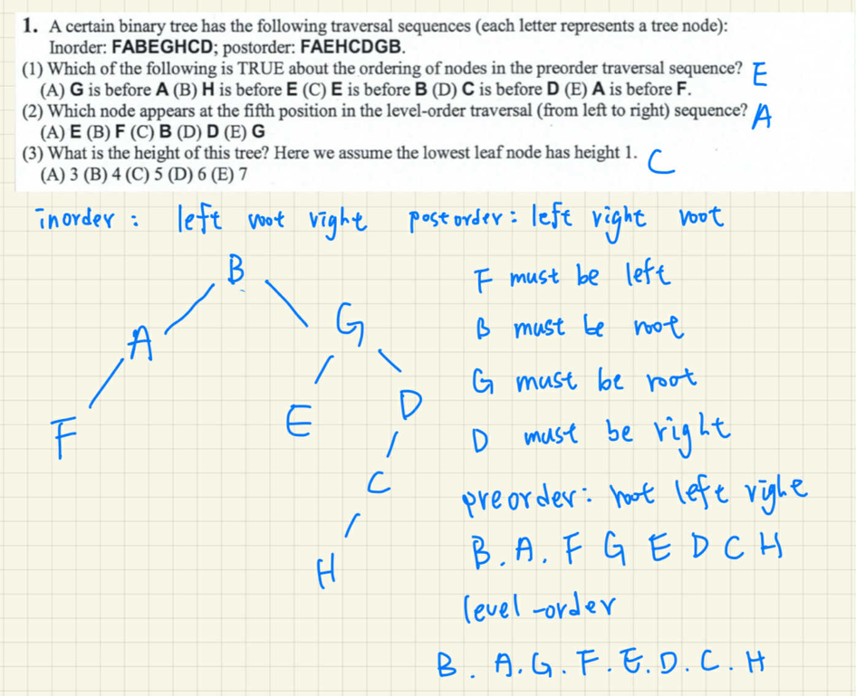

- 從 inorder, postorder 反推樹的結構
  - 第一個 node F 一定是 left node。
  - 第二個 node A 可能是 root node 或 right node ，但是假設是 right node 那 inorder 會違反規則，所以 node A 一定是 root node 。
  - node B 在 inorder 先被印出，在 postorder 排到最後一個表示他一定是 stack 內最後被拿出來的，所以最可能是 root node，
  - 以此類推...。

## 第2題 Postfix Expression

<center>

</center>

- 方法 1
  - 這題之前的[文章]()有寫過~ 會利用 stack 紀錄運算符號然後根據不同符號的 priority 將運算符號從 stack 取出，最後數學式轉換成 postfix expression 。
  - postfix expression 又可以利用另一個 stack 裝運算元，每遇到運算符號就取出兩個運算元跟運算符號做計算，再放回 stack 最終 stack 會剩下最終運算結果。

- 方法 2 (後來發現更好)
  - **先劃出 expression tree 然後用 postfix traverse**

## 第3題 C++ and Linked List

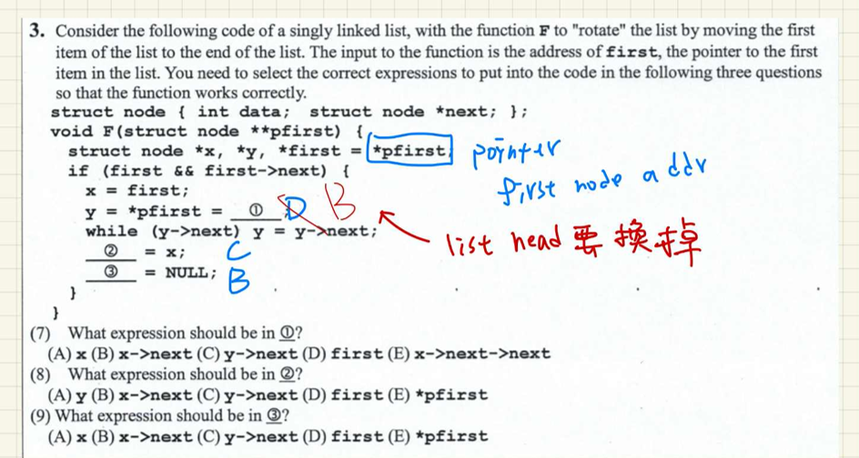

- F 的功能是把 first node 挪到 linked list 的最後面

- \*pfirst 存的是 linked list 第一個 node 的位址

- while loop 用 y 來遍歷 linked list (目的是讓 y 走到最後一個 node)

- 因此 x 用來暫存 first node 的位址
  - while loop 完後用來做 swap
  - y -> next = x
  - x -> next = null

- y = (\*pfirst = ?)
  - 唯一還沒做的就是更換 list head
  - 程式 evaluation 規則換先處理 等號右邊
  - y = \*pfirst = x -> next

## 第4題 BST

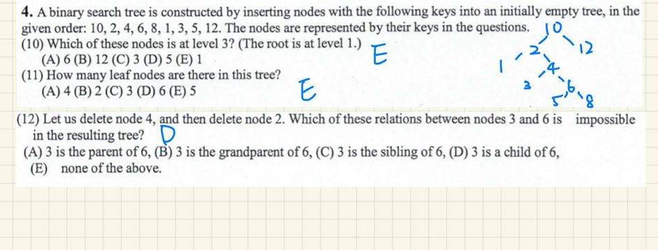

- 結構已經畫在圖裡了，第 12 題刪除 BST node 有幾個方法 ，結果應該要維持用 inorder 讀取 BST 依然由小到大。

- 刪除規則
  1. 刪除的 node 是 leaf node 直接刪掉一定不影響順序
  2. 刪除的 node 有一個 child node ，刪掉 node 後， child node 補位
  3. 刪除的 node 有兩個 child node:
     - 取 left tree下面最右邊的 leaf node
     - 取 right tree下面最左邊的 leaf node
     - 直接把 left tree 補位，但是衝突的 child node 移走
     - 直接把 right tree 補位，但是衝突的 child node 移走

- (c) 其實也不太合理，理由是通常刪除節點會採用同一個邏輯，如刪除節點有兩個子節點則一律取左樹中最大節點取代刪除節點位置或刪除節點有兩個子節點則一律取右樹中最小節點取代刪除節點位置。唯有採用混和策略才可能出現 3 跟 6 最後是sibling ，但是 D 則是絕對不可能。

## 第5題 **Red Black Tree**

- 紅黑樹是透過 udemy willson 恩師的演算法課程學的(他根本不認識我，但是我的轉職很多基礎都是買他的課學的，推薦想入門學習的人喔~)。

- 補充其他 balance BST
  - 首先 BST 的插入規則就自帶排序性質，你可以想像，如果我依序插入 1, 2, 3, 4 , 5 這個 BST 的五個節點會形成 5 層的樹，但是如果我改變插入順序 3, 2, 1, 4, 5 那麼樹就會是 3 層，如果插入數字超大，兩種 tree 的搜尋時間就會是 BigO(n) 跟 BigO(log n) ，因此衍生出
  - **AVL tree** ，AVL tree 的 balance 邏輯左右樹高不超過 2 層，但是當樹的層數很高，balance 操作就會成倍成長，因此有了 Red Black tree。
  - RB tree 可以改善 AVL tree balance 操作太多的問題，但同時平衡高度就沒有 AVL tree 精確，因此同一個數列化為 AVL tree, RB tree，AVL tree 查詢會比 RB tree 快。
  - B tree(m-way search tree) 也是一種平衡樹，但是他是設計給 secondary storage 資料交互用的，最常使用 B tree 演算法的就是資料庫。

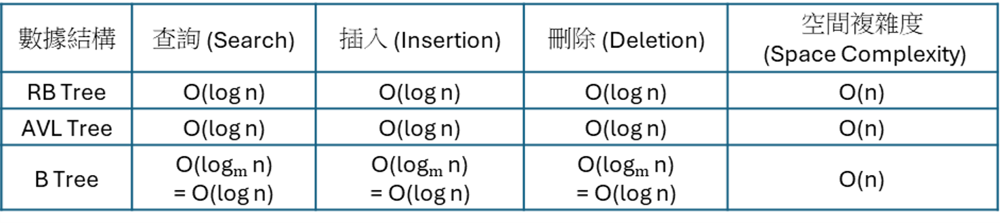

<center>
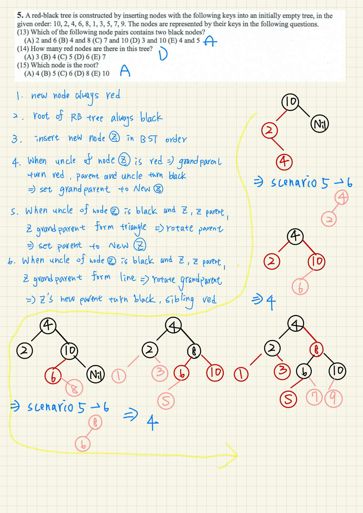
</center>

- RB tree 規則:
  1. 插入依循 BST 規則
  2. new node Z 一定是 red node
  3. RB tree 最高的 root 一定是 black node
  4. red node 不能連接 red node ，需要使用 5-7 方法做 tree balance
  5. **new node Z 插入後， uncle node 是 red node ⮕ 將 grandparent node 轉為 red node，parent node 跟 uncle node 轉為 black node ➤ 將 node Z 指向 Z’s grandparent。**
  6. new node Z 插入後， uncle node 是 black node ，且 Z, Z’s parent, Z’s grandparent 呈三角形 ⮕ parent node 左轉或右轉 ➤ 將 node Z 指向 Z’s parent。
  7. **new node Z 插入後， uncle node 是 black node ，且 Z, Z’s parent, Z’s grandparent 呈一直線 ⮕ grandparent node 左轉或右轉 ，將 Z’s parent 轉為 black node ， Z’s sibling 轉為 red node。**
  8. 最終 RB tree root 到每個 leaf node 遇到的 black node 都會一樣多

- uncle red 換顏色 then grandparent as new Z

- uncle black 轉然後換顏色

## 第6題 Array, Linked List, **Failure function (LPS, KMP)**

### 第16題 Array

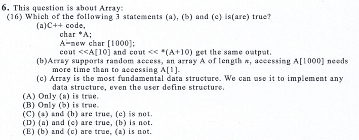

- A 是一個 pointer
  - A 裝 (new char[1000]) 的位址
  - &A 是 pointer A 本身的位址

- print char array 傳入 address 會自動印出該 address 到最後一個 address 的值 ， int array 則不會。

  ```
  #include <iostream>
  #include <string>
  int main(){
      char *A ;
      A = new char[100];
      strncpy(A, "abcdefghijklmno", 99);
      std::cout<< A << ",\n" ; // abcdefghijklmno
      std::cout<< A+1 << ",\n" ; // bcdefghijklmno
      std::cout<< A[10] << ",\n" ; // k
      std::cout<< *(A+10) << ",\n" ; // k
      std::cout<< &A << ",\n" ; // 0x505298
      std::cout<< &A + 1 << ",\n" ; // 0x50529c
      std::cout<< &(A+1); //不合法
      return 1;
      }
  ```

- 記憶體存取時間都是O(1) ，所以 A [1000], A[1] 存取時間相同

- 答案是 D

### 第17題 Array, Linked List

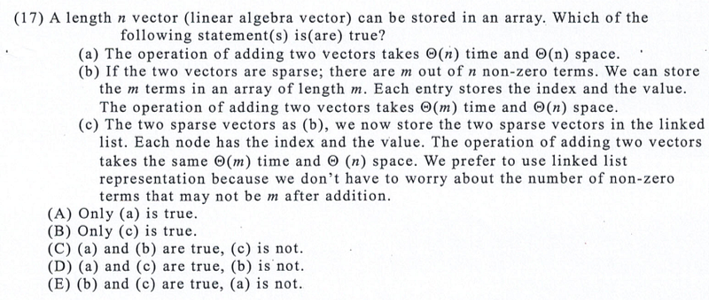

- 使用 theta 符號通常表示 tight-bound 時間複雜度或是 tight-bound 空間複雜度，所以針對 b , c 敘述空間複雜度應該都是 θ (m)。

- sparse array 是指 array 內很多空 entry (如 [ , , , 1, , , ])，有些時候為了提升計算效率，就會針對有數字的 entry 做紀錄跟計算避免不必要的紀錄浪費空間利用
  - sparse array 大小為 m 因此空間複雜度應該是 O(m)

- 答案是 A

### 第18題 **字串搜尋演算法**

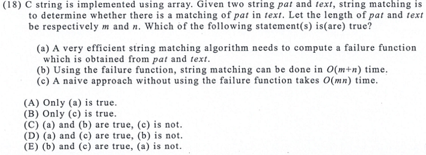

- 暴力破解 O(m*n)
  - 最差狀況就是每次比對到 pat 的最後一個字才發現錯誤

  ```
  function strMatch(pat, text) {
      for (let i = 0; i < text.length; i++) {
          for (let j = 0; j < pat.length; j++) {
              if (text[i] !== pat[j]) {
                  break;
              }
              if (j === pat.length - 1 && text[i] === pat[j]) {
                  console.log('find');
              }
          }
      }
  }
  ```

- Knuth–Morris–Pratt algorithm O(m+n)
    - 需要 **failure function** 輔助 (屬於DP) - 對 pat 去做一個叫做 Longest Prefix Suffix 的紀錄，有這個紀錄輔助後就省去遇到錯的字回溯到前面重新比對的成本 - 以暴力法來說，假設 pat = AABAAB ; text = AABAACAABAAB 當 i = 0 ，要檢查到 j = 5 才發現 B 跟 C 的衝突，下一步 i = 1 等於是比到 C 後發現不對又重新回到第二個 A 再往後面比。如果有 Longest Prefix Suffix 的紀錄就可以推測出 C 之前都已經沒救了應該直接往後比對，我們來看看怎麼做 Longest Prefix Suffix:

        ```
        function failure(pat) {
            const LPS = [0];
            let i = 1, j = 0;
            while (i < pat.length) {
                if (pat[i] === pat[j]) {
                    j++
                    LPS[i] = j
                    i++
                } else {
                    if (j > 0) {
                        j = LPS[j - 1]
                    } else {
                        LPS[i] = 0
                        i++
                    }

                }
            }
            return LPS
        }
        console.log(failure('AABAAB')) // [0, 1, 0, 1, 2, 3]
        ```
    - LPS 陣列記錄了對於一個模式字串 pat 的每個前綴 pat[0...i]，其**最長**的、同時也是其 Proper Prefix 也是其 Proper Suffix 的子字串的**長度**。
    - 以 AABAAB 為例：
        - LPS[0] 始終為 0 (單個字符沒有真前綴或真後綴)。
        - LPS[1] = 1 (對應 AA)
            - 計算 AA 的最長共同 Proper Prefix Suffix 長度。
            - Proper Prefix A = Proper Suffix A，長度為 1。
        - LPS[3] = 1 (對應 AABA)
            - 計算 AABA 的最長共同 Proper Prefix Suffix 長度。
            - 共同部分為 A，長度為 1。
        - LPS[4] = 2 (對應 AABAA)
            - 計算 AABAA 的最長共同 Proper Prefix Suffix 長度。
            - 共同部分為 AA，長度為 2。
        - **簡而言之：LPS[i] 就是看 $P[0 … i] 的「頭」和「尾」有多少個字母是重疊且一樣的 (不包含整個字串本身)。**
        - 時間複雜度 O(m) 
    - KMP 
        ```
        function KMP(pat, text) {
        const LPS = failure(pat);
            let j = 0;
            for (let i = 0; i < text.length; i++) {
                if (text[i] === pat[j]) {
                    j++;
                    if (j === pat.length) {
                        j = LPS[j - 1];
                        console.log('find');
                    }
                } else {
                    j = LPS[j - 1];
                }
            }
        }

        KMP('AABAAB', 'AABAACAABAABAABAABAAB'); // find find find find
        ```
        - 時間複雜度 O(m+n)

- 答案是 E

## 第7題 Priority Queue, **Lefties tree**, Min Heap

### 第19題 Min Heap

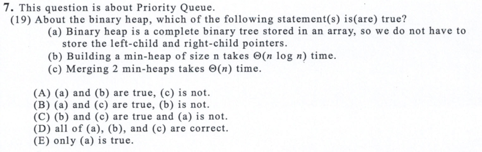

- build min heap
    1. 一個一個放入 heap 然後都依循 min heap 規則排到該 element 的正確位置，可以想像每放一個，就可能需要檢查 log₂(i) 次 ，i從 1 到 n ，如果用 log₂(1) + log₂(2)… + log₂(n) 根據 log 運算性質就會是log₂(n!) 近似 n log₂(n) ，時間複雜度表示 O(n log n)。
    2. 直接對已經放好的 heap 做 min heap，而且從尾端往前(由下而上)整理，再由該節點往下檢查 min heap

        <center>
        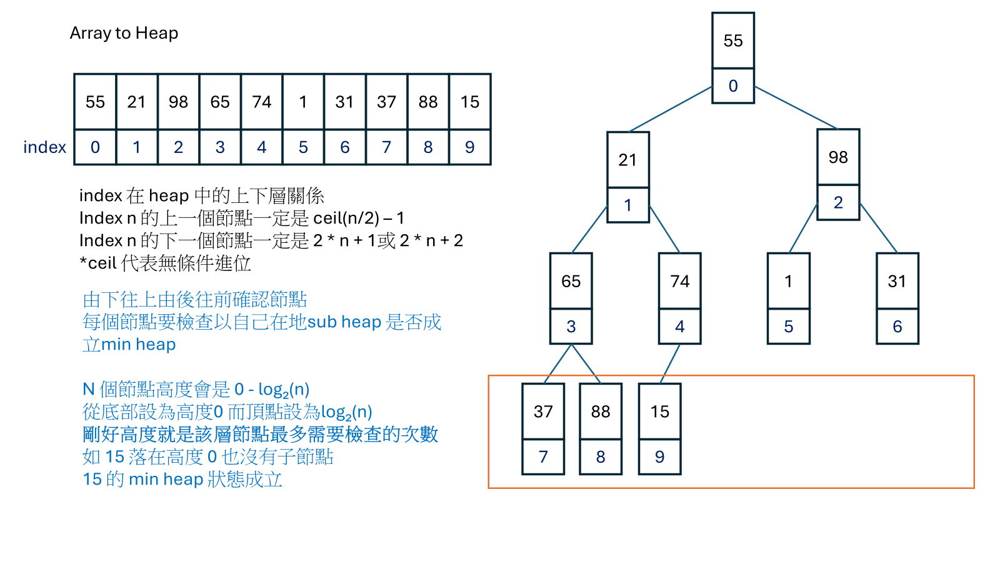
        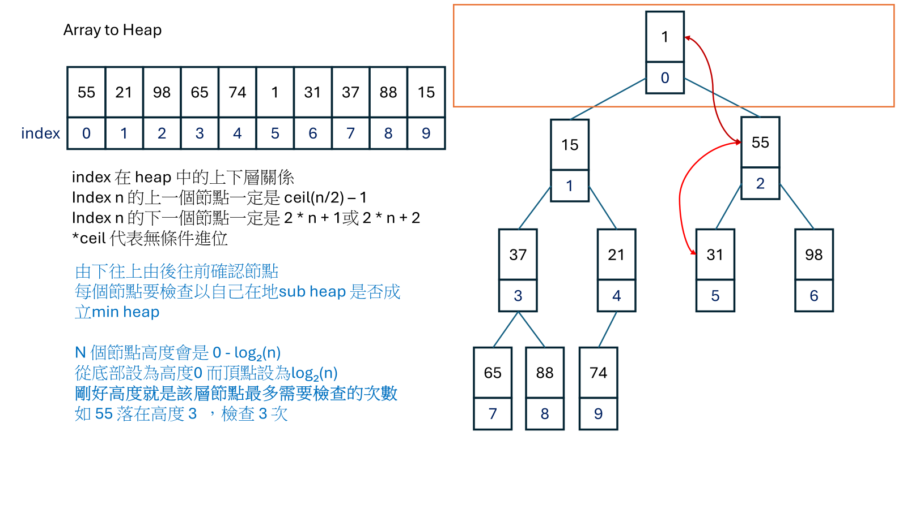
        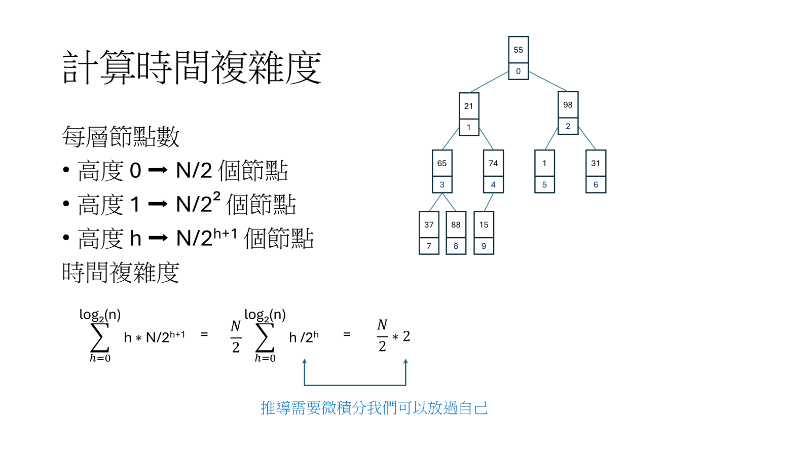
        </center>

        - **時間複雜度是 O(n)**
- 最終只要是建立 min heap 最佳的時間複雜度都是 O(n) ，merge 兩個 min heap 也是一樣，只要是一次整理整個 array 都可以達到 O(n)。

- 答案是 B

### 第20題 **Leftist Tree**

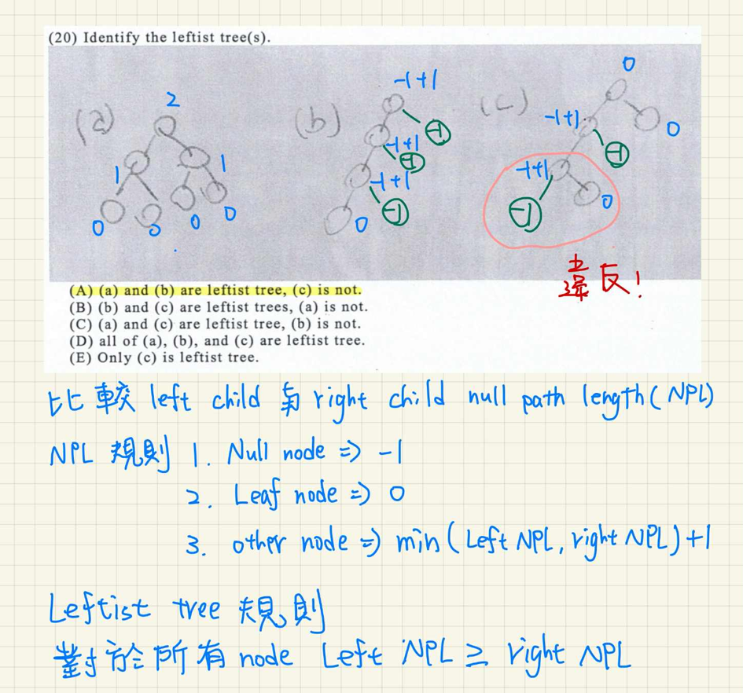

- ref  [intro](https://www.youtube.com/watch?v=Hy3LBl3tKq8), [ds](https://www.youtube.com/watch?v=4DwwamtBRPU), [NPL](https://www.youtube.com/watch?v=Z43QOiaYfT0), [build(insert)](https://www.youtube.com/watch?v=XEg9Id8aDDA), [merge](https://www.youtube.com/watch?v=8u4o5BdlXQo), [delete](https://www.youtube.com/watch?v=BBlPV4jwnGY)，教授講得蠻清楚的~

- Leftist Tree 是一種特殊的 heap 資料結構，具有以下特性：
    1. heap 性質：是一個 min-heap 或 max-heap
    2. Leftist Property（左偏性質）：對於每個節點，左子樹的 NPL ≥ 右子樹的 NPL
    3. NPL (Null Path Length)：從該節點到最近的「外部節點」（null）的最短路徑長度
        - NPL 的定義：
            - null 節點的 NPL = -1
            - 葉子節點的 NPL = 0
            - 內部節點的 NPL = min(左子NPL, 右子NPL) + 1

- 答案是 A

### 第21題 **Leftist Tree**

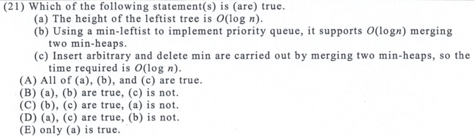

- 有可能高度為 O(n)

- leftist tree 的 insert, merge, delete leftist tree (min heap) 其實都延伸自 insert。

- leftist tree 不是用 array 構成的而是像一般的 tree node 帶有 left child pointer 跟 right child pointer 跟兩個變數一個是該 node 的資訊另一個則是 NPL。

- insert 的規則
    - 假設插入element A ，是先跟 root 比大小
        - 如果是 A < root ，則 A 做為新的 root 舊的 tree root 直接插入 A’s right child ，檢查 NPL 一定是A’s right child NPL > A’s left child NPL ，因此需要交換(swap) A’s right child 到 A’s left child;
        - 如果是 A > root ，則 A 要跟 root's right child 比大小。這時候就把接下來的情況比照 A < root 及 A > root 時的操作了。
    - A < root’s right child 則 A 取代 root’s right child ，root’s right child 插入 A's right child，檢查 NPL，做 swap …; A > root’s right child 就找 (root’s right child)'s right child。
- merge 的規則
    - 跟 insert 幾乎是一樣的檢查 A’s root < B’s root ➝ (A’s root)’s right child < B’s root ➝ ((A’s root)’s right child)’s right child > B’s root，拆掉 ((A’s root)’s right child)’s right child (給個新名字 C ) ，B’s root 成為 ((A’s root)’s right child)’s right child ， 然後 C merge 到 B ，重複 B 插入 A 時的邏輯。
- delete 的規則
    - 找到刪除的 node ，然後 merge 刪除的 node 的 left child 跟 right child ， 但通常應該是抓 root 取出去，然後merge left child 跟 right child，因為是min heap。
- 以下我用畫圖的方式說明為何 insert, merge, delete 操作的時間複雜度都屬於 O(log n)。
    

- 答案是 C

## 第8題 Sorting

### 第22題 Quick Sort

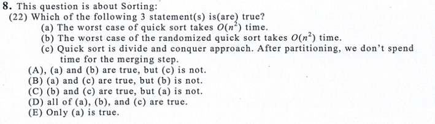

- quick sort
    - 每次抓出一個數字 k 作為pivot，檢查其他數字大於 k 放到其右邊，小於 k 放到其左邊，每次至少可以排序完一個數字，這個機制一直重複做是有 divide and conquer 的
    - 如果排序的數列剛好都可以讓你依序取得中間數你才能夠達到最好的排序效果，因為你每次可以均勻地把數列分成兩半，最佳時間複雜度是 O (n log n)
    - 如果排序一個已經排序好的數列做 quick sort 每次執行你只會得到一個排序好的數字跟 n-1 個剩餘需要排序的數。
    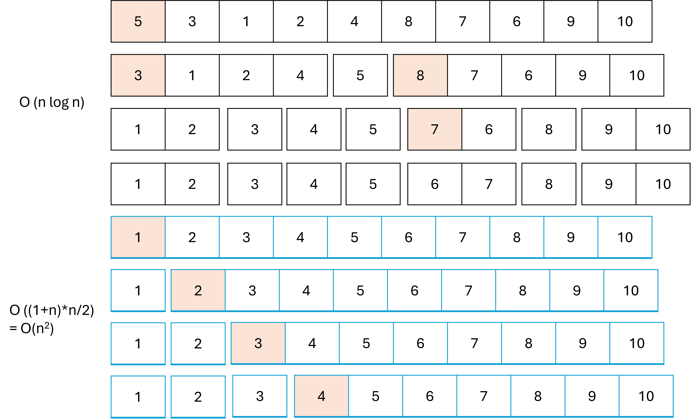

- random quick sort 
    - 挑選 pivot 是隨機的可以降低遇到 O (n²) 的機率，但是最不幸就是每次隨機選 pivot 就是剛好取到未排序的數字中的最大或是最小值，所以最壞情況還是 O (n²)

- 基本上是對sub array 原地排序，因此不需要 merge

- 答案是 D

### 第23題 Stable Sort

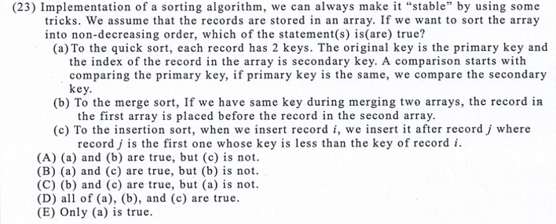

- 排序的物件有同等級的，如 [( Z, 1 ), ( B, 3 ),… ( C, 2 ), ( A, 1 )]，對其**做 stable sort 使結相同 key 的元素，排序後的「相對順序」必須與「原始輸入順序」完全相同**，可以觀察陣列中有放入順序差，利用這點可以使排序後 [( Z, 1 ),... ( A, 1 )...] 同等級的物件相對順序永遠不變。

- insertion sort 將左邊陣列視為以排序右邊新物件往左scan 找插入位置，想像 [1, 3, 5, 3']，假設現在 i = 3 ，根據題目說找到第一個 < 3' 的時候插入，那就是遇到 1 時插入 [1, 3', 3, 5] 這樣違反 stable sort 的定義。

- 答案是 A

### 第24題 Sort

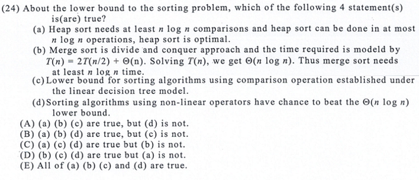

- heap sort
    - 把 root 取出來，將最後一個 node 取出 insert 到 root ，而取 node 是 O(1)， insert node 則是 O(log n) ，n 個 node 要做➝ log₂(n) + log₂(n - 1) + log₂(n - 2)… + log₂(1) 次，根據 log 運算性質就會是 log₂(n!) 近似 n log₂(n) ，時間複雜度表示O (n log n)。

- merge sort
    - Omega 才是 At least（至少、下界）
    - Theta 是 Tight Bound 不能說是 >=

- decision tree 
    - 是一種幫助分析 sorting 效率的 binary tree
    - 證明 sorting 的極限位什麼是 Ω (n log n)。
    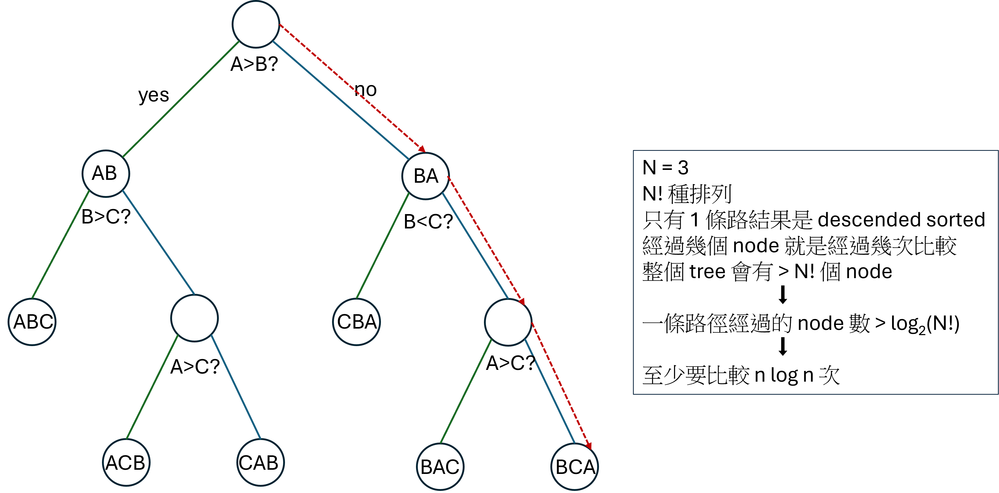

- non-linear operators 非比較大小的運算符
    - 非比大小方式做的 sorting 可以突破 O (n log n)
    - 利用元素的額外結構（如整數、字串的位元表示）來進行計數、桶分或基數處理等操作，缺點是他只能針對定範圍或條件的資料做排序。
    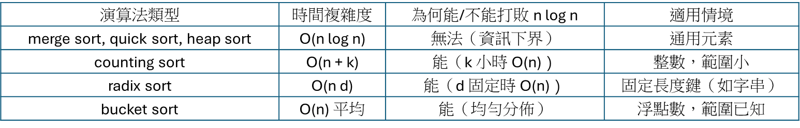

- 答案是 C

## 第9題 Graph

### 第25題 Graph DFS, BFS, **Union and find**

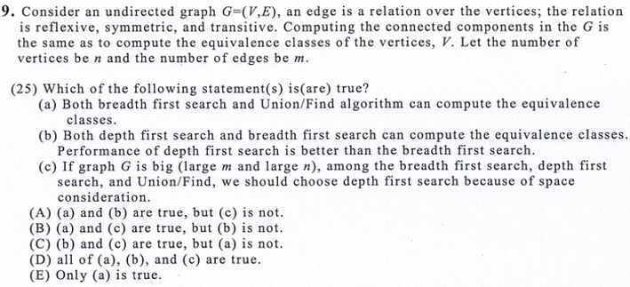

- graph relation 
    - reflexive (node A to itself)
    - symmetric ((u, v) if and only if (v, u) 因為是 undirected graph)
    - transitive ((u, v), (v, w) 屬於同一個 component 則一定存在路徑 (u, w))。
    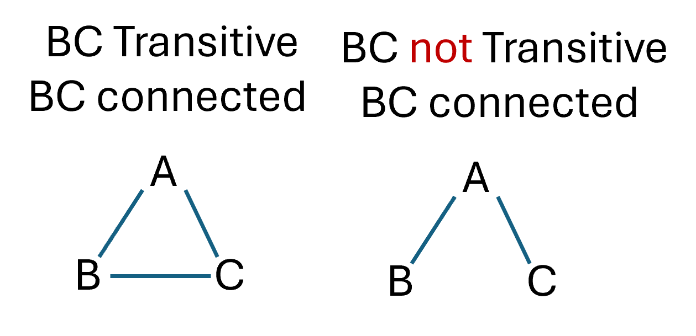

- 題目給你 n 個頂點（vertices）和 m 條邊（edges），例如： V = [A, B, C, D, E, F]， E = [[A,B], [A,C], [B,C], [D,E], [E,F], [F,D]] 這樣的 V 和 E 可以描述多組圖。我們的目標是 計算等價類（equivalence classes），也就是找出哪些頂點屬於同一連通分量。

- BFS（廣度優先）
    - 用 Queue 輔助
    1. 先檢查 A，把它的鄰居 B、C 依序放入 queue
    2. 取出 B，發現它的鄰居 C 已經訪問過 → 不重複加入
    3. 繼續處理 C、D、E、F… → 最終發現 {A,B,C} 是一組，{D,E,F} 是一組
    - 遍歷所有頂點與邊， 時間複雜度：O(n + m)

- DFS（深度優先）
    -  用 Stack（或遞迴）輔助
    1. 從 A 開始，放入 B、C 到 stack
    2. 取出 C（後進先出），再放入它的鄰居…
    3. 一路往下探，到底再回來 → 最後也得到 {A,B,C} 和 {D,E,F} 兩組
    - 遍歷所有頂點與邊， 時間複雜度：O(n + m)

- Union-Find（並查集）
    - 需要兩個函數
        1. Find(x)：找 x 所屬的根節點（代表組別）
        2. Union(x, y)：把 x 和 y 所在的組併起來
    1. 根據 E 的每條邊 [u, v] 做：Union(u, v)
        - Union(A, B) → 發現 A 和 B 都是自己當根 → 把 B 的 parent 設為 A
        - Union(A, C) → 同理，把 C 的 parent 設為 A
        - Union(B, C) → 呼叫 Find(B) 和 Find(C)，發現兩者根都是 A → 已經同組，什麼都不做
    2. Union 階段只是「整理關係」，還沒輸出結果。 要輸出等價類，最後再掃一遍所有頂點，用 Find(i) 看每個點的根是誰，相同根的歸一組。
    - 時間複雜度:
        - Union 被呼叫 m 次（每條邊一次）
        - 每次 Union 內部會呼叫 2 次 Find → 總共 2m 次 Find
        -  **路徑壓縮（path compression**: Find 會把整條路徑壓平 → 樹高快速下降 
        - Find 的單次操作 接近常數時間（嚴格說是 O(α(n))，α(n) ≤ 4）
        - 總時間 = O(m × α(n)) + O(n)（最後掃一遍） → 實務上就是 O(m + n)

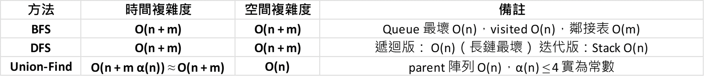

- 三種方法時間複雜度差不多，空間最佳是 Union-Find ~ 

- 答案是 E

### 第26題 **Union and Find**

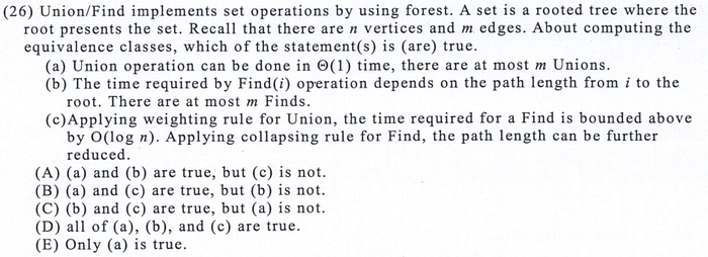

- using forest 
    - 把同一組的 vertices 用 tree 的結構來顯示 tree 的 root 就是該組圖的表頭。

- Union 
    - 是建立樹的連接步驟，可以利用 **rank** 來控制樹的高度成長速度是 log(vertices)

- Find **路徑壓縮（path compression**
    - 壓平樹的步驟，使的後續的 find 接近 O(1)。

- (a) Union 中有呼叫 Find (需要O(α(n)))，因此不能說是 Θ(1)

- (b) 假設 m 次 Union 都不執行壓平那麼 find 至少要 recursive trace m 次

- (c) **weighting rule** 就是指利用 rank 來控制樹的高度這件事，假設 edges = [[A,B], [B,C], [C,D], [D,E], [E,F], [F,D]] 不使用 rank 控制樹的結構最終會變成
    ```
    edges = [[A,B], [B,C], [C,D], [D,E], [E,F], [F,D]]

    不使用 weighting：
    A → B → C → D → E → F

    使用 Union by Rank：
        A
    /| | | \
    B C D E F
    ```
    - 用 rank 控制樹的結構，樹高的成長高度可以控制在 log(n)。
```
class UnionFind:
    def __init__(self, n):
        # parent[i] = i 的父節點
        self.parent = list(range(n))
        # rank[i] = 以 i 為根的樹的rank（近似高度）
        self.rank = [0] * n
        self.count = n # 連通分量數量

    def find(self, x): #路徑壓縮優化
        """
        時間：O(α(n))，α 是 Ackermann 函數的反函數，實際上 < 5
        """
        if self.parent[x] != x:
            # 路徑壓縮：直接連到根節點
            self.parent[x] = self.find(self.parent[x])
        return self.parent[x]

    def union(self, x, y): #rank小的樹接到rank大的
        """
        時間：O(α(n))
        """
        root_x = self.find(x)
        root_y = self.find(y)

        if root_x == root_y:
            return  # 已經在同一集合

        if self.rank[root_x] < self.rank[root_y]:
            self.parent[root_x] = root_y
        elif self.rank[root_x] > self.rank[root_y]:
            self.parent[root_y] = root_x
        else:
            self.parent[root_y] = root_x
            self.rank[root_x] += 1

        self.count -= 1  # 分量數減 1

    def connected(self, x, y):
        return self.find(x) == self.find(y)

    def get_components(self):
        components = {}
        for i in range(len(self.parent)):
            root = self.find(i)
            if root not in components:
                components[root] = []
            components[root].append(i)
        return list(components.values())
```

- 答案是 C

### 第27題 math

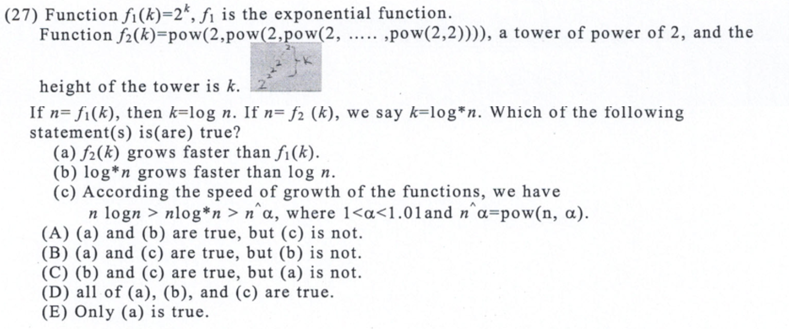

<center>
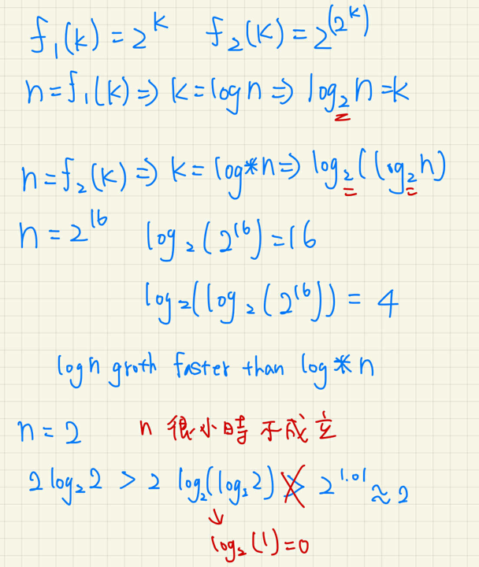
</center>

- 答案是 E

## 第10題 **Amortized cost**

### 第28題 **Union and Find**

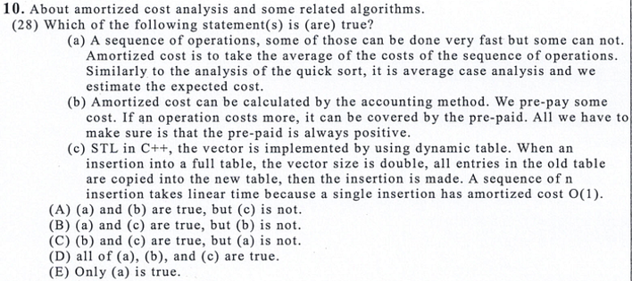

- (a) quick sort 的 theta 時間複雜度類比 amortized cost。

- (c) C 語言 vector (或是 array) 都是分配連續記憶體位置，通常在定義時就會設置一個 vector size ，如果要做到動態變換 vector size 就需要在背後偷偷重新配置新 vector size並且把舊的資料搬移，因此 vector 插入都是 O(1) ，但是如果說放滿的話需要 O(n)，而放滿的情況很少發生，Amortized cost 是O(1)。
    - STL 是 Standard Template Library 

- (b) Accounting Method（會計法）是一種「攤還分析（Amortized Analysis）的方法，拿 (c) 的情境用 Accounting Method 分析就會是一個插入預付多少成本，敘述正確
    ```
    實際成本：  1  1  1  1  5  1  1  1  9  ...
    攤還成本：  3  3  3  3  3  3  3  3  3  ...
                ↑  ↑  ↑  ↑  ↑
                預付 → 用來補擴容
    ```

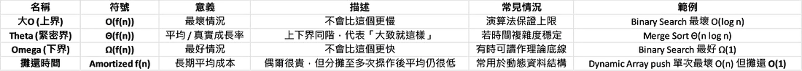

- 答案是 C

### 第29題 **Fib Heap**

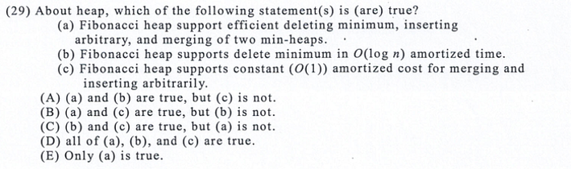

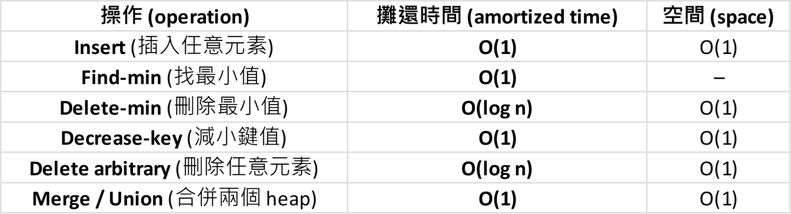

- 答案是 D

<div style="page-break-after: always;"></div>

### 第30題 **Double Stack Queue**

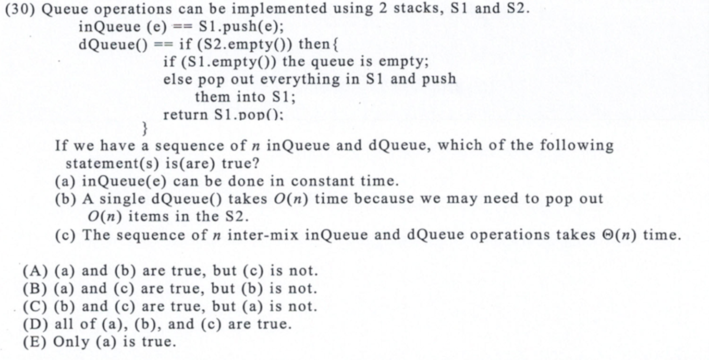

- 程式碼應該錯了
    ```
    inQueue(e):
        S1.push(e)                     # O(1)

    dQueue():
        if S2 is empty:
            if S1 is empty:
                error "queue empty"
            else:
                while S1 not empty:    # 最多 n 次
                    S2.push(S1.pop())  # ← 倒到 S2！
        return S2.pop()                # O(1)
    ```

- stack 是後進先出，兩個後進先出做出來的效果就是先進先出

- 可以想像 n 個element 要進出這個 queue 就會 n 次進入 S1 ，n 次出入 S1， n 次進入 S2 ，n 次出入 S2 總共 4 n 次，但是 Θ 不用表示常數，所以是 Θ(n)。

- 答案是 D

## 第11題 **Hashing**

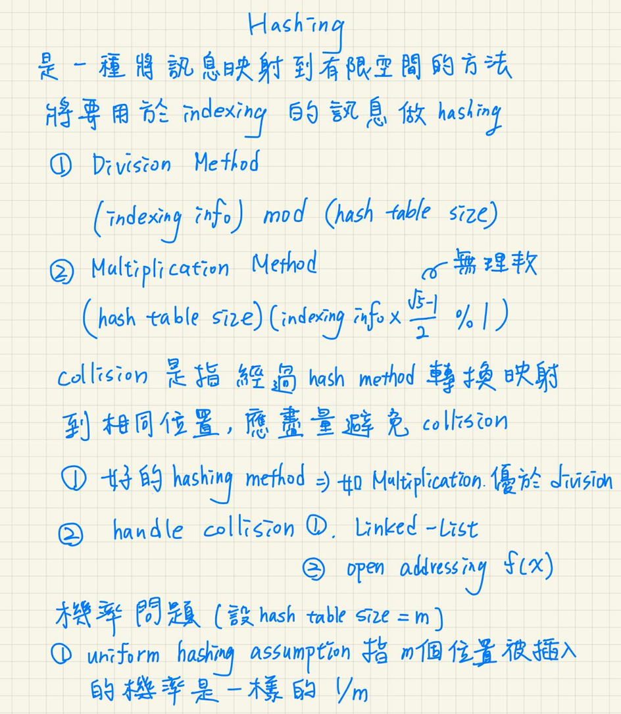

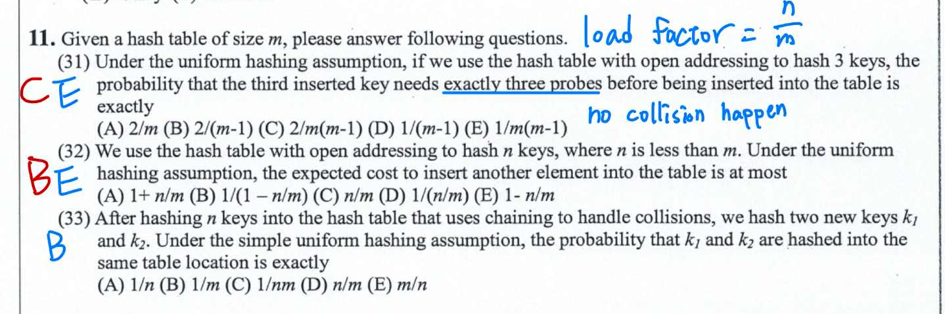

### 第31題 

要插入 3 個 key，在處理第 3 個插入時會產生 2 次碰撞的機率?

- 第 1 次處理第 3 個插入會發生碰撞，因為有 2 個 key 已經被放入，所以發生碰撞機率是 2/m。

- 第 2 次處理第 3 個插入會發生碰撞，因為第 1 次處理已經是碰撞 2 個已經被放入 key 的其中之一，不應該碰撞一樣的 key，因此碰撞機率是 1/(m-1) 

- 總結機率是 (2/m) *( 1/(m-1))。

### 第32題 

已知 hash table 中 n 個位置都被填滿，第 n + 1 個插入的成本期望值?

- 期望值是事件的發生概率*該事件的成本，如中獎機率 50 % ，中獎獎金 100 萬，則中獎期望值是 50% * 100 萬。

- 操作次數 * 成功插入的機率就會是插入的成本期望值。
    - α=n/m
    - 以 1 次 probe 成功插入的機率：1(1−α) , 以 2 次 probe 才插入的機率：α(1−α) …
    - E = 1(1−α)+2(α(1−α))+3(α²(1−α))+⋯ = (1−α) (1+2α+3α²….)
    - S = 1+2α+3α²…kαᵏ⁻¹
    - αS = α+2α²+3α³…kαᵏ
    - (1-α)S = 1+α+α²...+αᵏ⁻¹-kαᵏ = (1-αᵏ)/(1-α)
    - when 0<α<1 → S = 1/(1-α)²
    - E = (1−α) * (1/(1-α)²) = 1/(1-α)

### 第33題 

已知 hash table 中 n 個位置都被填滿，新插入 k1 再插入 k2 時發生的碰撞是跟 k1的機率

- 因為 k1 就是佔 m 個位置中的其中 1 個位置 ， 因此是 1/m

## 第12題 **Master theorem**

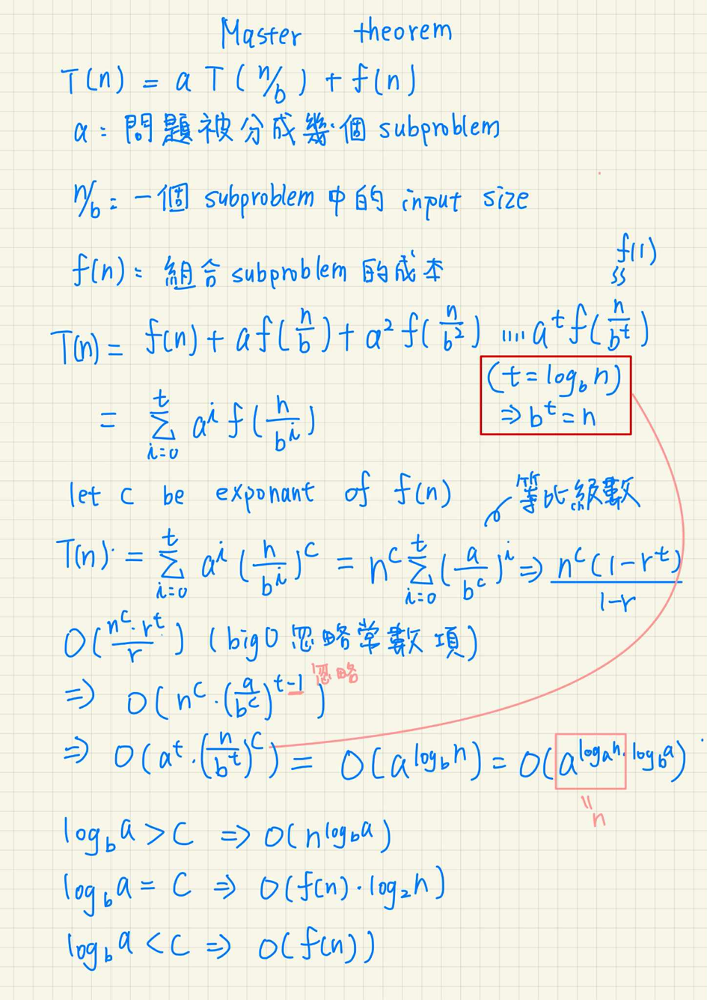

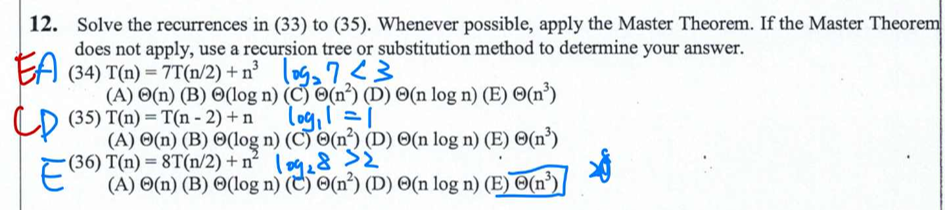

### 第34題 

- log₂7 < 3 ⭢ O(n³)

### 第35題 

- 不適用 master theorem，因為它的子問題大小是用「減法」縮減，而不是「除法」。

- T(n) = ...T(n−6) + (n−4) + (n−2) + n 約 n/2 項

- (n / 2) * n - (等差級數 2 + 4 +...+ n ，n/2 項 ) ➝ 是 O (n²)

### 第36題 

- log₂8 > 2 ⭢ O(n^log₂8)

## 第13題 Binary Search

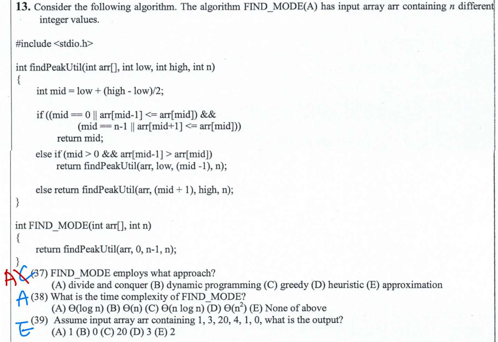

- divide and conquer 會分出 sub problem ，但這個直接把東西對切操作也可以算是。
    - 三個步驟：Divide (切分) ⭢ Conquer (遞迴解) ⭢ Combine (合併結果)。
    - 關鍵特徵：切分出來的子問題是 「互不相干 (Independent / Non-overlapping)」 的。這是它跟 DP 最大的差別。
    - 例子：Merge Sort (標準 D&C)、Binary Search (簡化版 D&C，只有 Divide 沒有 Combine)。

- dynamic programming 透過紀錄過去的答案 (Memoization) 來堆疊出全局最佳解
    - **Overlapping Subproblems (重疊子問題)**：子問題會重複出現（例如 Fibonacci 的 f(n-1) 和 f(n-2) 會一直重複算 f(n-3)），所以要查表。
    - **Optimal Substructure (最佳子結構)**：問題的最佳解包含其子問題的最佳解。

- Greedy 是根據當下最佳情況來執行，最終不一定可以得到最優解

- heuristic 也是根據當下最佳情況或是有方法協助**預判**來執行，最終不一定可以得到最優解

- approximation 字面上意思求近似 (用於某些 NP 問題)

## 第14題 **Matrix Multiplication** (DP)

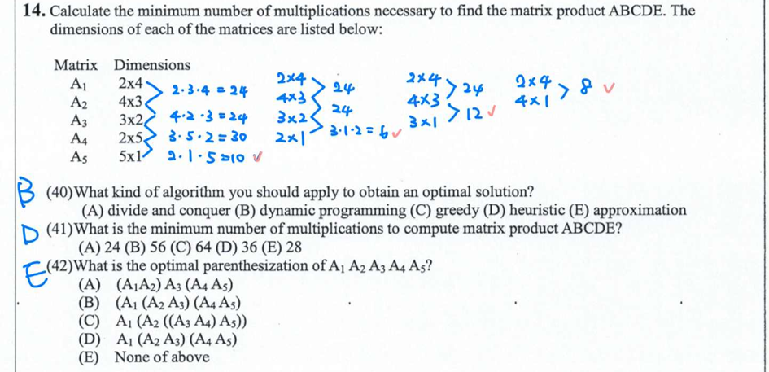

<center>
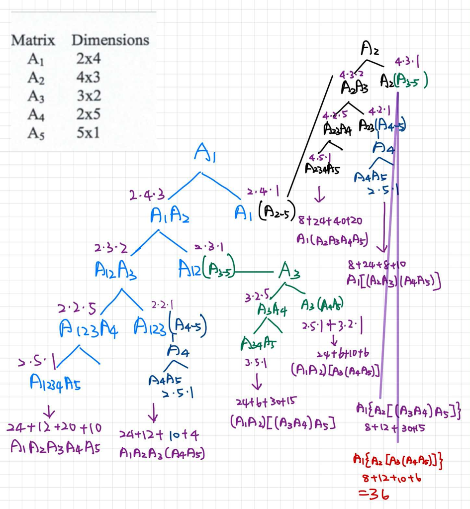
</center>

## 第15題 **Huffman Encode** (Greedy)

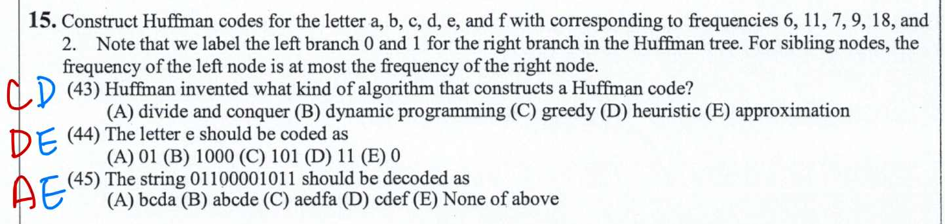

題目要求每次將當前最小的 2 個頻率合併，成為 root 資訊，然後每個左節點的訊息大小會 < 右節點，建完的樹如下。

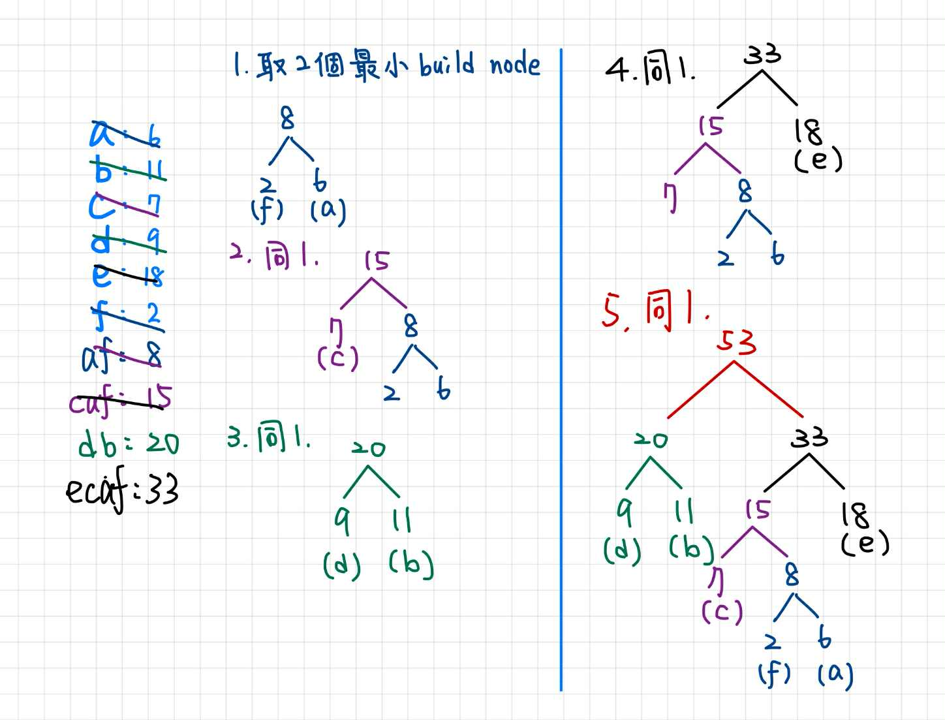

<div style="page-break-after: always;"></div>


## 第16題 **Shortest Path** 

- 圖的演算法我是透過 YT 學習的 1. [Shusen Wang](https://www.youtube.com/@ShusenWang) 2. [波波微课](https://www.youtube.com/@boboweike) ，我覺得有搭配圖像解釋對於理解很有幫助~

- [圖的定義跟資料結構](https://www.youtube.com/watch?v=JS9MB8tp0eY)

<center>
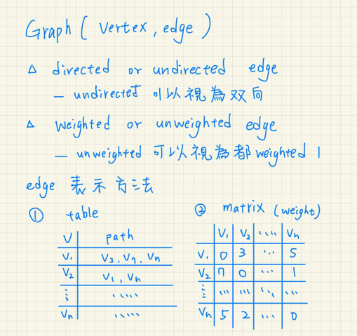
</center>

<div style="page-break-after: always;"></div>

[Shortest Path for unweighted graph (BFS)](https://www.youtube.com/watch?v=e7unEsKHW54)

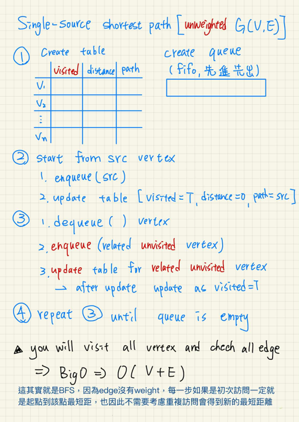

<div style="page-break-after: always;"></div>

[Shortest Path for non-negative weight graph (Dijkstra) (Greedy)](https://www.youtube.com/watch?v=uyNJxsH16nc)

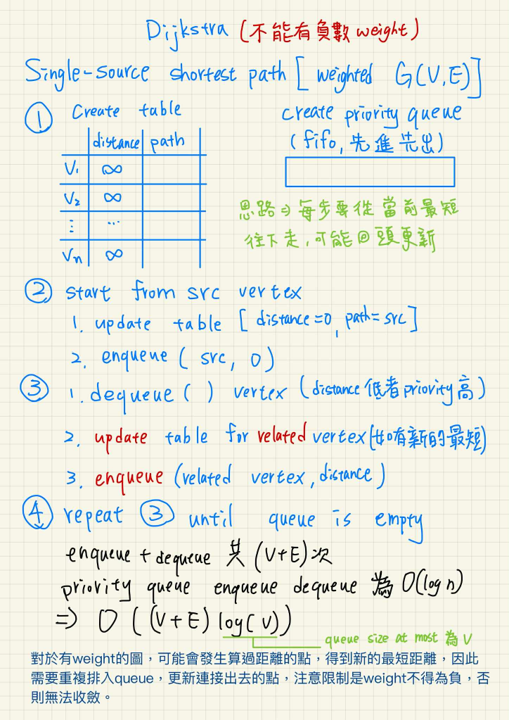

<div style="page-break-after: always;"></div>

[Shortest Path for weight graph (A*) (heuristic)](https://www.youtube.com/watch?v=9R_NjVbFWjI)

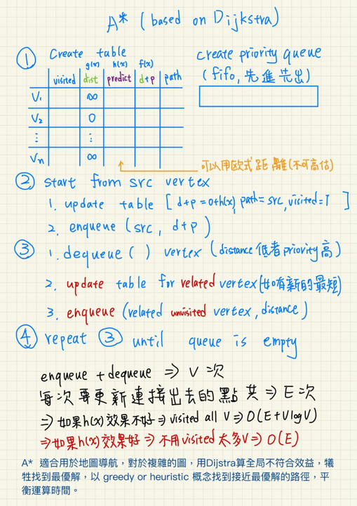

<div style="page-break-after: always;"></div>

[Shortest Path for weight graph (Bellman-Ford) (DP)](https://www.youtube.com/watch?v=YklWOOAR6rs)

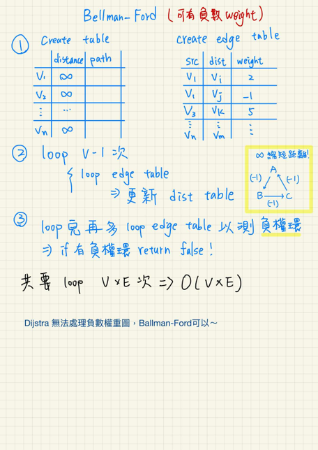

<div style="page-break-after: always;"></div>

[Shortest Path for weight graph (Floyd-Warshall) (DP)](https://www.youtube.com/watch?v=aSbdzpJh8VQ)

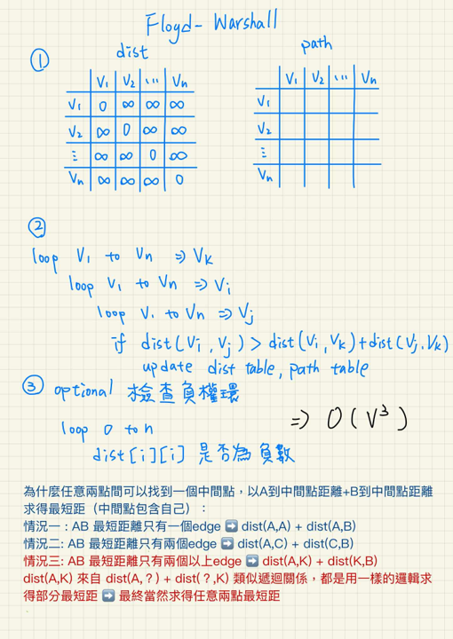

<div style="page-break-after: always;"></div>

[Topology sort for directed acyclic graph (Kahn) (Greedy)](https://www.youtube.com/watch?v=t_Ut2QPC6m0)

<center>
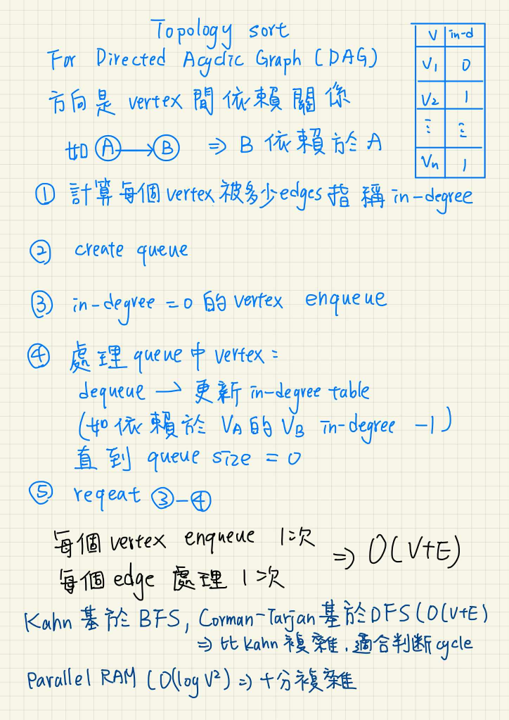
</center>

<div style="page-break-after: always;"></div>

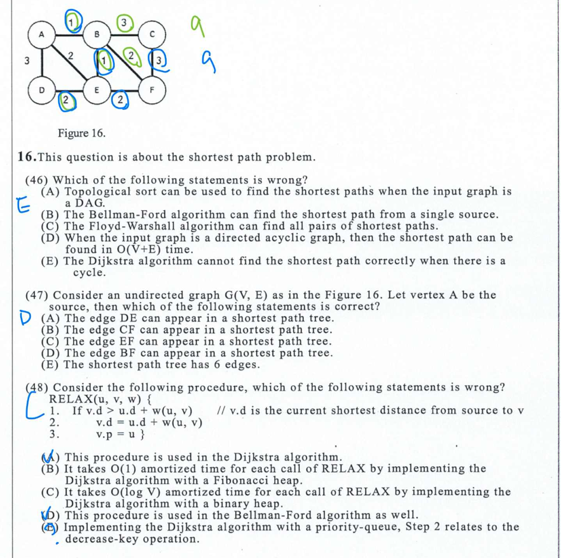

### 第46題
- Dijkstra 不能有負數 weight 、負權環否則無法收斂

### 第48題
- RELAX 操作是更新新的最短距離，對於 Dijkstra 要操作 RELAX 都是在取 min vertex in priority heap 後，檢查該 vertex 的 edge ，這些操作都是 O(1)。

<div style="page-break-after: always;"></div>

## 第17題 **Minimum Spanning Trees** (Greedy)

[樹的定義](https://www.youtube.com/watch?v=KsobpcI3dN0)

<center>
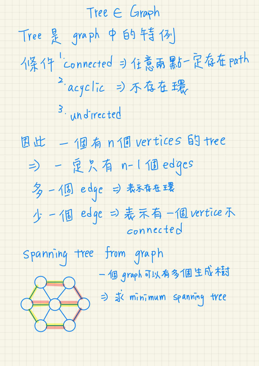
</center>

<div style="page-break-after: always;"></div>

[Minimum Spanning Trees (Prim)](https://www.youtube.com/watch?v=GLlIaT_PxVE)

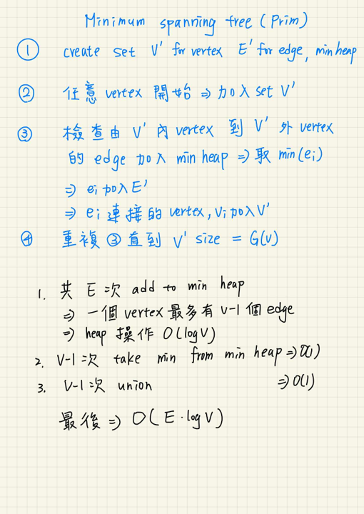

<div style="page-break-after: always;"></div>

[Minimum Spanning Trees (Kruskal)](https://www.youtube.com/watch?v=Z4jm4o2bt28)

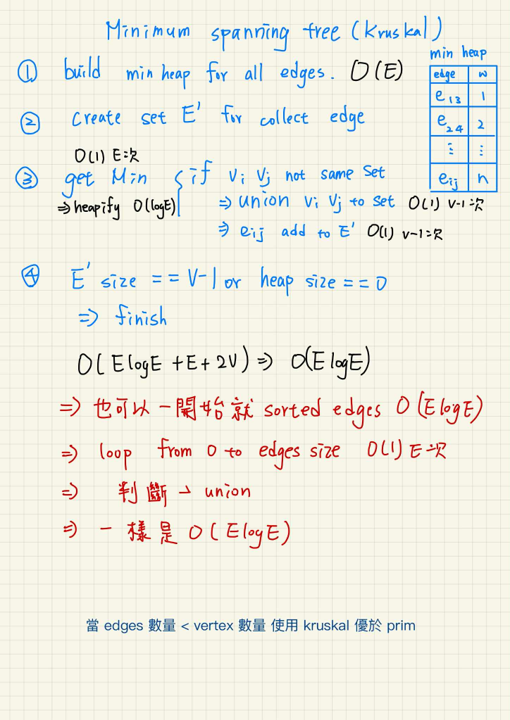

<div style="page-break-after: always;"></div>

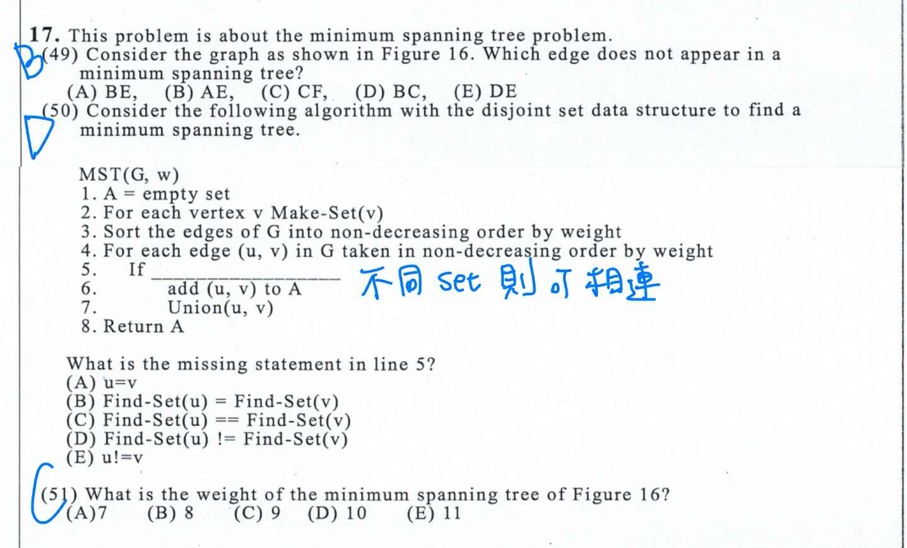

## 第18題 **Maximum Flow** (Greedy)

[flow 問題 naive 算法](https://www.youtube.com/watch?v=6DFWUgV5Osc)

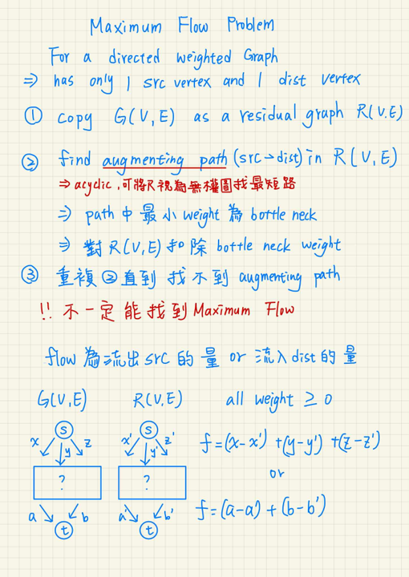

<div style="page-break-after: always;"></div>

[flow 問題 Ford-Fulkerson & Edmonds–Karp](https://www.youtube.com/watch?v=8sLON0DqLZo)

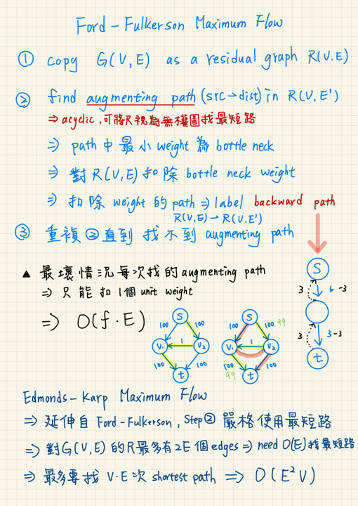

<div style="page-break-after: always;"></div>

[flow 問題 Dinic’s](https://www.youtube.com/watch?v=mtxzaGFLIAo)

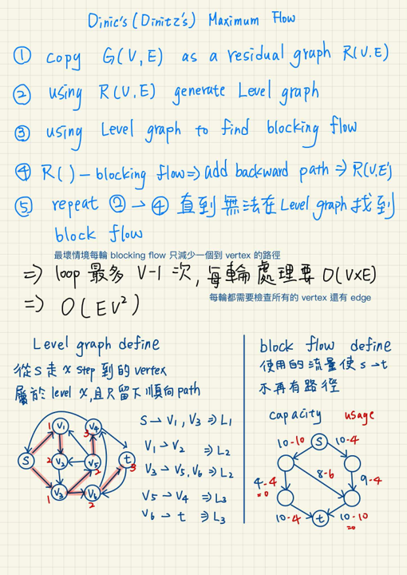

<div style="page-break-after: always;"></div>

[flow 問題 Min-Cut](https://www.youtube.com/watch?v=Ev_lFSIzNh4)

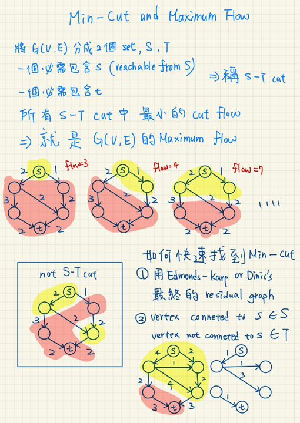

<div style="page-break-after: always;"></div>

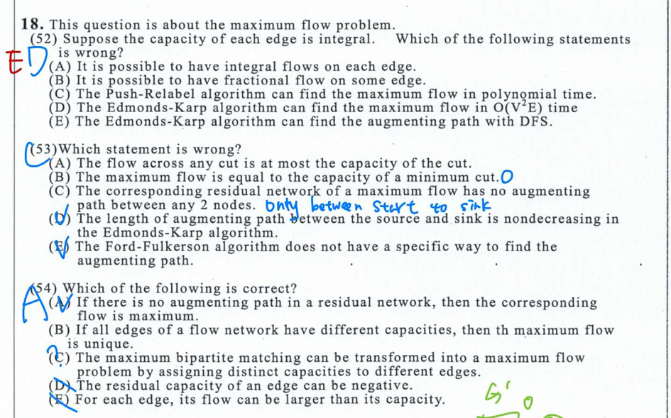

### 第52題

- d, e 應該都是錯的，Edmonds–Karp 強制用 shortest path 找 augmenting path 而 shortest path 會基於 BFS。

### 第53題

- src 跟 dist 之間不存在 augmenting path 才是結束條件，其他 node 之間可能還是存在 augmenting path。

### 第54題

- bipartite 是另一個算法下面來做補充

<div style="page-break-after: always;"></div>

- [Bipartite Graphs](https://www.youtube.com/watch?v=lyH43SAcyjc)

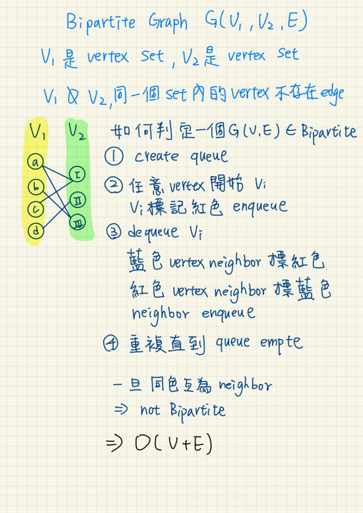

<div style="page-break-after: always;"></div>

- [Maximum-Cardinality Bipartite Matching](https://www.youtube.com/watch?v=cndaoZ6XTxA)

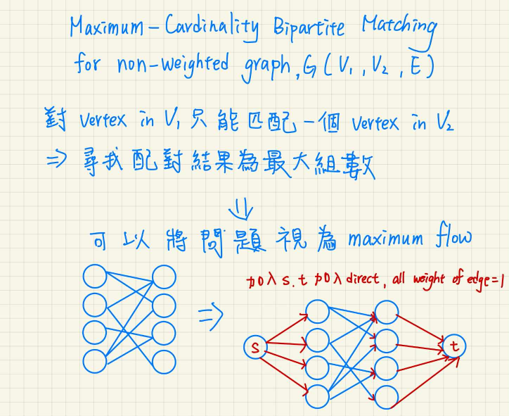

- [Maximum-Weight Bipartite Matching](https://www.youtube.com/watch?v=7yN_KZijerA)

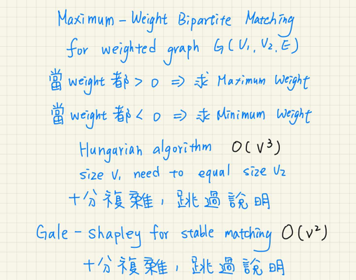

<div style="page-break-after: always;"></div>

## 第19題 **Dijkstra, Bellmen-Ford**


圖 A (G, w)，加入一個新的 vertex 跟多個 s 的edges 得到 G' , w, s，先用 Bellmen-Ford 檢查是否有負權環，沒有負權環可以繼續執行，Dijkstra 不能有負權環之外不能有負數權重，w’(u, v) 應該要 > 0 ，然後使用 Dijkstra 算出新的最短路徑。

### 第55題 

- A 是正確 D 就是跟 A 矛盾

### 第56題 

- Bellmen-Ford 需要 O(V*E) Dijkstra 需要 O( E + V²log V)

### 第57題 

- Dijkstra 不能檢查出負權環會無法收斂，錯誤或是無限迴圈，不可替換。

## 第20題 **P vs NP, NP complete, NP hard, SAT** 

- P vs NP

P 指的是 polynomial time ，對於演算法的時間複雜度用 O (input size)ᶜᵒⁿˢᵗᵃⁿᵗ 量級表示的都屬於 P 問題; 對於演算法的時間複雜度用 O (constant) ⁱⁿᵖᵘᵗ ˢⁱᶻᵉ 量級表示的都屬於 NP 問題。N 是指 Non-deterministic Turing machine。

deterministic Turing machine 是我們現代電腦的基礎， P 問題在 deterministic Turing machine 可以 polynomial time 時間計算完問題，NP 問題則無法。 ➞ P ≠ NP ??

Non-deterministic Turing machine 幾乎不可能存在但其概念比起 deterministic 可以視為擁有無限個處理器，因此 NP 問題在 Non-deterministic Turing machine 可以在 polynomial time 時間計算完問題。與此同時 P 問題在 Non-deterministic Turing machine 一定也可以在 polynomial time 時間計算完問題。➞ P = NP ??

這就是 P vs NP 問題，沒人可以證明 P ≠ NP 為真還是 P = NP~ 但是 P ∈ NP

舉例一個 NP 問題，給你一個數字為兩個質數的乘積 133 ，找到兩個質數 7 * 19 ，這個問題你只能把每個質數拿來對 133 除看看才能找到答案，如果質數的乘積非常大，可能要檢驗非常多次。但是如果你想檢驗答案卻非常快，只需要檢查是否可以整除這個操作卻是 P 問題。這個原理被用在 RSA 加密演算法~

<div style="page-break-after: always;"></div>

- 接下來都沒把握我完全正確

- NP complete
    - NP 問題中有一些問題是 NP 問題中最困難的，如果你可以解決最困難的表示其他 NP 問題也可以被解決 (Cook–Levin theorem)，你可以將問題 reduce 成該類問題，NP 問題中最困難的問題叫做 NP complete，reduce 操作可以在 polynomial time 內完成。NP complete ∈ NP

- NP hard
    - NP hard 是困難度 ≧ NP 問題的集合 ， NP complete = NP ∩ NP-hard

- SAT (Boolean satisfiability problem)
    - SAT 是什麼，是一個布林公式（用 AND、OR、NOT 組成），以硬幣問題為例，擲三個硬幣 → 八種組合，擲完
    - 結果是八種組合其中之一。那我的問題只想檢驗結果是不是 "正正反"，我只需要邏輯 硬幣一 ∧ 硬幣二 ∧ ¬硬幣三 就可以檢查結果。SAT ∈ NP complete ，所以根據 Cook–Levin theorem ，其他 NP 問題可以在 polynomial time 內 reduce NP 問題到 SAT (但是能 reduce 到 SAT 的問題不表示他是 SAT 問題)

- CNF, CLAUSE, LITERAL
    ```
        #多個子句用 AND 連起來
        CNF = (Clause1) AND (Clause2) AND ... AND (Clausen)
        #一組變數或變數的否定，用 OR 連起來
        Clause = (literal1 OR literal2 OR ...)
        #一組變數或變數的否定
        literal = x 或 ¬x
    ```
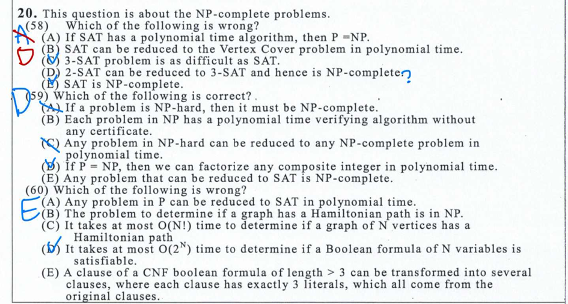

### 第58題 2-SAT 3-SAT

- 2-SAT 不屬於 NP complete ，可以 reduce 到 3-SAT，不代表屬於 NP complete!

### 第59題 

- (b) 實在很魔幻 without any certificate 應該是指沒給你驗證的答案，不知道答案你即使有 verifying algorithm 也無法檢驗答案。

### 第60題 

- 把多個and or 邏輯拆成 3 個變數一組不太可能不需要轉換變數的 x 或 ¬x ，可以去了解離散數學中布林邏輯的基本規則。

#### 補充 NP hard
NP hard 問題，我覺得很像腦筋急轉彎，鱷魚悖論就是一種 NP hard，"一位母親的孩子被一條鱷魚搶走了，這位母親救子心切，於是試著與鱷魚談判，希望能用任何條件換回她的孩子。鱷魚聽罷，便與她說：「如果妳答對我接下來提的問題，我就放了妳的孩子，如果妳答錯了，那妳的孩子可就小命不保了。」說完，鱷魚便問：「妳猜猜我是否會吃掉妳的孩子？」這位機智的母親思索了片刻，便回答鱷魚：「我猜您會吃掉我的孩子。」鱷魚沉思了一會兒，發現無論如何，自己推理中的分析句子與結果皆相矛盾，因此鱷魚陷入兩難，永遠無法履行自己的諾言。"