# 109 -Algorithm

## 第 1 題 Graph

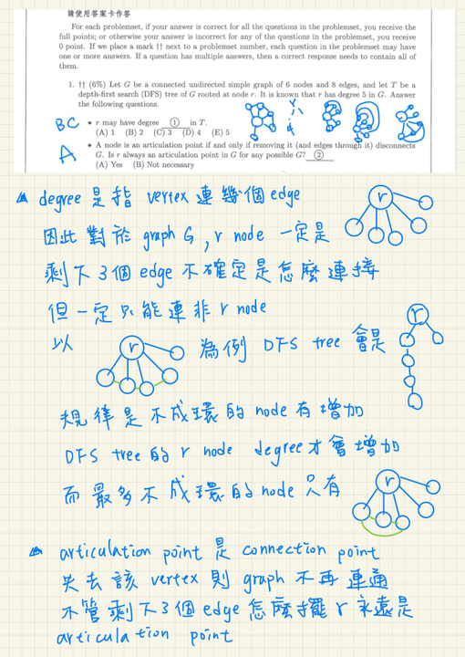

- Degree of a Vertex: 一個 vertex 的 degree 就是「跟這個頂點直接連的 edge 有幾條」。

## 第 2 題 Graph, Bipartite , NP 問題

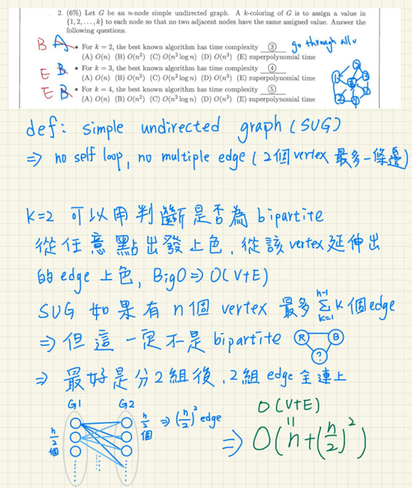

- bipartite 二分圖（也叫二部圖）
    - 是指可以把所有頂點分成兩個互不相交的集合（通常叫 U 和 V），而且圖中每一條邊都只連接 U 和 V 之間的頂點，同一個集合內的頂點之間沒有邊。 詳細可以參考過去筆記 105 年-Algorithm第 18 題

## 第 2 題 Graph, Bipartite , NP 問題

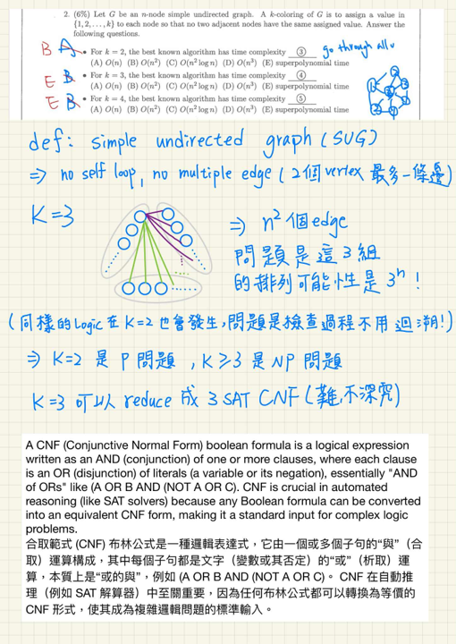

- 圖的上色問題，如果是上 3 個以上顏色都是 NP 問題，3 個顏色問題可以規約成 3 SAT 問題 ，我目前沒有很想花大量時間弄懂，但我有找到一個很不錯的解釋影片，[歡迎參考~](https://www.youtube.com/watch?v=JOZS9_ijZ7o)

## 第 3 題 **Hamiltonian cycle**

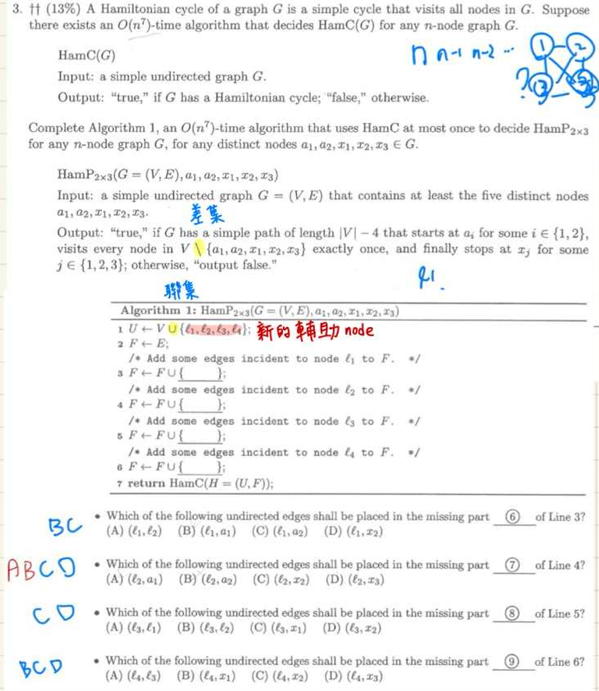

- Hamiltonian Cycle 
    - 是指一個 graph 中的一個 cycle ，它正好經過圖中每一個 vertex 一次且僅一次，最後回到起點。

這題難在讀懂問題 ，HamC 是一個判斷輸入的圖是否為 Hamiltonian Cycle 的函式，HamP 則是一個判斷輸入的圖是否存在符合條件路徑(如題)，利用HamC 完成 HamP 需要使用 4 個輔助 vertex ，使的 4 個輔助 vertex 加入圖 G 後 G (V, E) ∪ { 𝓁1, 𝓁2, 𝓁3, 𝓁4 , 與一些新 edge } 成為有 Hamiltonian Cycle 的圖。

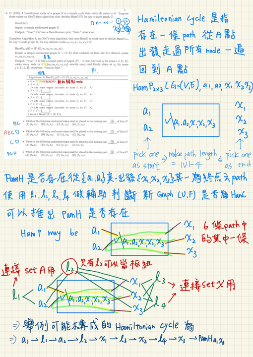

## 第 4 題 B-tree (m-way search tree)

- m-way 是指一個 node 可以有幾個 pointer 往下搜尋， m = 10 則一個 node 最多有 m-1 個 key ，而 B tree 是一種 self balance tree，當有 node 因為裝滿 key 而需要分裂時，分裂出來的 child node 至少有 m/2 個 pointer ，稱之為 minimum degree of a B - tree。

- B-Tree Rules
    - The data insertion follows the binary search tree rule (an in-order traversal produces a sorted result).
    - No leaf node can be empty.
    - The number M defines the maximum size of a B-Tree node.
    - When a B-Tree node reaches its maximum size and a new value needs to be inserted, the node is split and a new level may be created.
    - New data is always inserted into a leaf node first, then propagated (recursively) back up to the parent nodes if necessary.

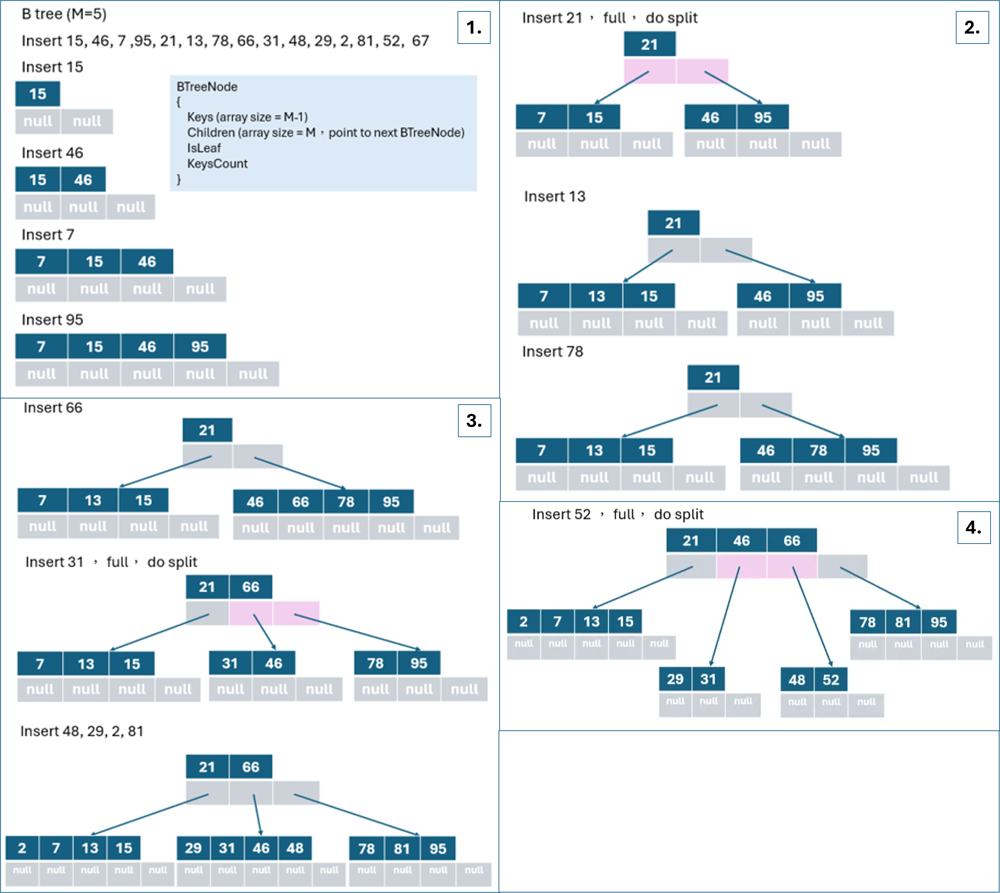

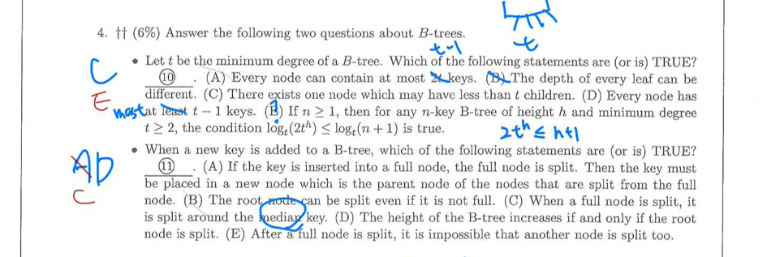

- every node 最多有 2t-1 keys

- every leaf node 高度相同

- 分裂時產生的 child node 會是 m/2 (就是 t) 個 pointer

- every node 至少一個 key

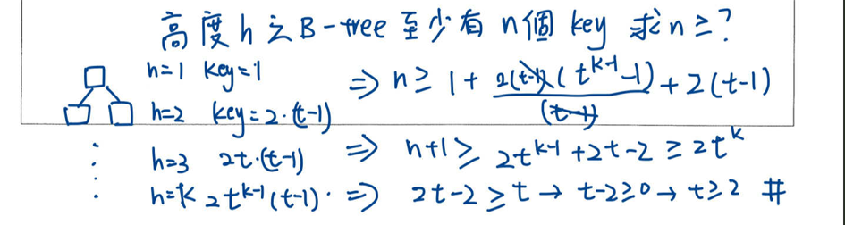

- 如果插入的node 已經滿 key 則需要將插入數字一起放進數列取出中位數最為新的 parent key

- 當發生 split 將 parent key 插入上層如果插入的上層也滿了就再往上 split

## 第 5 題 Minimum Spanning Trees

- 詳細可以參考過去筆記 105 年演算法第 17 題

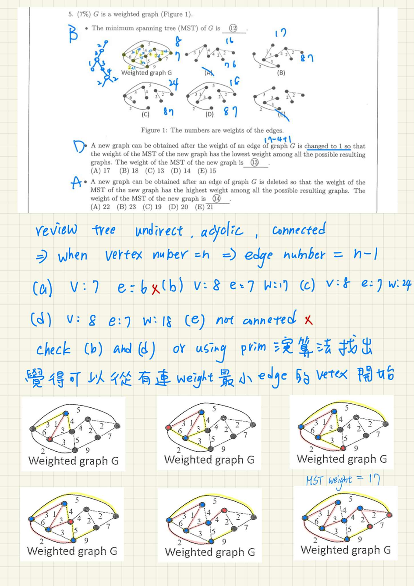

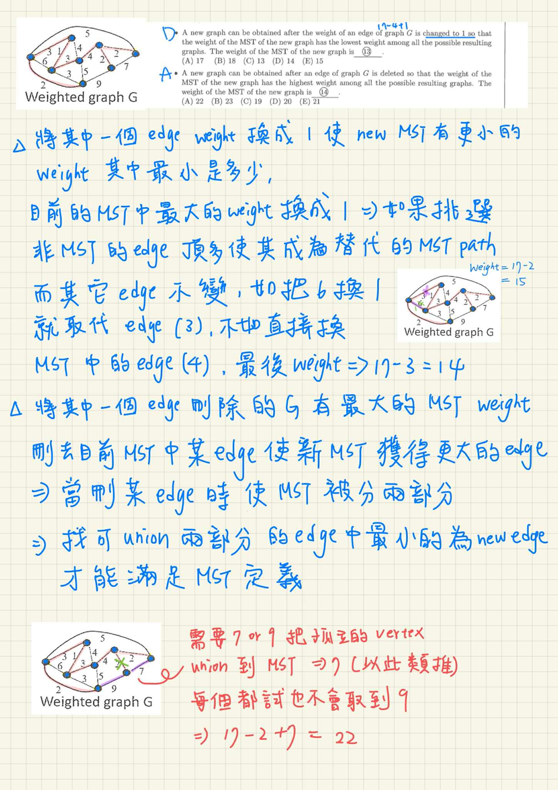

## 第 6 題 Graph Shortest path

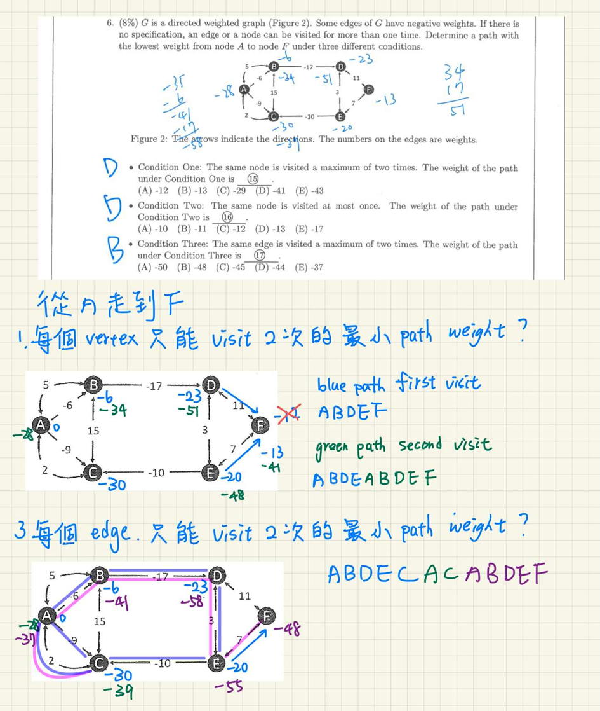

## 第 7 題 Union and find, Kruskal’s Algorithm

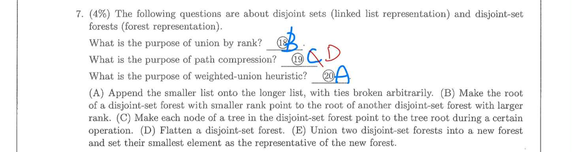

- Union by Rank
    - 隨意合併兩棵樹（例如總是將第二棵接在第一棵下面），可能會導致樹變得像一條長鏈（Linked List），使得 Find 操作的時間複雜度退化成 O(n) ⭢ 記錄每棵樹的 Rank（近似於樹的高度）。合併時，總是將 Rank 較小（較矮）的樹根，指向 Rank 較大（較高）的樹根。

- Path Compression
    - 即使有了 Union by Rank，樹還是可能會有一定高度 ⭢ 每次 Find 都要一層層往上爬在執行 Find(x) 的過程中，我們已經走訪了從 x 到根節點的路徑。我們順便將這條路徑上的所有節點，直接重新指向根節點。 (Gemini說 C 正確度大於 D ??? )

- Weighted-Union Heuristic
    - 在 Linked List 表示法中，如果要合併兩個集合，必須把其中一個 List 的所有元素之 head 指標更新為另一個 List 的代表。如果把長串列接到短串列後面，要更新的元素非常多。記錄每個 List 的長度（Weight）。合併時，總是將較短的 List 接到較長的 List 後面。

## 第 8 題 **Matrix Exponentiation**

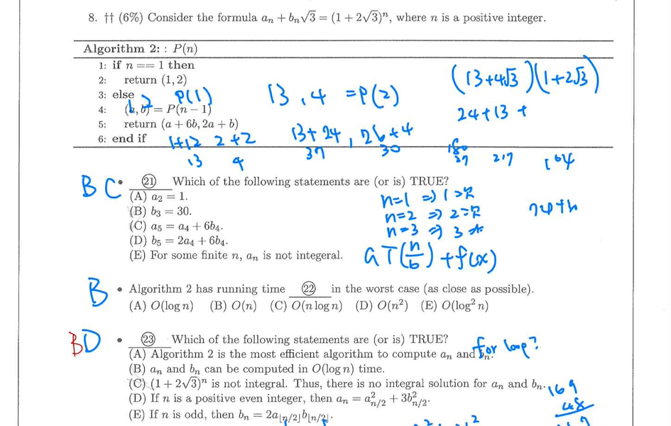

- 這題前兩小題可以簡單推出答案，但是關於 aₙ, bₙ 可以在 log n 內算出要用到，新學到的概念 Matrix Exponentiation ， aₙ, bₙ 其實可以寫成矩陣

`[ [1, 2]ᵀ, [6, 1]ᵀ ]ⁿ ⋅ [1, 2]ᵀ = [aₙ, bₙ]ᵀ`

 

- 所以 [ [1, 2]ᵀ, [6, 1]ᵀ ]² = [ [1, 2]ᵀ, [6, 1]ᵀ ] ⋅ [ [1, 2]ᵀ, [6, 1]ᵀ ] 這樣只要 n 是 2 的次方如 4, 8 , 16 都可以用 log n 次算完， 如果是非 2 的次方 5 可以拿 4 跟 1 做一樣可以快速得到結果。

## 第 9 題 **DP**

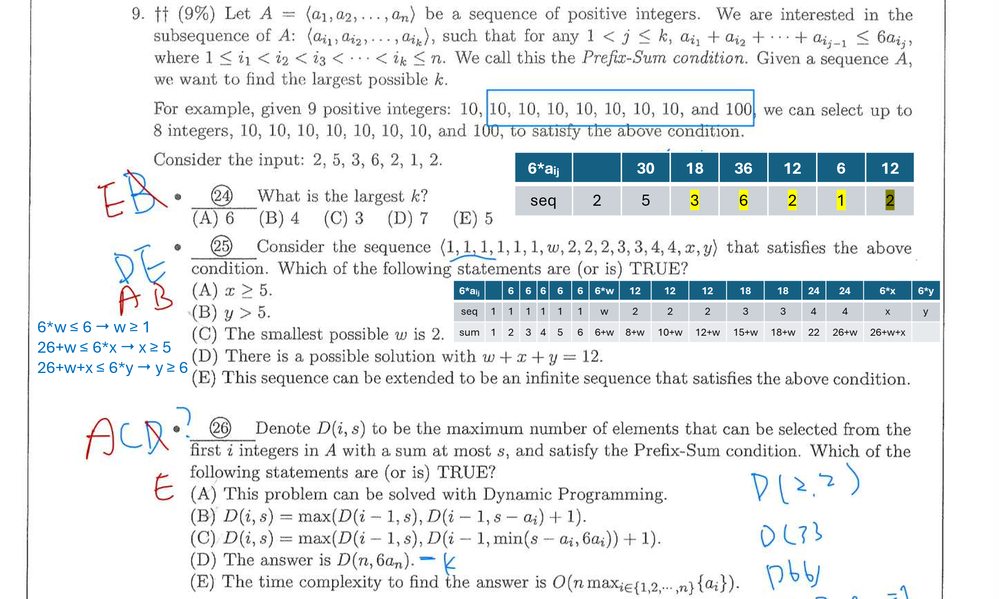

### 第 24 題

- 動態規劃逐一檢查，如圖中表格。

### 第 25 題

- 動態規劃逐一檢查，如圖中表格

### 第 26 題

- D(i, s) return sequence 中前 i 個 element 符合 prefix-sum 的最大數組數，

- 如 24 題來說 

| seq  | 2 | 5 | 3 | 6 | 2 | 1 | 2 |
|:----:|:-:|:-:|:-:|:-:|:-:|:-:|:-:|
| 6*ai |   | 30| 18| 36| 12| 6 | 12|
| sum  |   | 7 | 10| 16| 18| 19| 21|
|   s  |   | 7 | 10| 16| 12| 6 | 12|

- 以動態規劃來看，每個 D function 要參考前一項的結果才符合定義的功能， 如 D(7, 12) 就要參考 D(6, 6)， D(6, 6) 要參考 D(5, 12) = 4，所以 b,c,d 只有 c 是正確的函式

- 複雜度取決於總和 s 的範圍。最大總和是所有元素（ sum A ）的總和，而不僅僅是 max(aᵢ) 。因此複雜度是 O(n * sum A) 。(gemini 說 E 是錯誤的) (我不會已放棄)

## 第 10 題 Hash, Balance Tree

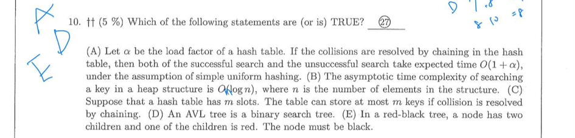

- load factor, a = n / m

- 算出 index 位置可以用 division method 或 Multiplication method 無論哪種都是 O(1)

- index 裡面裝的 chain 的長度其實就是 load factor (在理想狀態下，均勻地插入的話)，所以搜尋時間複雜度是 (O (1 + a))

- asymptotic (近似) 寫的時候看不懂這個字所以沒選，答案也沒有 B 但是我覺得這是對的。

- 使用 chaining 表示 m 個 entry 可以無限 chaining，最後 hash table 一定裝超過 m 個 element

- AVL tree 是一種自我平衡的 Binary Search Tree（BST）

- 紅黑樹性質之一：紅色節點不能有紅色子節點

## 第 11 題 Sort

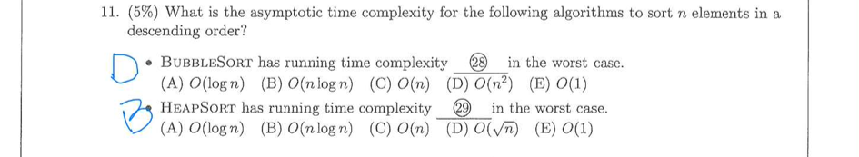

- 如圖

## 第 12 題 **Max-Flow**

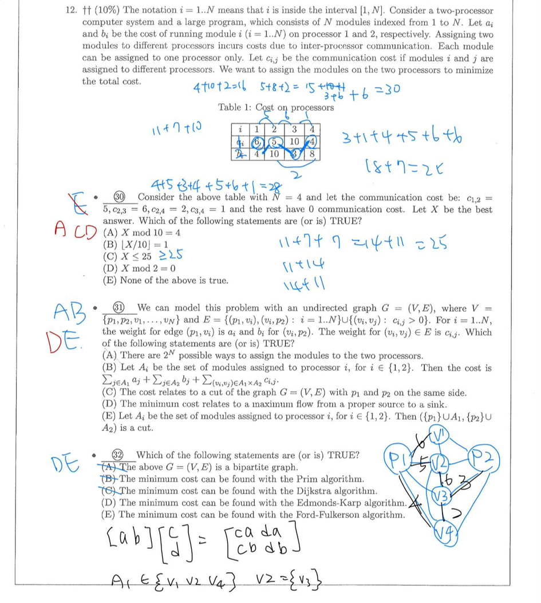

- 這個問題的標準解法是將其轉化為 最大流最小割 (Max-Flow Min-Cut) 問題， P1 跟 P2 將分別是起點終點，找出 min-cut 表示找到最小化 (執行成本 + 通訊成本)

- min-cut 不能將起點終點放在同一個 set

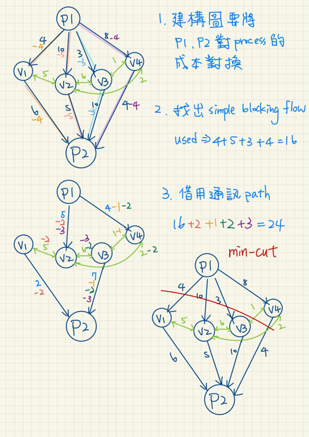

## 第 13 題 Tree traversal

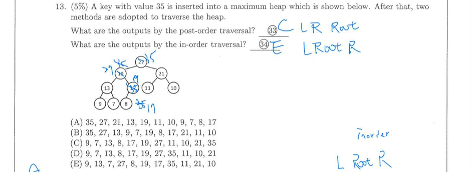

## 第 14 題 Tree

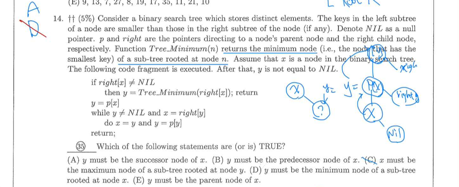

- successor：排序後「緊接在後」的那一個元素; predecessor：排序後「緊接在前」的那一個元素

- 第一部分：右子樹存在 y = 右子樹中最小節點

- 第二部分：右子樹不存在（向上尋找）

## 第 15 題 Circular linked list

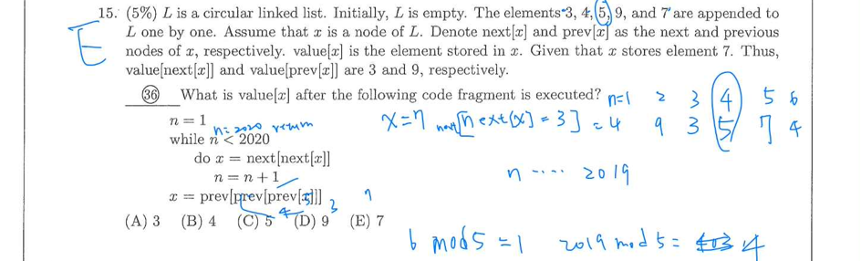

- 找規律 (n, element): (1, 4) ⭢ (2, 9) ⭢ (3, 3) ⭢(4, 5) ⭢(5, 7) ⭢ (6, 4) 重複了

- 2019 mod 5 = 4 相當於 n = 4 也就是指向數字 5

- 往前推 3 步， 5 ⭢ 4 ⭢ 3 ⭢ 7