# 111 -Algorithm

## 第 1-3 題 AVL Tree

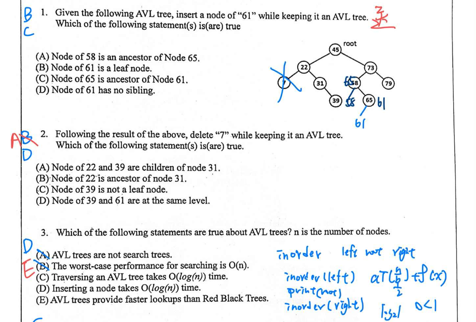 

### 第 1 題

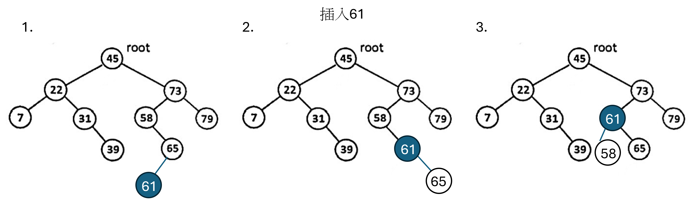 

### 第 2 題

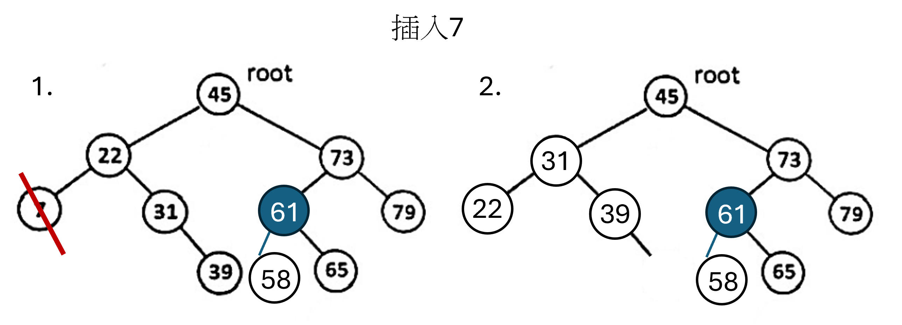 

### 第 3 題

- AVL 樹是「嚴格平衡」的。它規定任何節點的左右子樹高度差不能超過 1

- 紅黑樹是「大致平衡」的。它的平衡條件較寬鬆（最長路徑不超過最短路徑的兩倍）。因此，紅黑樹可能會長得稍微「高瘦」一點。

## 第 4 題 Minimum Spanning Trees (105 第 17 題)

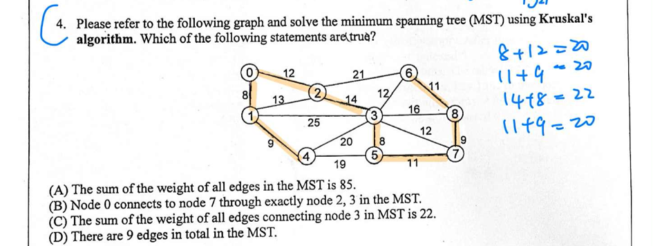 

- 不管是用 prim 還是 Kruskal 結果應該一樣!

- Prim: 
    - 從任一頂點出發，利用 Min-Priority Queue 維護「已選取頂點」對外連接的所有邊。
    - 每次從 PQ 彈出權重最小且連向「未加入頂點」的邊，將該點納入樹中，直到邊數達 $V-1$。
    - 每條邊最多進出 PQ 一次（$E$ 次操作），每次 PQ 調整為 $O(\log V)$，故總時間為 $O(E \log V)$。

- Kruskal: 
    - 將所有頂點視為獨立集合，並對全圖 Edge 權重進行排序。
    - 由小到大依序取邊，若邊的兩端屬於不同集合，則利用 Union-Find 進行合併，直到邊數達 $V-1$。
    - 主要成本在於排序 $E$ 條邊，時間為 $O(E \log E)$（或寫作 $O(E \log V)$）；Union-Find 操作在路徑壓縮下接近常數，可忽略不計。

## 第 5 題 Dijkstra (105 第 16 題)

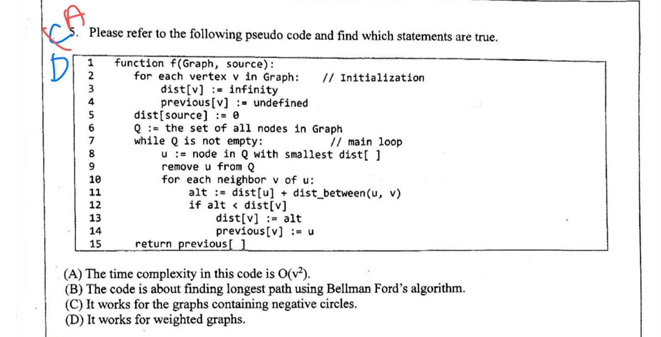 

- Dijkstra
    - 從起點出發，維護一個距離陣列，每次從「未處理頂點」中經由線性掃描選出距離最短的點。
    - 以該點為橋樑鬆弛 (Relax) 其所有鄰邊。因假設已選點即為最短路徑，故不適用於負邊。
    - 外迴圈 $V$ 次 $\times$ 尋找最小值 $V$ 次 + 鬆弛所有邊 $E$ 次，總計 $O(V^2 + E) = O(V^2)$

- Dijkstra (基於貪婪策略，每次選最近的點)，不是 Bellman-Ford (Bellman-Ford 會對所有邊進行 V-1 次更新最短距)。

- Dijkstra 的貪婪假設（已處理過的節點就是最短距離）會失效。若有負環或是負權邊，距離會無限縮小。

- 改用 Priority Queue (Min-Heap) 優化後，複雜度降到 $O((V+E) \log V)$ 
    - 但在演算法分析中，習慣簡化為 $O(E \log V)$，原因如下：
        1. 最短路徑問題時，我們通常假設圖是連通的 (Connected)
        2. 在連通圖中，邊的數量 $E$ 至少會是 $V - 1$。
        3. 既然 $E \ge V - 1$，那麼在 Big-O 的漸進分析中，$E$ 就 dominate 了 $V$。

## 第 6 題 DP, Greedy

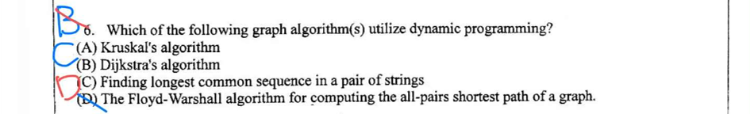 

- Kruskal’s algorithm 屬於 Greedy ，不需要解決重疊子問題，也不需要填表紀錄狀態，而是當下做出局部最佳選擇 (Local Optimum) 就能保證全域最佳 (Global Optimum)。

- Dijkstra’s algorithm 用了最佳子結構 (Optimal Substructure)，但其決策過程屬於 Greedy，而非 DP 的「填表與回溯」

- Finding Longest Common Subsequence (LCS) 屬於 Dynamic，重疊子問題 (Overlapping Subproblems)，狀態轉移

- The Floyd-Warshall algorithm 屬於 Dynamic，迭代中繼點 k (從 1 到 N) 來逐步建立解，完全依賴之前的計算結果，是標準的 DP。

## 第 7 題 Hash (105 第 11 題)

 
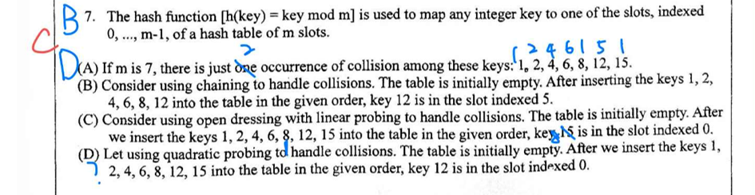 
 

- (c) Linear Probing (線性探測)。公式：(Hash(x) + i) 。遇到有人就往下一格找 (+1, +2, +3…) → [15, 1, 2, 8, 4, 12, 6]

## 第 8 題 Dijkstra (105 第 16 題)

 
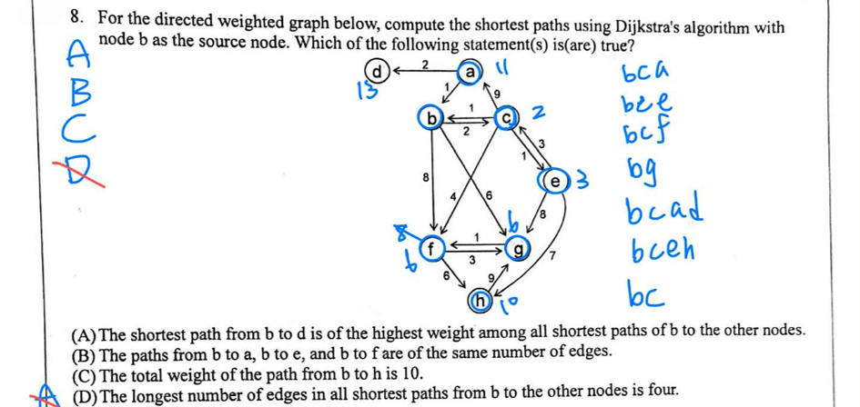 
 

- (d) 最多是 3 個 edge (b → c → a → d, b → c → e → h)

## 第 9 題 Red-Black Tree (105 第 5 題)

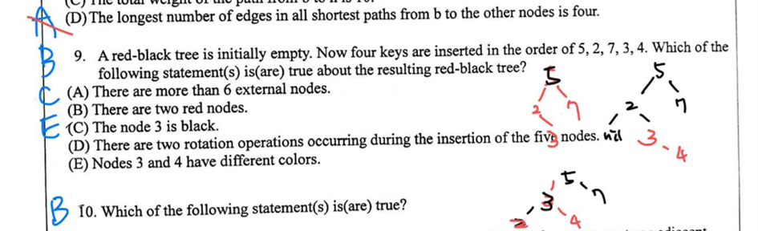 

- 5 個內部節點 (2,3,4,5,7)，所以外部節點數量是 5 + 1 = 6， more than 6 陳述不正確。

- More than x → > x, No less than x / At least x → ≥ x

## 第 10 題 Data Structure 

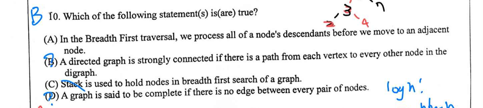 

- BFS (廣度優先)： 像水波紋擴散，先拜訪所有「鄰居」(Adjacent nodes, 距離為 1)，才去拜訪鄰居的鄰居 (Descendants, 距離為 2)。

- DFS (深度優先)： 是一條路走到黑，先拜訪「後代」(Descendants, 越深越好)，直到沒路才回頭拜訪旁邊的鄰居。

- Strongly Connected: 
    - 在一個有向圖中，對於每一對頂點 $(u, v)$，都存在從 $u$ 到 $v$ 的路徑，且存在從 $v$ 到 $u$ 的路徑。

- Connected:
    - 在一個有向圖中，如果忽略邊的方向（將有向邊視為無向邊）後，圖中的任兩點之間都有路徑相連。

- Complete graph (Kₙ)： 定義是「任意兩點之間都有一條邊相連」。邊數密度最高

- Null Graph / Empty Graph： 才是任意兩點之間都「沒有邊」

## 第 11 題 Time Complexity

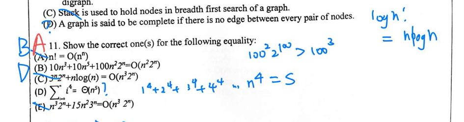

- n! ≤ nⁿ 因此 n! = O(nⁿ) 成立

- (d) 積分估計法：
$\sum_{i=1}^{n} i^k$ 的成長速度大約等於 $\int_{0}^{n} x^k dx = \frac{n^{k+1}}{k+1}$
    - $\sum i^2 \approx \frac{n^3}{3}$，所以它是 $\Theta(n^3)$。
    - $\sum i^4 \approx \frac{n^5}{5}$，所以它是 $\Theta(n^5)$。

## 第 12 題 Stack

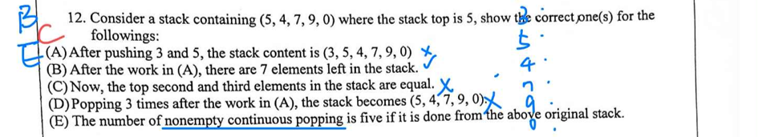

- (c) 目前的 Stack [ 5, 3, 5, 4, 7, 9, 0] !! 除非題目定義 “pushing 3 and 5” 是 “Push 5 then Push 3” 的倒裝句，那樣堆疊會變成 3, 5, 5…，此時第 2、3 個元素才會相等。但在沒有額外說明下，我們採用標準順序。 (by gemini pro)

## 第 13 題 Stack & Queue

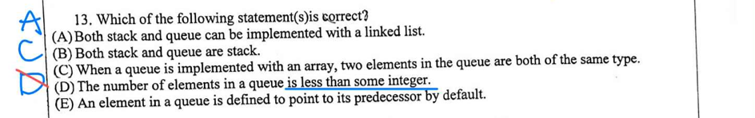

- (d) 正確 ，佇列的元素數量必為有限值。(by gemini pro)

- 記憶體有限： 無論是用陣列還是鏈結串列實作，電腦的記憶體 (RAM) 是有限的。有限集合： 任何時刻存在於記憶體中的佇列，其長度 N 必定是一個有限的整數。因此，一定存在一個整數 M (例如記憶體位元組總數或 MAX_INT)，使得 N < M。雖然在抽象數學上佇列可以無限長，但在「資料結構實作」的考題語境下，所有結構都是有限的 (Bounded)。

## 第 14 題 Stack

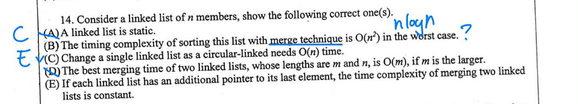

- (b) 不論是針對陣列還是鏈結串列，Merge Sort 的步驟都是：分割 (log n 層) to 合併 (每層 n 次比較)。最好、平均、最壞情況下都是 O(n log n)

- (d) 最佳策略應為 O(min(m, n))

## 第 15 題 List

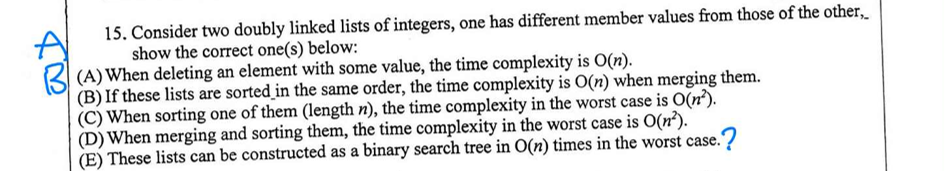

- (c) 鏈結串列的最佳排序演算法是 Merge Sort ，時間複雜度 O(n log n)

- (d) 兩個串列串接 O(1) 或 O(n) 然後做 Merge Sort

- (e) **要建立一個二元搜尋樹 (BST)，本質上等於對資料進行排序。未排序資料： 要從 list 取 n 次數字到 BST ，如果剛好 BST 退化成 list 每次插入要走 i 次 ( ∑ i) 所以最差需要 O(n²) 次; 已排序資料: 可以從 n/2 處往前往後遞迴處理每個 non leaf node，最多需要 O(n) 次**

## 第 16 題 **List**

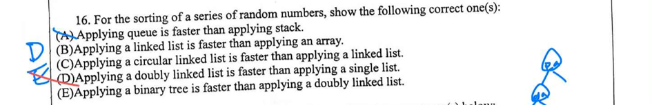

- (a) Queue 和 Stack 本身並不是為了排序設計的，用兩個 Stack 排序：類似河內塔搬移，複雜度 O(n²); 用 Queue 排序：通常聯想到 基數排序 (Radix Sort)，這是 O(nk) 的線性時間排序，確實比比較排序快。雖然 Radix Sort 用 Queue，但題目說是 “random numbers” 且沒有限定整數，通常預設討論比較排序。且這不是一個通用的定理，選項過於模糊。

- (b) Array： 支援 隨機存取 (Random Access)，可以使用像 Quick Sort 或 Heap Sort 這樣高效的演算法，平均複雜度 O(n log n)。且陣列記憶體連續，Cache Hit rate 高。

- (b) Linked List： 只能 循序存取 (Sequential Access)，通常只能用 Merge Sort，雖然也是 O(n log n)，但因為指針跳躍 (Pointer Chasing) 和 Cache Miss，常數時間 (Constant factor) 較大，實際執行通常比陣列慢。

- (c) Circular Linked List: 只是把尾巴接回頭，對於「排序」這個動作來說，時間複雜度沒有改變。

- (d) Doubly Linked List: 雖然可以雙向移動，但在排序演算法（如 Merge Sort）中，單向鏈結串列已經足夠做到 O(n log n)。雙向鏈結反而因為要維護兩個指標 (prev/next)，寫入成本較高。

- (e) 這邊的比較通常是指「將資料逐一插入資料結構以維持排序」的過程
答案應該是 (e) ，而 D(d) 敘述可能是錯誤的!

## 第 17 題 **List, BST**

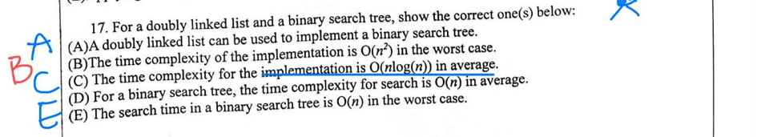

- (b) 要建立一個二元搜尋樹 (BST)，本質上等於對資料進行排序。未排序資料： 要從 list 取 n 次數字到 BST ，如果剛好 BST 退化成 list 每次插入要走 i 次 ( ∑ i) 所以最差需要 O(n²) 

- (c) 要建立一個二元搜尋樹 (BST)，本質上等於對資料進行排序。未排序資料： 要從 list 取 n 次數字到 BST ，如果剛好輸入資料是隨機排列插入一個節點平均需要 O(log n) ，需要操作 n 次 ⭢ O(n log n)

## 第 18 題 BST

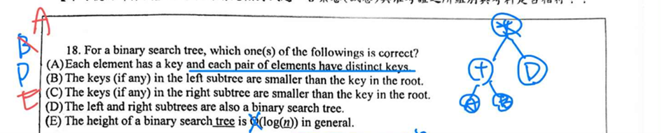

- (a) Each element has a key ⭢ 樹裡面的每一個 Node 都帶有一個數值，我們稱之為 Key

- (a) Each pair of elements have distinct keys ⭢ 隨便從樹裡面抓出兩個不同的節點都是不一樣 Key ⭢ 代表整棵樹裡面沒有重複的數字

- (b) ✔ (c) ✖ (d) ✔

- (e) 平衡樹才能保證高度 O(log n) (理論上陳述錯在這邊)

## 第 19 題 Prefix, Postfix, Infix Expression

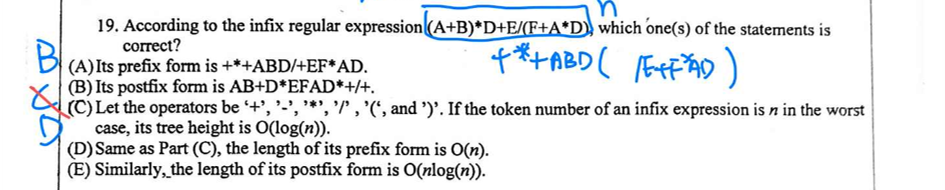

- Prefix, Postfix 表示法其實規律在於用 Infix 表示法建立一個 Expression Tree 如題目最終建立的 tree 會如下
```
          + (Root)
       /     \
      *       '/'
     / \     / \
    +   D   E   +
   / \         / \
  A   B       F   *
                 / \
                A   D
```
- (a) prefix 用 pre-order travers: +*+ABD/E+F*AD

- (b) postfix 用 p-order travers: AB+D*EFAD*+/+

- (c) Worst Case (歪斜時)： 如果運算式是 A + B + C + D + E ...，由於通常是「左結合 (Left Associative)」，樹會向左歪斜長成一條線，高度O(n)

- (e) 最多 O(n)

## 第 20 題 Heap

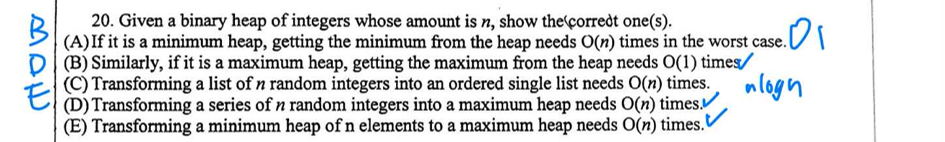

- (a) O(1)

- (c) O(n log n)

## 第 21 題 **Master Theorem**

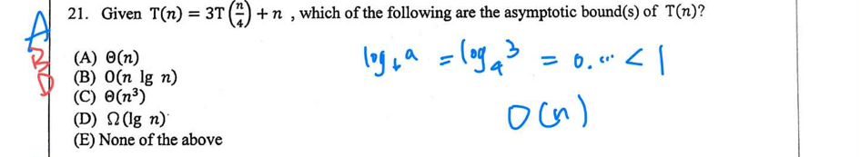

- 3T(n/4) 是分成 sub-problem 處理成本; n 是將 sub-problem 合併成本

- master theorem 用 logᵦ a 跟 n 的次方比大小看誰是量級決定因素

- log₄3 < 1 所以時間複雜度逼近 Θ(n)

- O 表示上界 n lg n > n 所以正確

- Ω 表示下界 lg n < n 所以正確

```
1. Big O 
    - f(n) = O(g(n))
    - 演算法執行時間 at most (≤) g(n)

2. Omega 
    - f(n) = Ω(g(n))
    - 演算法執行時間 at least (≥) g(n)
    - bubble sort Ω(n)

3. Theta
    - f(n) = Θ(g(n))
    - 演算法執行時間 exactly (=) g(n)
    - 同時滿足 Big O, Omega 
```

## 第 22 題 Recursive

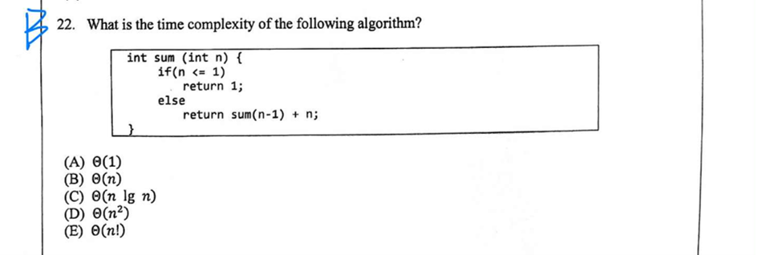

- 輸入 n 遞迴 n 次，遞迴操作成本 O(1)

## 第 23 題 Insertion Sort

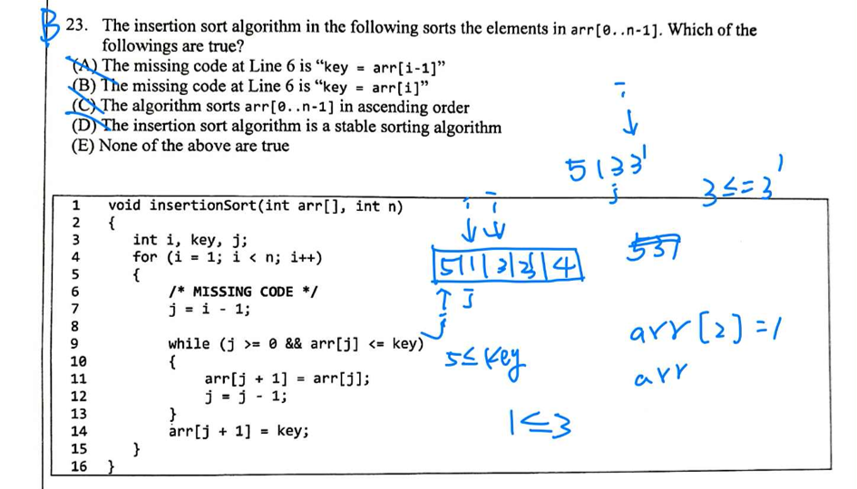

- (b) 正確 (a) 錯誤，arr[i-1] 是前一個已經排好的元素

- (c) 降序排序 (Descending Order，由大到小)

- (d) 陣列是 [3a, 3b]使用此演算法變成 [3b, 3a] **不穩定 (Unstable)**

## 第 24 題 Max Heap

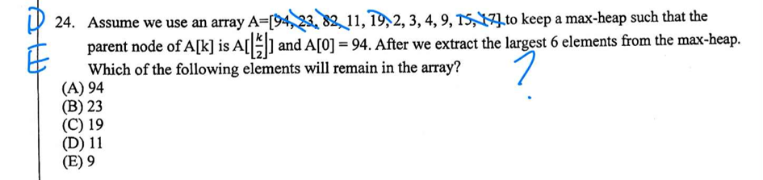

- 簡單到我以為有陷阱，真的是刪掉 6 個最大的數。

## 第 25 題 Sort

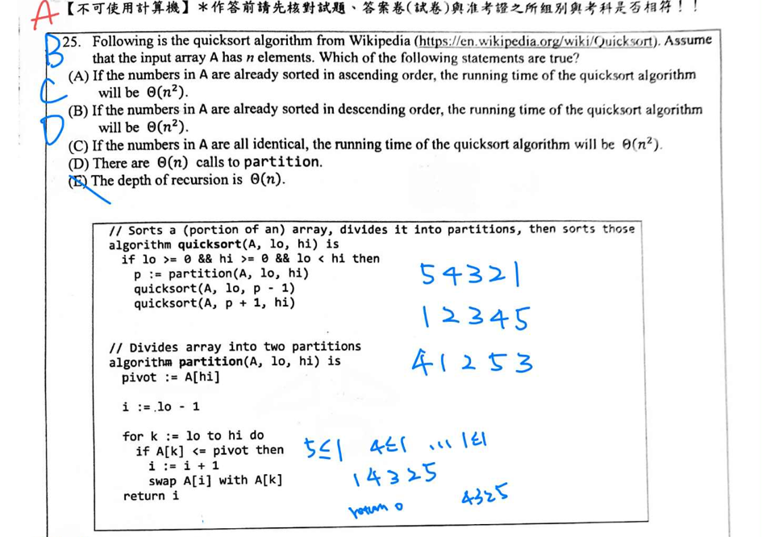

- (a, b, c) 只要輸入是 sorted 都會導致原地交換，使操作變成 n² 次

- (e) 遞迴深度是 Θ(log n)

## 第 26 題 Hash (105 第 11 題)

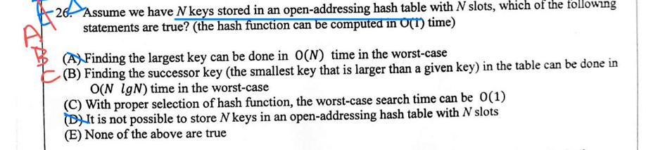

- (a) 如果放滿 n 個都剛好是發生 collision 的結果，就需要一個一個查找

- (b) 找後繼者 (Successor) 在無序陣列中，可以透過遍歷一次 (O(N)) 來找到「比目標大的最小值」。O(N lg N) > O(N) 不精確的正確?

- (c) 最差仍是剛好發生 collision 還是 O(N)

## 第 27 題 Hash (105 第 11 題)

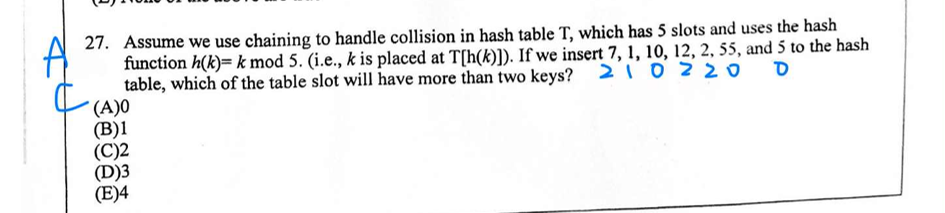

- mod 餘數一樣的會發生 collision

## 第 28 題 Tree

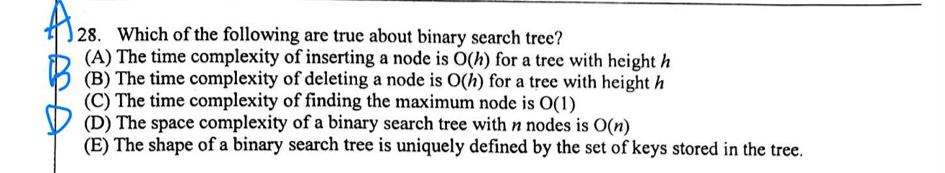

- (c) 最右邊最底部的 node 是最大值，高度約為 h，O(h)

- (e) 給定同一組鍵值 (Set of Keys)，可以畫出很多種不同形狀的 BST

## 第 29 題 Tree

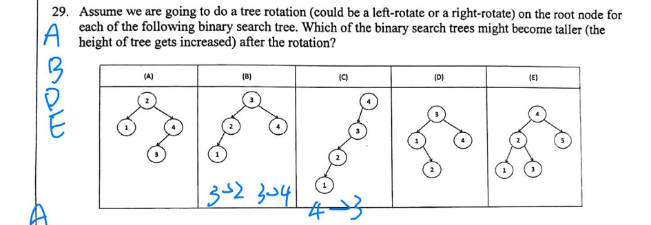

- 簡單到我以為有陷阱，真的是單純的轉樹。

## 第 30 題 Tree

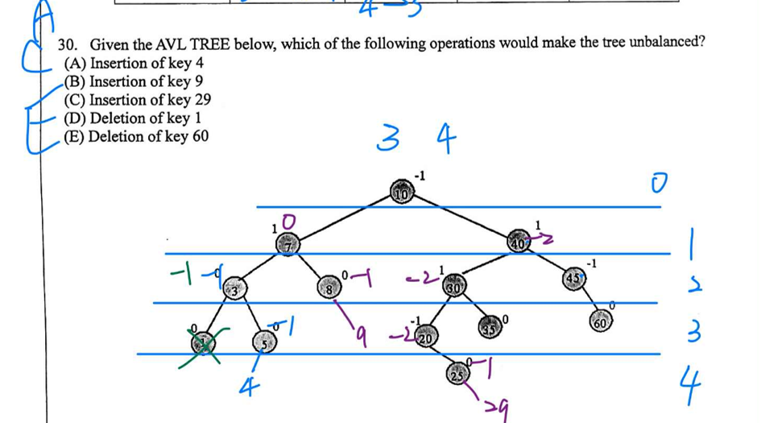

- 操作後任意節點的，兩個child 層數相差 > 1 是不平衡的

## 第 31 題 **Fractional Knapsack, 0–1 Knapsack**

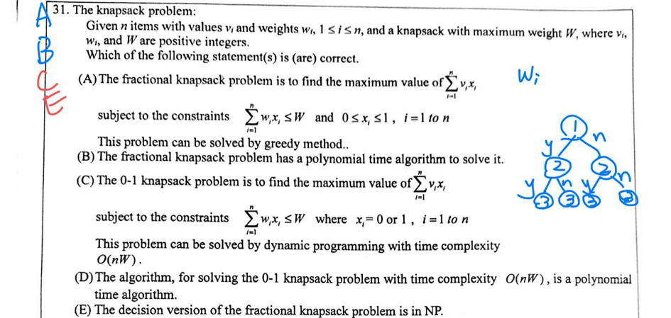

- (a) Fractional Knapsack 物品可切分，用貪婪演算法，將目標物換算分數單位重量價值高者優先取，直到重量達到限制。

- (b) 將 n 個物品依照 vᵢ / wᵢ 排序的時間複雜度 O(n log n)，隨後的遍歷選取過程是 O(n)

- (c) 0–1 knapsack 物品不可切分必須使用動態規劃，需要建立一張 n*W 大小的表格逐一放入檢查建表，最後用表反推結果，參考教學

- (d) 不知道該怎麼解釋，記得 O(nW) 是偽多項式時間 (Pseudo-Polynomial Time)

- (e) P ⊆ NP

- decision tree 版本 要花 O(2ⁿ) ! DP 是更好的方法!!

## 第 32 題 Shortest Path (105 第 16 題)

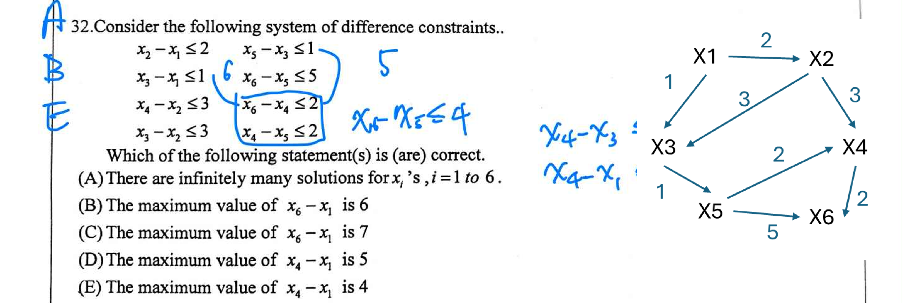

- xⱼ— xᵢ ≤ w 都可以看作圖形中的一條 有向邊 (Edge)，從 i 到 j 的最短路徑長度，就是 xⱼ — xᵢ 的最大值

## 第 33 題 Minimum Spanning Trees (105 第 17 題)

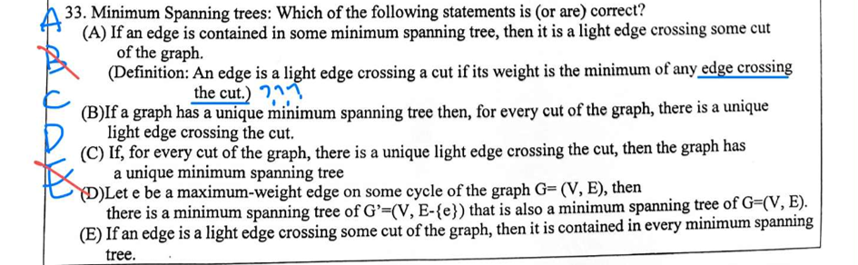

- (a) 假設邊 (u, v) 存在於某個 MST 中，如果我們將 (u, v) 從 MST 中移除，樹會斷成兩個連通分量 (Components)，設為 V1 和 V2。這定義了一個切割 (Cut)。⭢(u, v) 必定是跨越這個切割的所有邊當中，權重最小的 (Light Edge)

- (b) Cut 可能跨越權重相同兩條 edges ，假設都是最小權重，那麼就不存在只切 unique 最小權重 edge。

- (c) 如果對於圖中的 **每一個** 切割，都只有唯一的一條最輕邊，那麼組出來的 MST 自然也是唯一的

- (d) Cycle Property 指出：對於任意迴圈，權重最大的邊 e **不一定** 會被選入 MST (如果它是嚴格最大，則一定不選；如果有多個最大，則至少有一個 MST 不選它)。⭢這意味著，我們總是能找到一個 **不包含** e 的 MST，設為 T。⭢ 既然 T 不包含 e，那麼 T 自然也是子圖 G’ = (V, E — {e}) 的生成樹。

- (e) “If an edge is a **UNIQUE** light edge crossing some cut, then it is contained in every MST.” 這樣才對，如果一個切割有 多條 同樣權重的 Light Edges (例如權重都是 5)，MST 只需要選其中一條來連接即可，不一定要全選。

## 第 34 題 Maximum Flow (105 第 18 題)

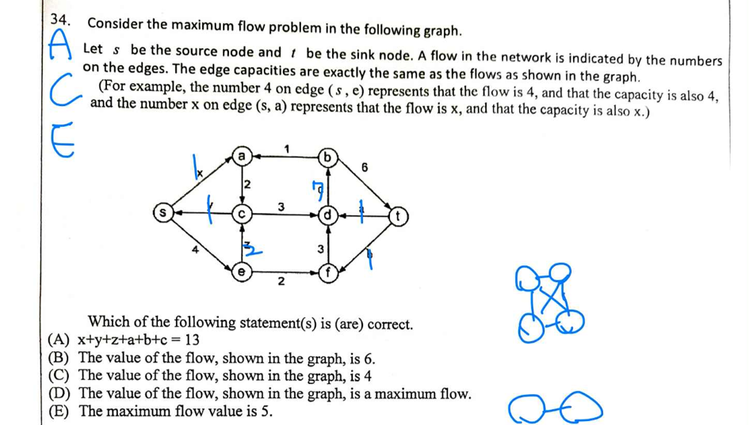

- 每個 vertex 流入流出應該相同 如 b 點 流出 7 推得未知數 c = 7，以此類推解出所有未知數

## 第 35 題 Graph

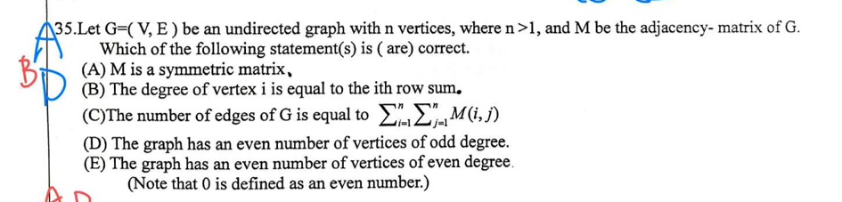

- 在矩陣的第 i 列 (Row) 中，若 Mij=1，代表有一條邊連接 i 和 j。

- 邊數應為 1/2 ∑ ∑ M(i, j)，有一半是重複的

- 握手定理 (Handshaking Lemma): 
    - 所有頂點的分度總和 = 邊數的 2 倍 ∑deg(v) = 2|E| (一定是偶數) ⭢
    - 分度總和 = (奇數分度的總和) + (偶數分度的總和)。⭢
    - 因為「偶數分度的總和」一定是偶數，所以「奇數分度的總和」也必須是 偶數。

## 第 36 題 P vs NP (105 第 20 題)

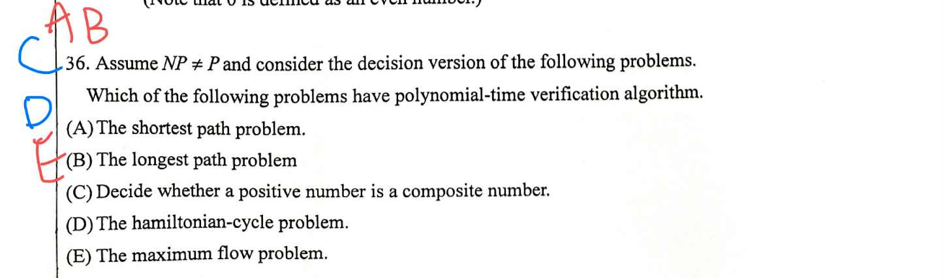

下列哪些問題擁有『多項式時間驗證演算法 (Polynomial-time verification algorithm)』?

- 所有的 P 問題都是 NP 問題

- NP 問題都可以多項式時間驗證演算法 (Polynomial-time verification algorithm)

- 所以以上演算法都符合

- P 問題: 
    - The shortest path problem
    - The maximum flow problem 

- NP-Complete: 
    - The longest path problem
    - The hamiltonian-cycle problem

- **Decide whether a positive number is a composite number(隨著 AKS 質數測試演算法的發現，此問題已被證明屬於 P，但它依然屬於 NP。)**

## 第 37 題 P vs NP (105 第 20 題)

 
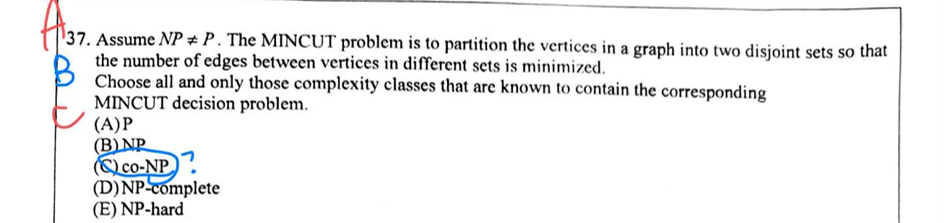
 

- Class P: 所有能在多項式時間內 解決 (Solve) 的問題。

- Class NP: 所有能在多項式時間內 驗證 (Verify) 解的問題。

- **Class co-NP: 所有能在多項式時間內驗證「No」實例的問題**

- Class NP-Complete: NP 中最難的問題。

- Class NP-Hard: 至少跟 NP-Complete 一樣難。

## 第 38 題 P vs NP (105 第 20 題)

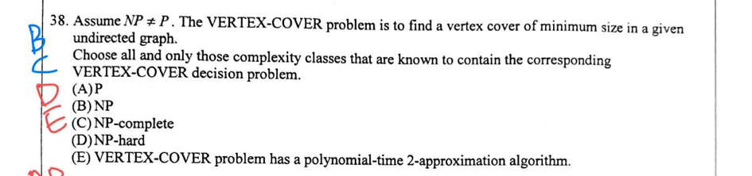

- **Vertex Cover 問題**： 
    - 給定一個無向圖 G=(V, E) 和整數 k，是否存在一個頂點集合 S ⊆ V，使得 |S| ≤ k，且圖中的每一條邊都至少有一個端點在 S 中？

- Vertex Cover 是經典的 NP-Complete 問題。它可以由 3-SAT 或 Clique 問題歸約而來。

- 如果一個問題至少跟 NP 中最難的問題一樣難（即所有的 NP 問題都可以歸約到它），它就是 NP-hard。

- 存在一個非常簡單的貪婪演算法（Matching-based approach）：
    1. 隨便選一條邊 (u, v)。
    2. 將 u 和 v 兩個點都加入覆蓋集 S。
    3. 將與 u, v 相連的所有邊從圖中移除。
    4. 重複上述步驟直到圖中沒有邊為止

## 第 39 題 Algorithm

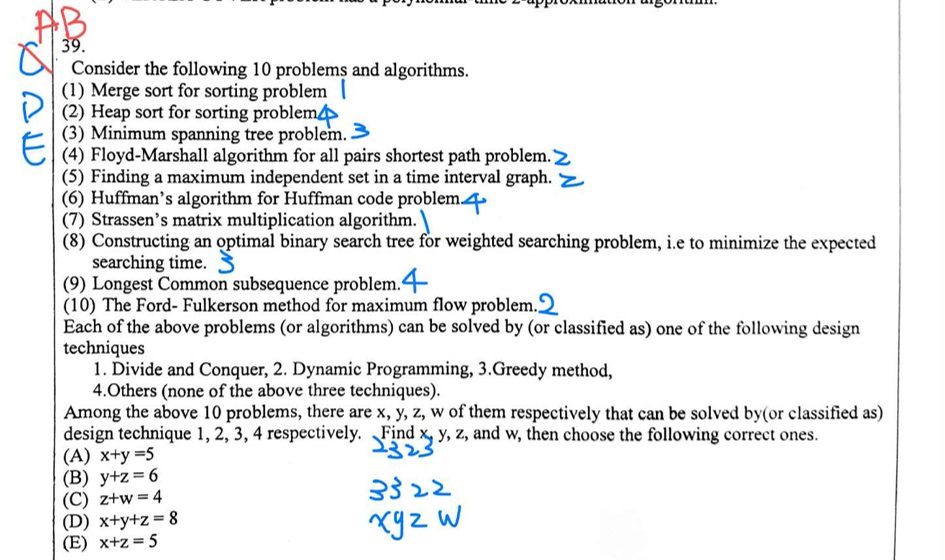

- Divide and Conquer
    1. Merge sort
    2. **Strassen’s matrix multiplication**

- DP
    1. Floyd-Warshall algorithm
    2. **Constructing an optimal binary search tree**
    3. Longest Common Subsequence\

- Greedy 
    1. Minimum spanning tree
    2. **Finding a maximum independent set in a time interval graph**
    3. Huffman’s algorithm

- **Others**
    1. Heap sort
    2. The Ford-Fulkerson method(Iterative Improvement)

## 第 40 題 P vs NP (105 第 20 題)

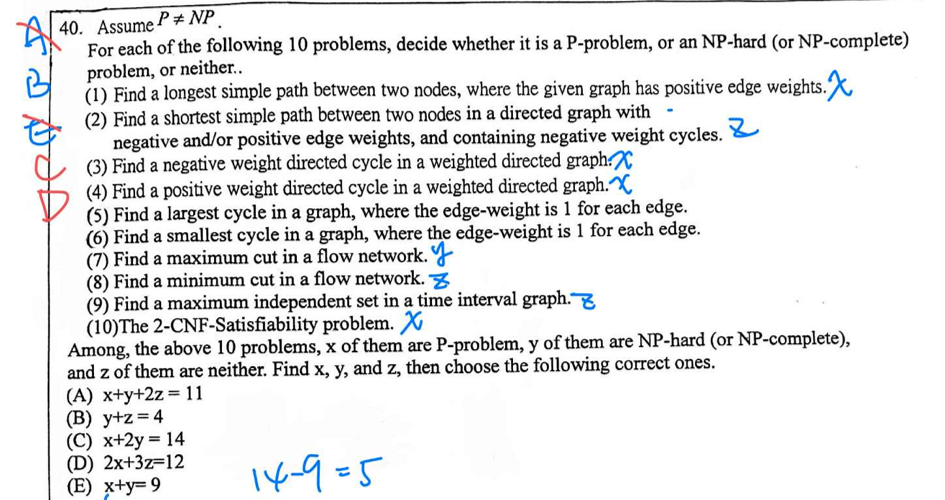

- P:
    - (3) Find a negative weight directed cycle in a weighted directed graph.
    - (4) Find a positive weight directed cycle in a weighted directed graph.
    - (6) Find a smallest cycle in a graph, where the edge-weight is 1 for each edge.
    - (8) Find a minimum cut in a flow network.
    - (9) Find a maximum independent set in a time interval graph.
    - (10)The 2-CNF-Satisfiability problem.

- NP-hard:
    - (1) Find alongest Simple path between two nodes, Where the given graph has positive edge weights.
    - (2) Find a shortest simple path between two nodes in a directed graph with negative and/or positive edge weights, and containing negative weight cycles.
    - (5) Find a largest cycle in a graph, where the edge-weight is 1 for each edge.
    - (7) Find a maximum cut in a flow network.
