<style>
b, strong {
  /* font-weight: 800; */
  font-size: 20px;
}
.tight-list li > p {
  margin: 0 0;
  line-height: 1.2;
}
.tight-h3 h3 {
    margin: 0 0;
}

.tight-h2 h2 {
    margin: 0 0;
}

.tight-p p {
    margin: 0 0;
}

</style>

# 113 -Algorithm (113 年的考題是惡魔)

## 第 1-3 題 Queue, Linked List

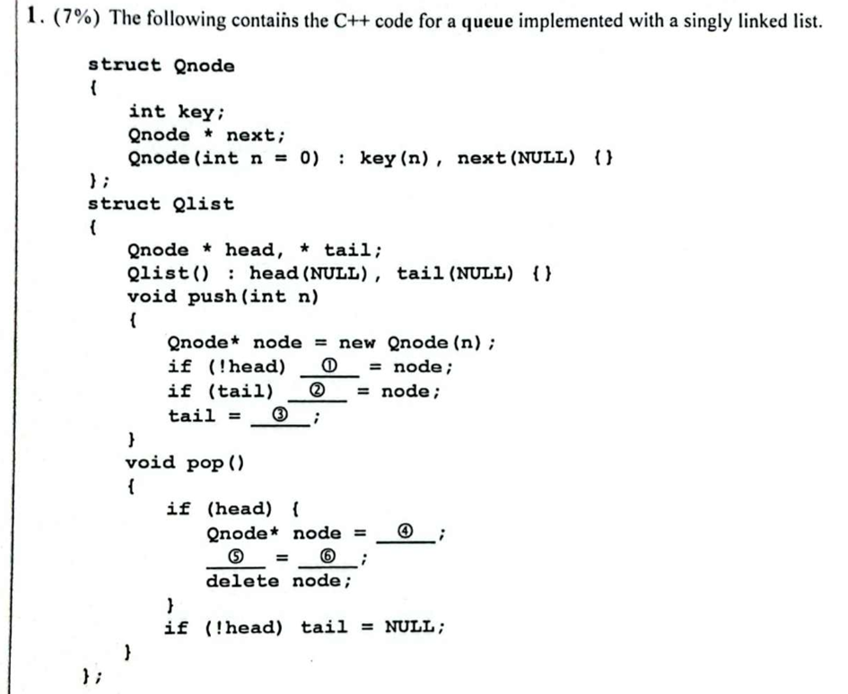

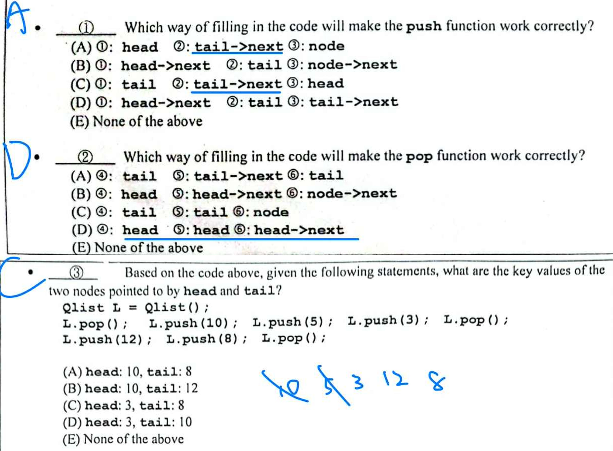 


- 這是 Singly Linked List 建構的 Queue (FIFO)

- `push` 函式
    -建立節點：`Qnode* node = new Qnode(n);` 產生一個新節點。
    - 處理空佇列 (①)： 如果 `head` 為空（`!head`），代表這是第一個進入佇列的節點，所以 head 必須指向它。 ⮕ ① = `head`
    - 連接新節點 (②)： 如果 `tail` 已經存在，我們需要讓目前的最後一個節點指向新節點。 ⮕ ② = `tail->next`
    - 更新尾端指標 (③)： 最後，將 `tail` 指標移到最新的節點上。 ⮕ ③ = `node`

- `pop` 函式
    - 檢查佇列是否為空：`if (head)` 確保有東西可以刪除。
    - 暫存待刪除節點 (④)： 為了在移動指標後還能釋放記憶體，先用一個指標指向目前的 head。 ⮕ ④ = `head`
    - 移動前端指標 (⑤, ⑥)： 將 `head` 指標移向下一個節點。 ⮕ ⑤ = `head`，⑥ = `head->next`
    - 釋放記憶體：`delete node;`


## 第 4-6 題 Quick Sort.

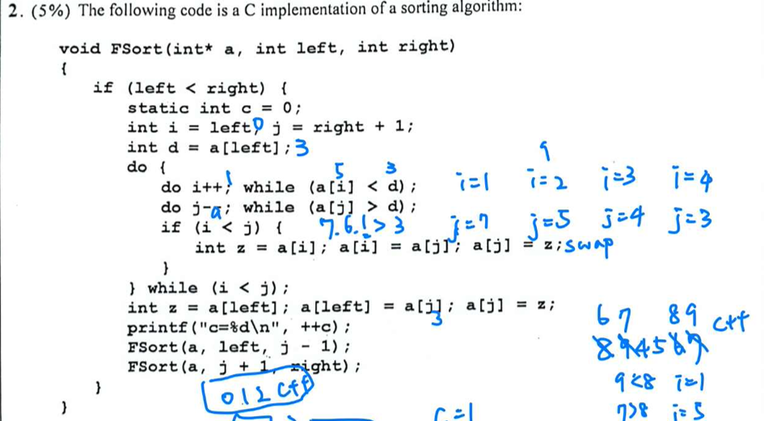 

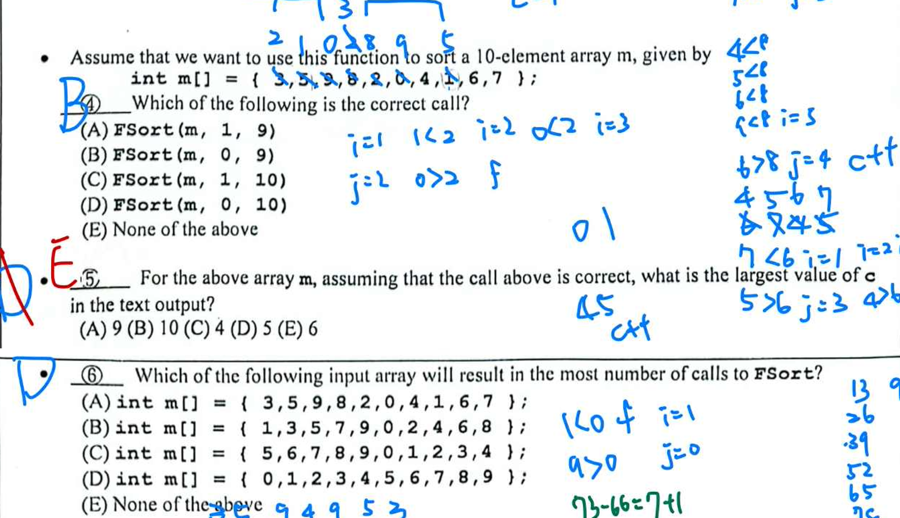 


### 第 4 題 

- FSort 參數
    - FSort(int array pointer, start idx of array, end idx of array)

### 第 5 題

- 放定一個 pivot ⮕ C++

```
1. idx 1 (5) , idx 7 (1) swap ⮕ 3 1* 9 8 2 0 4 5* 6 7
2. idx 2 (9) , idx 5 (0) swap ⮕ 3 1 0* 8 2 9* 4 5 6 7
3. idx 3 (8) , idx 4 (2) swap ⮕ 3 1 0 2* 8* 9 4 5 6 7
4. i < j ⮕ i++ (idx 4), j++ (idx 3)
5. idx 0 (3) , idx 3 (2) swap ⮕ 2 1 0 3* 8 9 4 5 6 7 (放定一個 pivot)
6. FSort([2, 1, 0]), FSort([8, 9, 4, 5, 6, 7,])
7. FSort([2, 1, 0]) ⮕ 0, 2*, 1  (放定一個 pivot)
8. FSort([8, 9, 4, 5, 6, 7,]) ⮕ 7, 4, 5, 6, 8*, 9 (放定一個 pivot)
9. FSort([7, 4, 5, 6]) ⮕ 6, 4, 5, 7* (放定一個 pivot)
10. FSort([6, 4, 5]) ⮕ 5, 4, 6* (放定一個 pivot)
11. FSort([5, 4]) ⮕ 4, 5* (放定一個 pivot)
```

### 第 6 題 

- 傳入排序好的序列，需要最多的 swap

## 第 7-9 題 Hash

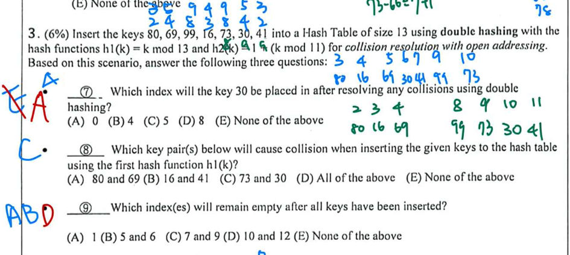


- **Double Hashing**
    - 表格大小 ($m$)：13 (索引為 0 ~ 12)
    - 第一雜湊函數 $h1(k)$：$k \pmod{13}$
    - 第二雜湊函數 $h2(k)$：$1 + (k \pmod{11})$
    - **雙重雜湊公式：$H(k, i) = (h1(k) + i \times h2(k)) \pmod{13}$，其中 $i$ 為發生衝突的次數 ($0, 1, 2, \dots$)**

插入鍵值 (k)|h1(k)|h2(k)|嘗試過程 (Index)|最終位置|
|----------|----|----|----------|-------|
|80|2|-|2|2|
|69|4|-|4|4|
|99|8|-|8|8|
|16|3|-|3|3|
|73|8|8|i=0:8 ✖; i=1:(8+8)(mod13)=3 ✖; i=2:(8+16)(mod13)=11|11|
|30|4|9|i=0:4 ✖; i=1:(4+9)(mod13)=0|0|
|41|2|9|i=0:2 ✖; i=1:(2+9)(mod13)=11 ✖; i=2:(2+18)(mod13)=7|7|

## 第 10-12 題 Minimum Spanning Trees (Kruskal) (105 第 17 題 )

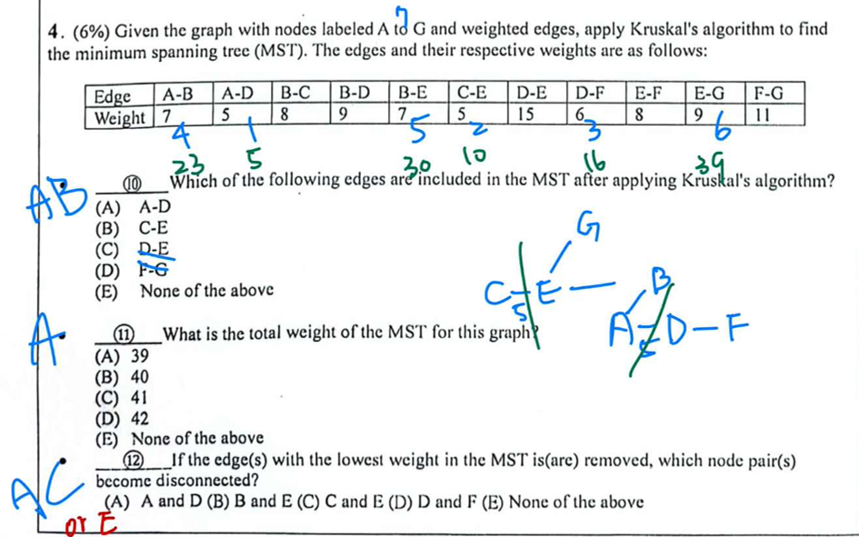

1. 列出並排序邊的權重：
    ```
    (A, D): 5
    (C, E): 5
    (D, F): 6
    (A, B): 7
    (B, E): 7
    (B, C): 8 (跳過，會形成環 B-E-C-B)
    (E, F): 8 (跳過，會形成環 E-B-A-D-F-E)
    (B, D): 9 (跳過，會形成環 B-A-D-B)
    (E, G): 9
    (E, G): 9
    (F, G): 11 (跳過)
    (D, E): 15 (跳過)
    ```

2. 挑選過程：
    ```
    1. 挑選 (A, D), 權重 5。
    2. 挑選 (C, E), 權重 5。
    3. 挑選 (D, F), 權重 6。
    4. 挑選 (A, B), 權重 7。
    5. 挑選 (B, E), 權重 7。此時 A, B, C, D, E, F 已連通。
    6. 最後挑選 (E, G), 權重 9。所有 7 個節點皆已連通。
    7. 最終 MST 邊集合： {(A, D), (C, E), (D, F), (A, B), (B, E), (E, G)}
    ```

## 第 13-14 題 Maximum Flow (105 第 18 題 )

 
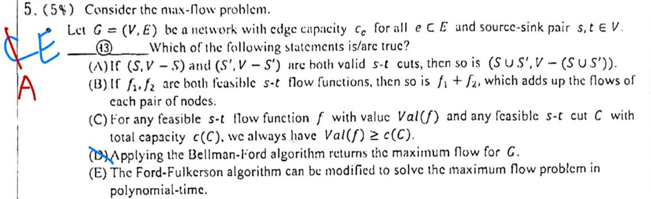
 

### 第 13 題

- (a) 這是 Flow 的一個性質，若 $(S, V - S)$ 與 $(S', V - S')$ 為有效切割，其聯集運算後的分割亦為有效 $s-t$ 切割。
    - 切割 1：$(S, V-S)$，其中 $s \in S, t \notin S$。
    - 切割 2：$(S', V-S')$，其中 $s \in S', t \notin S'$。
    - **聯集（Union）**運算 $S \cup S'$ 時：
        - 關於 $s$：因為 $s$ 同時屬於 $S$ 與 $S'$，所以 $s$ 必定屬於聯集結果 $S \cup S'$。
        - 關於 $t$：因為 $t$ 既不在 $S$ 中，也不在 $S'$ 中，所以 $t$ 絕對不會出現在聯集結果 $S \cup S'$ 中。
        -  $(S \cup S', V - (S \cup S'))$ 就完全符合 $s-t$ 切割的定義。

- (b) 兩個可行流 $f_1, f_2$ 相加後的總流值可能會超過邊的容量限制（Capacity Constraints）。

- (c) 根據「最大流最小切定理」，任何可行流的流值 $Val(f)$ 必定 ≤ 任何有效切割的容量 $c(C)$。

- (d) Bellman-Ford 演算法是用於尋找圖中的最短路徑（包含負權重邊的情況），處理最大流問題應使用 Ford-Fulkerson 或 Edmonds-Karp 演算法。

- (e) Ford-Fulkerson 的一個變體——Edmonds-Karp 演算法，透過廣度優先搜尋（BFS）尋找增廣路徑，其時間複雜度為 $O(VE^2)$，屬於多項式時間演算法。

### 第 14 題

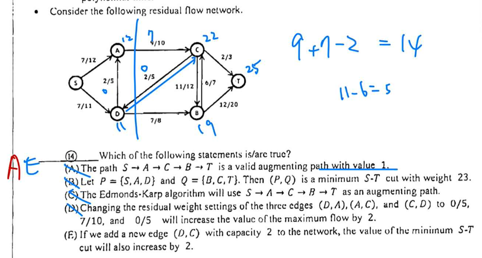

- (a) 路徑 $S \to A \to C \to B \to T$ 還有 1 個容量可以被利用所以是 augmenting path 

- (b) 該切割的重量（容量）應為 18

- (c) Edmonds-Karp 演算法會選擇邊數最少 (undirectd shortest path) 的 augmenting path ， 路徑 $S \to A \to C \to T$ 只有 3 條邊，會優先於 4 條邊的 $S \to A \to C \to B \to T$。

- (e) 新增一條從 $D$ 到 $C$ 的邊（容量 2），由於 $D \in P$ 且 $C \in Q$，這條邊會直接增加最小切割的容量。在有足夠剩餘流量導向 $T$ 的前提下，最小切割值將從 18 增加到 20。


## 第 15-16 題 

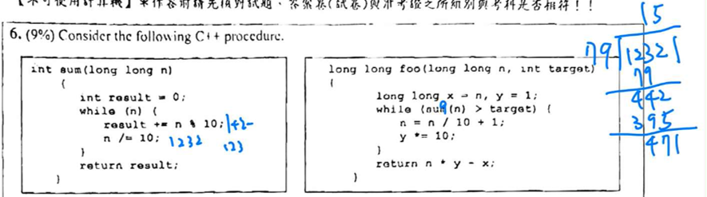

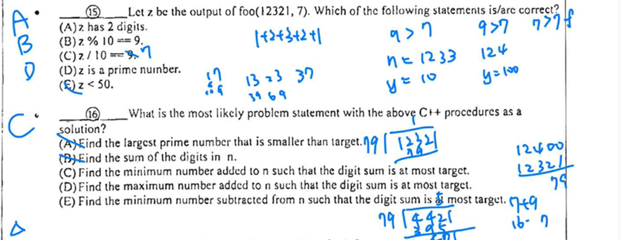

1. sum(n) 函式: 計算整數 n 的各個位數之和（Digit Sum）。

2. foo(n, target) 函式：
    - 初始值：x = n (紀錄原始值), y = 1 (權重倍數)。
    - 迴圈條件：當 sum(n) > target 時持續執行。
    - 迴圈內容：
        - n = n / 10 + 1;：將目前的 n 除以 10（去掉最後一位）後加 1（進位）。
        - y *= 10;：將權重擴大 10 倍。
    - 回傳值：n * y - x：這代表「調整後的數值」減去「原始數值」的差值。

- 尋找加到 n 上的最小正整數，使得位數和不超過 target

## 第 17-18 題 Linear Algebra

 
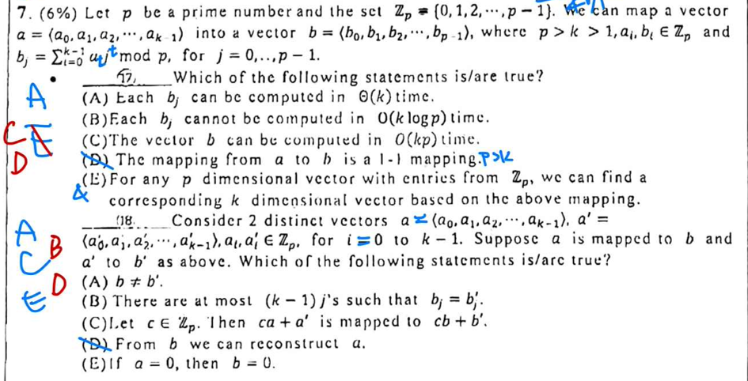
 

### 第 17 題 

- (a) 計算單一個 $b_j$ 需要計算 $k$ 個項次的加總。時間複雜度為 $\Theta(k)$。

- (b) $O(k \log p)$  > $O(k)$ > $\Theta(k)$

- (c) 總共有 $p$ 個 $b_j$ 要算，每個花 $\Theta(k)$，總時間就是 $\Theta(kp)$。


    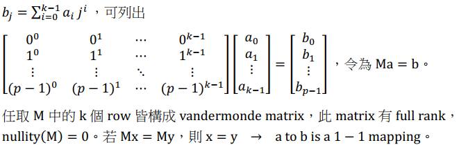

- (e) k < p， k 維向量沒有辦法對應至 p 維的所有向量

### 第 18 題 

- (a) 因為映射是 1-1（由 17D 得知），不同的 $a$ 必定對應不同的 $b$

- (b) $b_j = b'_j$ 代表 $P(j) - P'(j) = 0$。由於 $P(x) - P'(x)$ 是一個次數最高為 $k-1$ 的非零多項式，它在體 $\mathbb{Z}_p$ 中最多只有 $k-1$ 個根。因此，最多只有 $k-1$ 個位置的數值會相同。

- (c) 多項式評估（Evaluation）是線性運算。$M(ca + a') = c(Ma) + (Ma') = cb + b'$，符合線性變換定義。

- (d) 既然是 1-1 映射，只要給定 $b$（甚至只需要 $b$ 當中的任意 $k$ 個點），我們就可以透過 拉格朗日插值法（Lagrange Interpolation） 還原出多項式係數 $a$。

- (e) 若 $a = 0$（零多項式），則不論代入任何 $j$，結果 $b_j$ 恆為 0。


## 第 19-21 題 

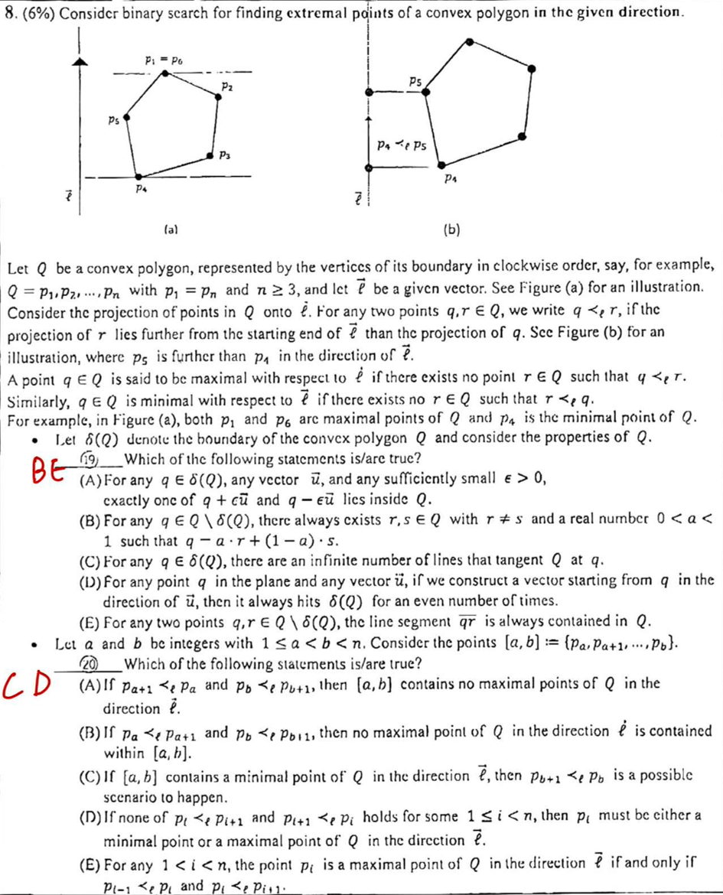
 

-----------------------------------------------------------

假設 $Q$ 是一個凸多邊形，其邊界上的頂點按順時針順序排列，表示為 $Q = \{p_1, p_2, ..., p_n\}$，其中 $p_1 = p_n$ 且 $n \ge 3$。給定一個向量 $\vec{l}$，考慮 $Q$ 中所有點在 $\vec{l}$ 方向上的投影。對於任意兩點 $q, r \in Q$，若 $r$ 的投影比 $q$ 的投影距離 $\vec{l}$ 的起點更遠，我們記作 $q <_l r$。最大值點（Maximal Point）：若 $Q$ 中不存在任何點 $r$ 使得 $q <_l r$，則稱 $q$ 為該方向上的最大值點。最小值點（Minimal Point）：若 $Q$ 中不存在任何點 $r$ 使得 $r <_l q$，則稱 $q$ 為該方向上的最小值點。範例：在圖 (a) 中，$p_1$ 與 $p_6$ 是最大值點，$p_4$ 是最小值點。

### 第 19 題 

令 $\delta(Q)$ 代表 $Q$ 的邊界。下列關於 $Q$ 的性質敘述何者正確？

- (A) 對於邊界上任一點 $q \in \delta(Q)$、任何向量 $\vec{u}$ 以及足夠小的 $\epsilon > 0$，$q + \epsilon\vec{u}$ 與 $q - \epsilon\vec{u}$ 兩者之中恰好只有一個會落在 $Q$ 的內部。
    - ✖：若 $q$ 位在多邊形的頂點（Vertex）上，並非所有方向的 $\vec{u}$ 都滿足此條件。可能存在某些方向使得往前往後都會跑出多邊形外。

- (B) 對於任何非邊界的內部點 $q \in Q \setminus \delta(Q)$，恆存在 $Q$ 中兩個不同的點 $r, s$ 以及一個實數 $0 < \alpha < 1$，使得 $q = \alpha \cdot r + (1 - \alpha) \cdot s$。
    - ✔：這符合**內部點（Interior Point）**的定義。多邊形內部的任一點 $q$ 都可以表示為多邊形內其他兩點（或頂點）的線性組合。

- (C) 對於邊界上任一點 $q \in \delta(Q)$，存在無限多條在 $q$ 點與 $Q$ 相切的直線。
    - ✖：在凸多邊形的平滑邊界點上，切線是唯一的。只有在頂點上才可能有範圍內的無限多條切線，但題目說「對於任何 $q$」，故不成立。

- (D) 對於平面上任一點 $q$ 與任何向量 $\vec{u}$，若從 $q$ 出發沿著 $\vec{u}$ 方向構造射線，該射線與邊界 $\delta(Q)$ 的交點個數恆為偶數。
    - ✖：如果射線從多邊形內部出發，它只會穿過邊界一次（奇數次）。只有當起點在外部時，穿過次數才會是 0 或偶數。

- (E) 對於任何兩點 $q, r \in Q \setminus \delta(Q)$，連線段 $\overline{qr}$ 恆包含於 $Q$ 之中。
    - ✔：這是凸集合的核心定義：集合內任意兩點的連線段必完全落在該集合內。

### 第 20 題 

頂點範圍與極值判斷令 $a, b$ 為整數且 $1 \le a < b < n$。考慮點集範圍 $[a, b] := \{p_a, p_{a+1}, ..., p_b\}$。下列敘述何者正確？

- (A) 若 $p_{a+1} <_l p_a$ 且 $p_b <_l p_{b+1}$，則 $[a, b]$ 範圍內不包含 $Q$ 在 $\vec{l}$ 方向上的任何最大值點。
    - ✖：即便在兩端點的趨勢是向內縮的，中間的點集 $[a, b]$ 仍可能包含全域的最大值點。

- (B) 若 $p_a <_l p_{a+1}$ 且 $p_b <_l p_{b+1}$，則 $Q$ 在 $\vec{l}$ 方向上的最大值點不會落在 $[a, b]$ 之中。
    - ✖：與 (A) 邏輯類似，端點的投影大小關係不能直接否定中間存在極大值的可能性。

- (C) 若 $[a, b]$ 包含 $Q$ 在 $\vec{l}$ 方向上的某個最小值點，則 $p_{b+1} <_l p_b$ 是可能發生的情況。
    - ✔：在包含極小值點的區間中，出現 $p_{b+1} <_l p_b$（數值下降趨勢）是合理的可能情境。

- (D) 若對於某個 $1 \le i < n$，$p_i <_l p_{i+1}$ 與 $p_{i+1} <_l p_i$ 皆不成立，則 $p_i$ 必定是 $Q$ 在 $\vec{l}$ 方向上的最小值點或最大值點。
    - ✔：若 $p_i$ 與 $p_{i+1}$ 的投影相等，代表邊 $\overline{p_i p_{i+1}}$ 垂直於向量 $\vec{l}$。在凸多邊形中，這對點必然是該方向上的極大值或極小值點。

- (E) 對於任何 $1 < i < n$，點 $p_i$ 是最大值點的充要條件（if and only if）為 $p_{i-1} <_l p_i$ 且 $p_{i+1} <_l p_i$（註：原文圖中選項 E 略有模糊，此為根據邏輯與上下文反推）。
    - ✖：圖中顯示單純比較鄰居關係不足以構成充分必要條件，需考慮多邊形的整體單峰性質（Unimodal）。

### 第 21 題 

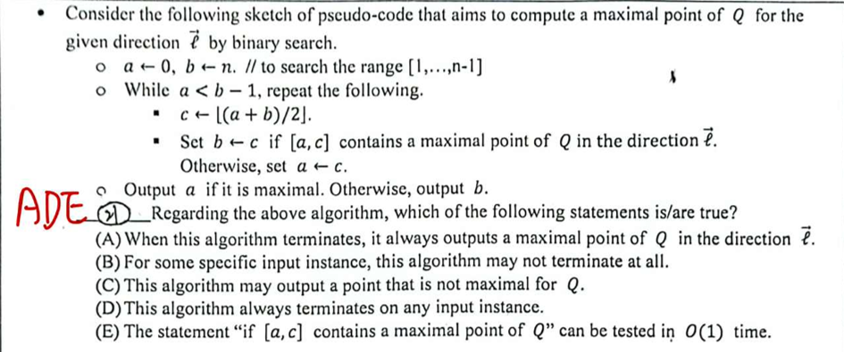

考慮以下旨在透過二元搜尋尋找最大值點的虛擬碼：

1. 設定 $a \gets 0, b \gets n$。（搜尋範圍 $[1, \dots, n-1]$）
2. 當 $a < b - 1$ 時，重複執行：$c \gets \lfloor(a + b) / 2\rfloor$若區間 $[a, c]$ 包含最大值點，則令 $b \gets c$；否則，令 $a \gets c$
3. 若 $a$ 是最大值點則輸出 $a$，否則輸出 $b$關於此演算法，下列敘述何者正確？

- (A) 當演算法終止時，它恆會輸出一個 $Q$ 在 $\vec{l}$ 方向上的最大值點。
    - ✔：由於迴圈的設計是不斷縮小包含極大值點的範圍，當停止時，輸出的點必然是該方向上的極大值。

- (B) 對於某些特定的輸入，此演算法可能永遠不會終止。
    - ✖：這是一個標準的二元搜尋結構，搜尋範圍 $[a, b]$ 每次迭代都會減半，保證會終止。

- (C) 此演算法可能會輸出一個並非最大值的點。
    - ✖：這與選項 (A) 的正確邏輯矛盾。

- (D) 此演算法在任何輸入情況下皆會終止。
    - ✔：基於 (B) 的分析，演算法在任何輸入下皆會收斂並終止。

- (E) 敘述「若 $[a, c]$ 包含最大值點」可以在 $O(1)$ 時間內完成測試。
    - ✔：在凸多邊形中，要判斷區間內是否有極大值，只需檢查邊界點與其鄰居的投影關係（斜率趨勢），這只需常數次比較，故為 $O(1)$。

## 題組 第 1 題 Tree

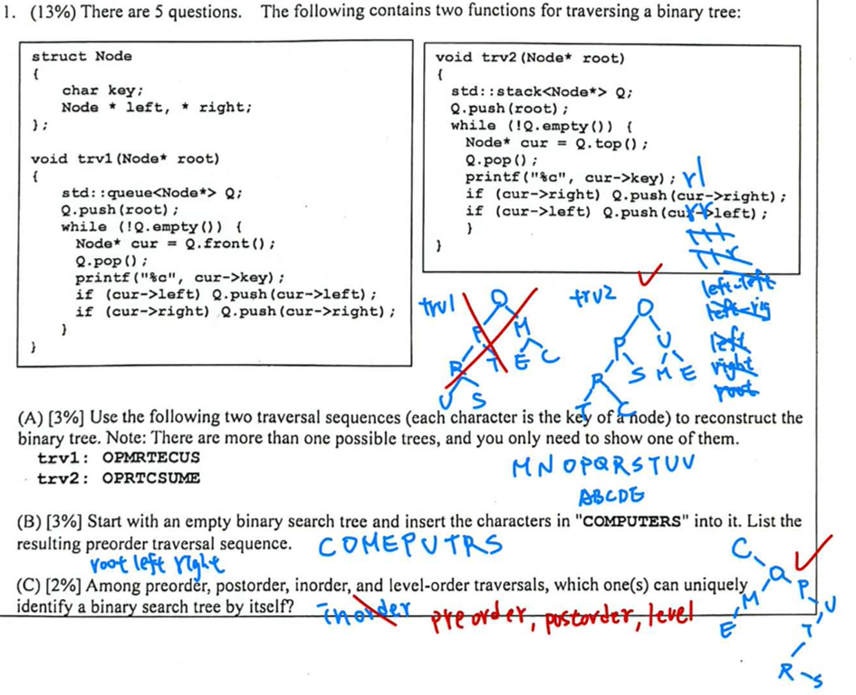

### 第 A, B 題

- 其實我寫對了，所以如圖

### 第 C 題 

如果只給你『一種』BST 走訪結果，你能不能唯一地畫出 BST 的形狀？

- Inorder 走訪不能唯一識別 BST 
    - 給定你排序好的數列，你可以排出很多種 BST

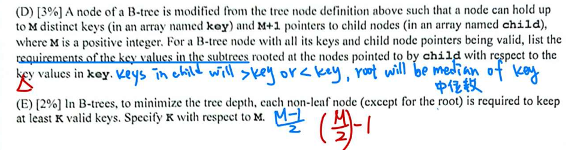

### 第 D 題 

B tree 子樹與鍵值 (Key) 的關係限制

- 在一棵 M 階的 B-Tree 節點中，假設鍵值為 $k_0, k_1, ..., k_{M-1}$，子節點指標為 $c_0, c_1, ..., c_M$：
    - 子樹 $c_0$ 的所有鍵值必須 小於 $k_0$。
    - 子樹 $c_i$ ($1 \le i \le M-1$) 的所有鍵值必須 介於 $k_{i-1}$ 與 $k_i$ 之間。
    - 子樹 $c_M$ 的所有鍵值必須 大於 $k_{M-1}$。

### 第 E 題 

最小有效鍵值數量 $K$

- 最大鍵值數 (Max Keys)：$M$

- 最大 children 數：$M+1$

- 分裂後
     - $$\text{Min Children} = \lceil \frac{M+1}{2} \rceil$$
     - $$K = \lceil \frac{M+1}{2} \rceil - 1$$

- 注意: 應該明確寫出向上取整或向下取整
    - 向上取整 (Ceiling) ⮕ 符號：$\lceil x \rceil$
    - 向下取整 (Floor) ⮕ 符號：$\lfloor x \rfloor$ （只有下方有鉤）


## 題組 第 2 題 Bellman-Ford

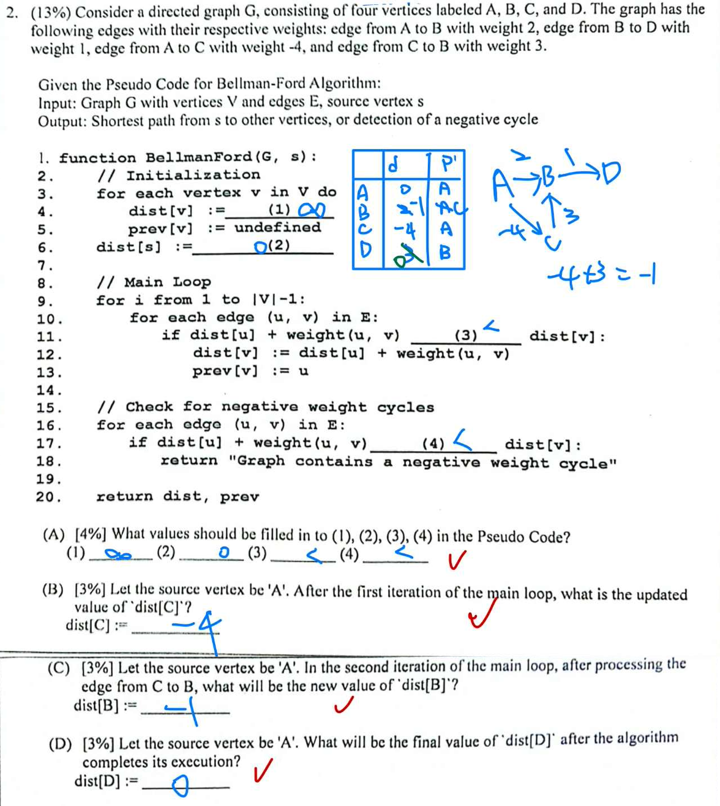

- Bellman-Ford
    1. 從起點出發，初始化距離陣列，其餘頂點設為無限大。
    2. 重複進行「對所有邊做鬆弛 (Relax)」共 **(V-1) 次**，逐步將最短距離往外傳遞。
    3. 因最短路徑最多包含 (V-1) 條邊，可處理 **負權邊**；再多做一次全邊鬆弛即可偵測負權環。
    4. 外迴圈 (V-1) 次 × 每次掃描所有邊 (E) 次，時間複雜度為 O(VE)

## 題組 第 3 題 Longest Palindrome Bimodal Subsequence (DP)

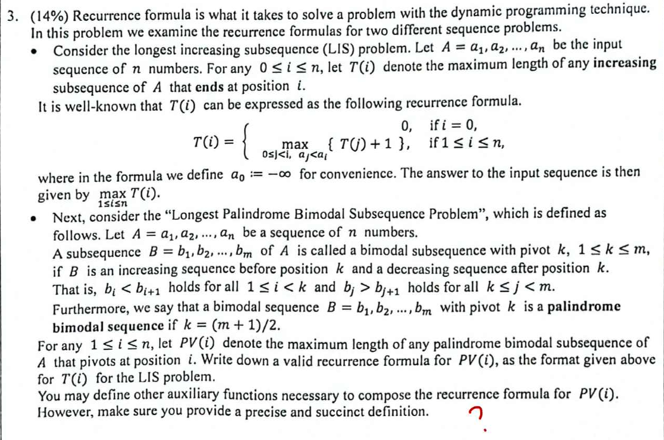


尋找 $PV(i)$ 相當於：固定 $a_i$ 為最高點。在 $a_i$ 左側（$1 \dots i-1$）找一個遞增序列。在 $a_i$ 右側（$i+1 \dots n$）找一個相對應的對稱序列。限制：左右選出的數字必須成對相等，且都必須小於 $a_i$。

問題邏輯分析
1. 雙峰序列 (Bimodal Sequence)：序列在樞紐（Pivot） $k$ 之前是嚴格遞增，之後是嚴格遞減。意即：$b_1 < b_2 < \dots < b_k > b_{k+1} > \dots > b_m$。

2. 迴文性質 (Palindrome Property)：題目定義 $k = (m+1)/2$ 且為迴文，這代表序列前半段的遞增部分與後半段的遞減部分是完全對稱的。也就是說，$b_1 = b_m, b_2 = b_{m-1}, \dots$。

3. 核心轉化：若我們固定 $a_i$ 為樞紐點（即 $b_k = a_i$），則問題等同於在 $a_1 \dots a_{i-1}$（左側）與 $a_{i+1} \dots a_n$（右側反轉後）中尋找最長公共遞增子序列 (Longest Common Increasing Subsequence, LCIS)，且該序列的所有元素都必須小於 $a_i$。

- 遞迴公式推導: 為了建構 $PV(i)$，我們需要定義一個輔助函數來紀錄左右兩側對稱元素的長度。
    1. 輔助函數定義令 $f(j, k)$ 為在左側子陣列 $a_1 \dots a_j$ 與右側子陣列 $a_n, a_{n-1} \dots a_k$ 中，以數值 $a_j$（且滿足 $a_j = a_k$）結尾的 LCIS 長度。
        - $$f(j, k) = \begin{cases} 1 + \max \{ f(p, q) \mid 0 \le p < j, k < q \le n+1, a_p = a_q < a_j \} & \text{if } a_j = a_k \\ 0 & \text{if } a_j \neq a_k \end{cases}$$
        - 邊界條件：定義 $a_0 = -\infty, a_{n+1} = -\infty$，且 $f(0, n+1) = 0$。
        -物理意義：這代表找到一對相同的數值分別放在樞紐的左右兩對稱位置。
    2. $PV(i)$ 的最終遞迴式: $PV(i)$ 表示以 $a_i$ 為中心（樞紐）時，迴文雙峰子序列的最大長度。除了中心點 $a_i$ 自己（長度為 1），左右兩邊對稱的長度需乘上 2：
        - $$PV(i) = 1 + 2 \times \max \{ f(j, k) \mid 0 \le j < i, i < k \le n+1, a_j = a_k < a_i \}$$

## 題組 第 4 題 

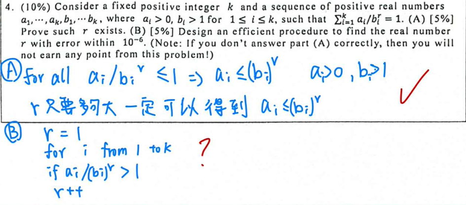


考慮一個固定的正整數 $k$ 以及一組正實數序列 $a_1, \dots, a_k, b_1, \dots, b_k$。其中對於所有的 $1 \le i \le k$，皆滿足 $a_i > 0$ 且 $b_i > 1$。已知有一個實數 $r$ 滿足以下等式：$f(r) = \sum_{i=1}^k \frac{a_i}{b_i^r}$

### 第 A 題 證明 $r$ 的存在性 

1. 連續性與單調性：
    -  $a_i > 0$ 且 $b_i > 1$，對每一項 $a_i / b_i^r = a_i \cdot e^{-r \ln b_i}$ ，都是關於 $r$ 的連續函數。
    - 由於 $\ln b_i > 0$，每一項的導函數皆為負值（$-a_i \ln b_i / b_i^r < 0$），因此 $f(r)$ 是一個連續且嚴格遞減的函數。

2. 極限行為分析：
    - 當 $r \to -\infty$ 時：因為 $b_i > 1$，則 $b_i^r \to 0^+$。因此分式 $\frac{a_i}{b_i^r} \to \infty$，導致 $\lim_{r \to -\infty} f(r) = \infty$。
    - 當 $r \to \infty$ 時：因為 $b_i^r \to \infty$，則分式 $\frac{a_i}{b_i^r} \to 0$。因此 $\lim_{r \to \infty} f(r) = 0$。

3. 中間值定理 (Intermediate Value Theorem, IVT)：
    - 已知 $f(r)$ 在 $(-\infty, \infty)$ 上連續，且其值域涵蓋了 $(0, \infty)$。
    - 因為目標值 $1$ 落在該區間內（$0 < 1 < \infty$），根據中間值定理，必定存在至少一個實數 $r^*$ 使得 $f(r^*) = 1$。
    - 又因 $f(r)$ 嚴格遞減，該解 $r^*$ 是唯一的。

### 第 B 題 尋找 $r$ 的高效程序設計 

 $f(r)$ 具有良好的單調性，二分法 (Bisection Method) 是尋找解的最穩定且高效的程序。
```
def f(r, a, b):
    return sum(ai / (bi ** r) for ai, bi in zip(a, b))
def find_r(a, b, tolerance=1e-6):
    r_low = 0
    r_high = 100  # 假設初始 r_high 為 100，如果需要可以增大
    # 確保 r_high 初始值合適
    while f(r_high, a, b) >= 1:
        r_high *= 2
    while (r_high - r_low) > tolerance:
        r_mid = (r_low + r_high) / 2
        if f(r_mid, a, b) > 1:
            r_low = r_mid
        else:
            r_high = r_mid
    return (r_low + r_high) / 2
```