# 105 -Sys-HW

## 第 1 題 commen scense

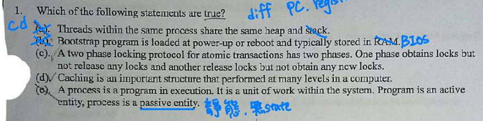

- (a) 同 process 的 threads 共享 heap and global data

- (b) 開機程序不可能存在揮發性記憶體 RAM 而是 ROM/Flash，開機時將被載入到 RAM。**我劃掉寫 BISO 也不對，BIOS 指的是儲存在主機板上的快閃記憶體（以前是 ROM）晶片中的程式。**

- (c) **Two-Phase Locking (2PL)** 的定義：
  - **Growing Phase**：只能 acquire locks，不能 release。
  - Shrinking Phase: 只能 release locks不能 acquire 新 locks

- (e) process 是運行中的 program 沒錯
  - Active Entity: 指正在執行、運作中、有行動或狀態會變化的事物
  - Passive Entity: 指靜態的、存在於某處、不執行任何動作、需要被「啟動」或「使用」的事物

## 第 2 題 commen scense

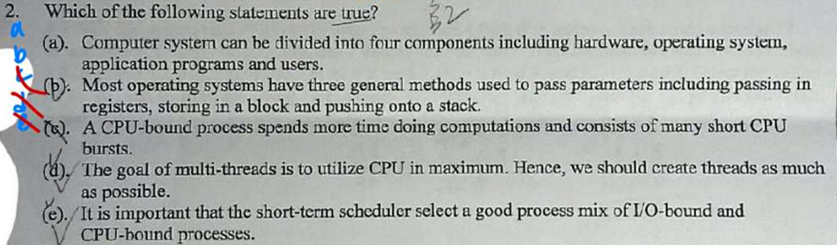

- (b) parameter passing 可以透過 register, stack, block 也就是 heap，我們常用的 pass by pointer, pass by address~

- (c) CPU-bound process has long CPU bursts (brust 不知道怎麼翻譯比較好ㄟ，應該可以想像是運作或是操作。)

- (d) 最佳執行緒數 ≈ CPU 核心數 × (1 + I/O wait / CPU time) → 不應無限制建立執行緒。
  - 過多執行緒會導致:
    - 上下文切換（context switch）開銷過大
    - 記憶體耗盡（每個 thread 有自己的 stack）
    - 鎖競爭（lock contention）

- (e) CPU scheduler
  - **Short-term scheduler (CPU scheduler) 決定下一個執行哪個 process**
  - **Long-term scheduler 決定哪些 process 可以進入 ready queue 準備執行。 → 負責選擇 I/O-bound 和 CPU-bound process 的良好混合比例（Process Mix），主要是 長期排程器 (Long-term Scheduler / Job Scheduler) 的職責，而不是短期排程器。**
  - **Medium-term scheduler 決定是否將一個 process 從記憶體中移出 (swap out) 或移入 (swap in)，以控制多工程度。**

## 第 3 題 common scense

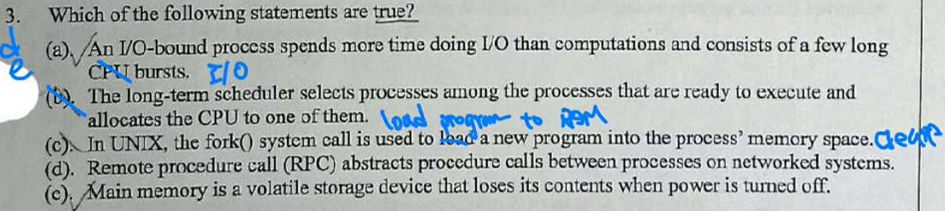

- (a) I/O-bound process 花費更多時間進行 I/O 而不是計算並由許多 short CPU bursts 組成。

- (c) fork()：
  - 複製當前 process（創建子 process）
  - 父子 process 共享相同的 memory space 內容(**包含PC**)（copy-on-write）
  - 不載入新程式 ( exec()：載入新程式)

- (d) **RPC 的核心目的：**
  - 讓程式設計師像 local procedure call 一樣簡單
  - 隱藏網路細節（marshalling、network transmission、unmarshalling）
  - 跨網路/跨機器 的 process 間通訊

## 第 4 題 common scense

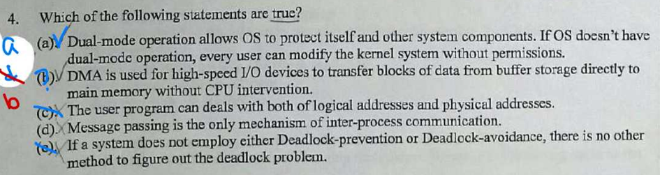

- (a) Dual-mode operation: User mode, Kernel mode 保護 kernel、I/O、記憶體

- (b) **DMA (Direct Memory Access)**
  - 適用於 高速 I/O 設備（如硬碟、網路卡）
  - 大塊資料傳輸（block transfer）
  - 繞過 CPU，直接在 device buffer ↔ main memory 之間傳輸
  - CPU 只負責設定 DMA controller（來源、目的、大小）
    → 減少 CPU 中斷次數，提升效率
  - CPU 設定, DMA 完成會發 interrupt

- (b) **Memory Map I/O**
  -  I/O device Buffer mapping  到 main memory 利用 DMA 資料搬運階段不佔用 CPU， 完成後通常會發 interrupt 通知 CPU

- (c) logical address (虛擬位址):
  - User program 只能操作 logical address
  - Physical address 由 MMU (Memory Management Unit) + OS 負責轉換

- (d) Inter-Process Communication, IPC 的方式主要可以分成兩大基本模型
  - Shared Memory (共享記憶體)
  - Message Passing (訊息傳遞)

- (e) **deadlock處理方法**
  1. Deadlock Prevention (死結預防)
      - 這是一種 Static 的策略。核心思想是破壞 Deadlock 發生的四個必要條件中的「至少一項」，以此保證死結永遠不會發生。
      - Mutual Exclusion (互斥): 很難破壞，因為某些資源（如印表機）本質上就是不可共用的。
      - Hold and Wait (持有並等待): 強制 process 一次申請完所有需要的資源才開始執行（利用率低、可能飢餓）。
      - No Preemption (不可搶奪): 若 process 申請不到新資源，必須釋放手上所有資源（適用於暫存器等狀態易保存的資源）。
      - Circular Wait (循環等待): 最常用的方法。對所有資源類型進行 排序 (Ordering)，強制 process 必須按序號遞增申請資源。
  2. Deadlock Avoidance (死結避免)
      - 這是一種 Dynamic 的策略。系統在執行過程中，每次 process 提出資源請求時，OS 會先運算「若核准這次請求，系統是否仍處於 安全狀態 Safe State」。
      - 關鍵概念： 需要事先知道每個 process 的 最大資源需求 (Max Claim)。
      - Safe State: 存在至少一組 Safe Sequence，讓所有 processes 都能順利執行完畢。
      - 著名演算法：
        - 單一資源種類：Resource Allocation Graph - - Algorithm (檢查有無 cycle)。
        - 多重資源種類：Banker's Algorithm (銀行家演算法)。
  3. Deadlock Detection + Recovery (死結偵測與恢復)
    - 允許系統進入死結狀態，但系統會定期執行偵測演算法。
    - Detection (偵測):
      - 單一資源種類：簡化為 Wait-for Graph，檢查是否有 Cycle。
      - 多重資源種類：類似 Banker's Algorithm 的變形，檢查是否所有 process 都能 finish。
    - Recovery (恢復):
      - Process Termination: 殺掉所有死結 processes（代價大），或一次殺一個直到死結解除（需考慮選擇哪個 Victim）。
      - Resource Preemption: 搶奪資源給其他 process 用（需考慮 Rollback 和 Starvation 問題）。
4. Ignore the Problem (忽視問題)
    - 別名： Ostrich Algorithm (鴕鳥演算法)。
    - 邏輯： 假設死結極少發生，且預防或偵測的代價 (Overhead) 太高，不如直接忽略。若真的發生（例如系統當機），就由使用者手動重開機。
    - 應用： 這是 UNIX / Linux / Windows 等通用作業系統採取的策略。

## 第 5 題 process

- blocking : 呼叫方發起請求後，會掛起等待，直到被呼叫方完成操作並將結果返回後，呼叫方才能繼續執行

- Non-blocking: 呼叫方發起請求後立即返回，線程不會被掛起。但由於是同步，呼叫方需要不斷地輪 (Polling) 檢查操作是否完成並獲取結果。

- process state 可以參考[過去文章](https://medium.com/@thk1106/%E4%B8%80%E7%94%9F%E7%A7%91%E7%A7%91%E6%BA%96%E5%82%99%E8%B3%87%E5%B7%A5%E5%9C%A8%E8%81%B7%E5%B0%88%E7%8F%AD%E8%AE%80%E6%9B%B8%E7%AD%86%E8%A8%98-%E4%BD%9C%E6%A5%AD%E7%B3%BB%E7%B5%B1-ch3-process-67216e97516e)

## 第 6 題 **NAS, SAN**

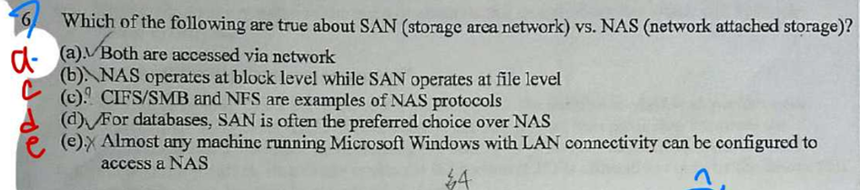

- Windows, UNIX/Linux NAS
  - CIFS/SMB（Server Message Block）：Windows環境常用，用於檔案分享（如OneDrive）。
  - NFS（Network File System）：UNIX/Linux環境常用，用於跨平台檔案存取。
  - 例如：NAS設備（如Synology）內建支援這些協議。

- 資料庫需要高I/O吞吐、低延遲、隨機存取，SAN的block-level存取更適合（像本地硬碟）。

- NAS的file-level會引入額外延遲，不利於大型交易資料庫（如Oracle、SQL Server）。

- Windows內建SMB/CIFS支援，只要有LAN連線，就能輕鬆掛載NAS（如「\NAS-IP\share」）。

|   特性   |   NAS          |   SAN             |
|:---------:|:--------------:|:-----------------:|
| 存取層級 | 檔案層級        | 區塊層級            |
| 網路類型 | Ether/LAN      | Fiber/iSCSI         |
| 協議     | NFS, CIFS/SMB | iSCSI, FCP, FC-NVMe |
| 性能     | 中             | 高                  |
| 成本     | 低/簡單        | 高/複雜              |
| 使用類型 | SMB/家用       | 企業/資料中心         |
| 檔案系統 | FS on storage  | FS on server        |
| req     | 給我檔案A/文件.doc| 讀寫block #1234 |

## 第 7 題 **File System**

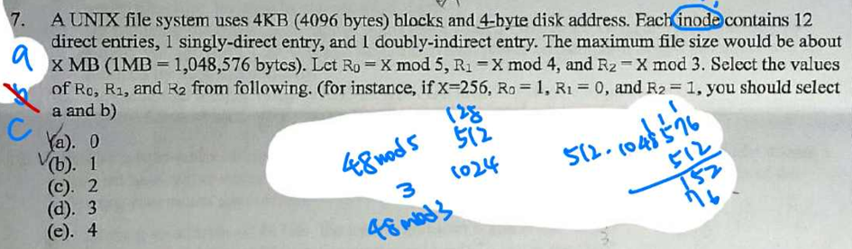

- UNIX inode 是類 Unix 檔案系統（如 Linux 的 ext4）中最核心、最重要的資料結構。

- 一個 inode 是一個固定大小的資料結構，它儲存了關於檔案或目錄的所有資訊，但不包括檔案名稱和實際資料內容。
  - 檔案類型： 是File、Directory、Symbolic Link 還是Device File。
  - 權限： 讀 (r)、寫 (w)、執行 (x) 權限，以及檔案擁有者 (User ID, UID) 和所屬群組 (Group ID, GID)。
  - 時間戳記：mtime (Modification Time), atime (Access Time), ctime (Change Time)
  - Link Count: 有多少個檔案名稱指向這個 inode（即硬連結 Hard Link 的數量）。
  - 檔案大小： 檔案的位元組數。
  - Block Pointers: 紀錄檔案的實際資料內容儲存在硬碟上的哪些 Data Blocks
    - Direct Entries : 指向一個 storage block 。如題目一個 block 大小4KB，而檔案 X inode 中有 12 個 Direct Entries 表示檔案有 12 * 4 KB。
    - Singly-Indirect : 指向一個 storage block ，而該 storage block 全部用來記錄 Direct Entries ，所以說 4KB 的 storage block 可以裝幾個 address ? 題目說一個 address 需要 4 byte 來表示，因此 4096 / 4 = 1024。→ 一個 Singly-Indirect 就會有 1024 * 4KB
    - Doubly-Indirect : 邏輯同 Singly-Indirect => 1024 * 1024 * 4KB
    - Triply-Indirect : 邏輯同上

- 所以 X 檔案大小是( (12 + 1024 + 1024 * 1024) * 4KB )/1024 MB = 4100 MB

## 第 8 題 **RAID**

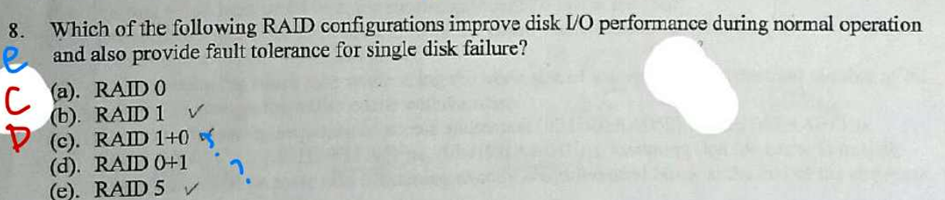

- Redundant Arrays of Inexpensive Disks (RAID) : 是把多個硬碟組合起來，提升「速度」或「可靠性」或「兩者兼顧」的技術。
- Redundant (冗餘) 在第五章後面介紹 Hamming code 有關，多花費一些 bit 紀錄用餘 error detect 或是 error correction
- Striping 切割成許多固定大小的小片段（稱為 Strip 或 Stripe Unit），然後將這些片段同時且均勻地寫入到陣列中的多個不同的硬碟上。
- 所有的標準 RAID 等級 (RAID 0 到 RAID 6) 都至少需要兩顆（2 顆）或更多的物理磁碟才能組成陣列。
- RAID 0 : block-level Striping：資料切塊分散(平行)寫入所有磁碟，速度最快，但無冗餘，一顆壞整組掛。
- RAID 1 : 純鏡像（Mirroring）：資料完全複製到另一顆磁碟，最安全（可壞一顆），但容量減半，寫入無平行。
- RAID 2 : bit-level Striping + Hamming 錯誤校正碼：用額外磁碟存 ECC，幾乎沒人用（太複雜）。
- RAID 3 : byte-level Striping + 專用同位磁碟（Parity Disk）：速度高但同位磁碟成瓶頸，很少用。
- RAID 4 : block-level Striping + 專用同位磁碟：可平行讀，但寫入同位磁碟成瓶頸，不常見。
- RAID 5 : block-level Striping + 分散式同位檢查（Distributed Parity）：速度與容量平衡佳，可壞一顆，最常用。
- RAID 6 : RAID 5 升級版，加第二個分散式同位檢查：可壞兩顆，更安全，寫入稍慢。
- RAID 0+1（或 RAID 01）先鏡像再條帶：兩組 RAID 1 再做 RAID 0，速度快、可壞一顆，但至少需 4 顆，容量減半。
- RAID 1+0（或 RAID 10）先條帶再鏡像：多組 RAID 0 再做 RAID 1，速度快、可壞多顆（每組一顆），最推薦企業用。

| RAID | 最小磁碟數 | 可壞磁碟數 | 容量利用率 | 讀寫速度 | 推薦用途 |
|:----:|:----------:|:----------:|:----------:|:--------:|:--------:|
| 0    | 2          | 0          | 100%       | ★★★★★   | 暫存、剪輯 |
| 1    | 2          | 1          | 50%        | ★★★★    | 系統碟 |
| 5    | 3          | 1          | (n-1)/n    | ★★★★    | 一般伺服器 |
| 6    | 4          | 2          | (n-2)/n    | ★★★     | 重要資料 |
| 10   | 4          | 1~n/2      | 50%        | ★★★★★   | 資料庫、VM |

## 第 9 題 File System

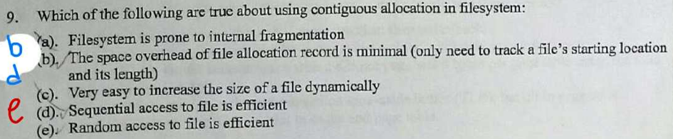

- (a) File system 容易發生 External fragmentation 才對
  - External fragmentation : 空間被切成不連續的小塊
  - Internal fragmentation : 配一大塊但只用一部分

- (c) 因為是連續配置因此需要記錄 起始位置 + 長度，Space overhead 就很小如果剛好分到一塊連續空間但是後面沒有多的空間將難以擴充

- (e) Random access 的方式可以用起始位址 + offset 就能直接定位 ，也是很快

## 第 10 題 Child Process

- Child Process (子行程)
  - 是用 fork() 或類似機制由 parent process 生成的
  - 記憶體空間獨立，但初始內容可從 parent 複製 (copy-on-write)
  - 可以繼承或不繼承父程式的資源 (file descriptors )等
  - 常用於 sandbox / 降權 / 隔離有風險的模組
  - 開 child process 其實會 增加 記憶體 overhead，不會減少。

## 第 11 題 ISA

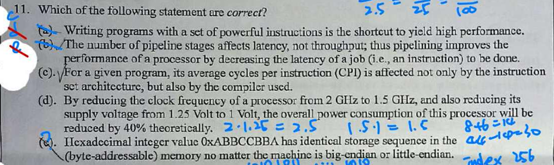

- (a) 這邊所謂 powerful instruction 是指一條指令完成強大功能 ，表示一條指令下去要做複雜的任務，複雜的指令集通常增加實作與編譯器成本。

- (b) pipeline 提升的是 throughput（每單位時間完成更多指令）；增加 pipeline stage 會改變單一指令的 latency（通常增加），不會降低 latency。

- (c) 平均 CPI 受 ISA 與 compiler（產生指令型態與序列）影響。

- (d) 動態功率 ∝ V²·f。頻率降至 1.5/2 = 0.75，電壓降至 1/1.25 = 0.8，功率比 = 0.⁸² × 0.75 = 0.48 → 約剩 48%，降低約 52%，不是 40%。(要算功率可以給公式嗎 = =)

- (e) big-endian 與 little-endian 記憶體擺放跟讀取方是相反所以不會是 identical storage sequence
  - （以 32-bit 整數 0x12 34 56 78 為例）

  | 記憶體位址      | Big-endian（內容） | Little-endian（內容） |
  |:---------------:|:------------------:|:---------------------:|
  | 0x00（低位址）  | 0x12（MSB）        | 0x78（LSB）           |
  | 0x01            | 0x34               | 0x56                  |
  | 0x02            | 0x56               | 0x34                  |
  | 0x03（高位址）  | 0x78（LSB）        | 0x12（MSB）           |

## 第 12 題 Cache

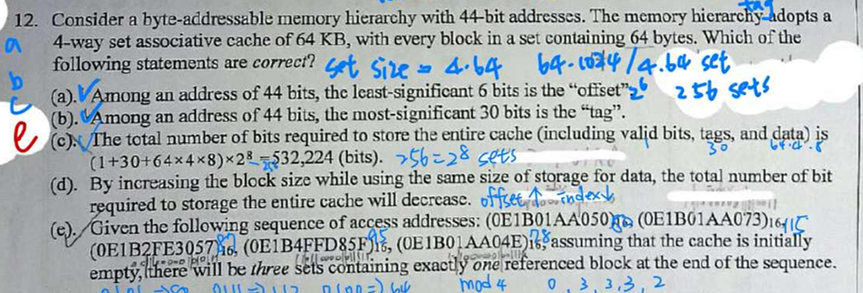

- (a, b, c) 計算 address 組成
  - block size = 64 bytes = 2⁶ → offset = 6 bits
  - 4-way → 每組 4 個 block → set 數量 = 1024 / 4 = 256 sets = 2⁸ → index = 8 bits
  - tag bits = 44–8–6 = 30 bits
  - valid bit: 1, tag: 30 bits, data: 64 bytes = 64 × 8 = 512 bits, 4* 256 blocks

- (d) 如果 block 變大，總資料容量固定，block 總數會減少 → tag 和 valid bit 的 overhead 減少 → 總需要存的 bit 會下降

- (e) 0E1B01AA050 → set 129, 0E1B01AA073→ set 129, 0E1B2FE3057→ set 193, 0E1B4FFD85F→ set 97, 0E1B01AA04E→ set 129，set 129 被訪問了三次，但都屬於同一個 block（offset 不同而已），所以只會存 一個 block。
  - 1. 除 (1000000)₂ 比較商若是一樣表示同一個 block
  - 2. 商接著 mod (100000)₂ 同個餘數坐落在同一個 set 

## 第 13 題 Virtrual Memory, **Page**

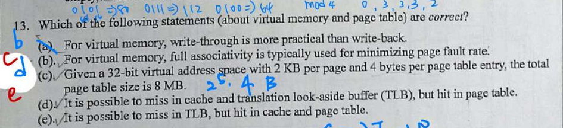

- (a) 虛擬記憶體的「page」在換入換出時，寫回磁碟成本非常高，所以一定要用 write-back（dirty bit）

- (b) 虛擬記憶體頁表 (或 TLB) 通常採 fully associative 或至少 highly associative，避免頁衝突造成 page fault

- (c) **計算 page table size**
  - Page size = 2KB = 2¹¹ → offset = 11 bits
  - VA = 32 bits → VPN = 32 − 11 = 21 bits
  - page number = 2²¹
  - page table entry = 4 bytes → Page table size = 2²¹ × 4 = 2²³ bytes = 8MB

- (d, e) **只要 Page Table miss 在 TLB, Cache 不可能發生 hit**
  | TLB | Page Table | Cache | possible
  |:---:|:----------:|:----:|:----:|
  | Hit | Hit        | Miss | True |
  | Miss | Hit       | Hit | True |
  | Miss | Hit       | Miss | True |
  | Miss | Miss      | Miss | True |
  | Hit | **Miss**   | Miss | False |
  | Hit | **Miss**   | Hit | False |
  | Miss | **Miss**  | Hit | False |

## 第 14 題 Cache

- Cache miss 分三種： 複習
  - Compulsory miss：第一次用到資料，一定會 miss
  - Capacity miss：cache 整體容量不夠
  - Conflict miss：同組(同 set)內路數不夠造成替換（對 direct-mapped 最嚴重）

- (a) block size 對 miss rate 的影響不是單調的，是一條 U 形曲線 ➜ 加大在某些範圍是好的但是過大也會使 capacity miss 增加

## 第 15 題 RAID

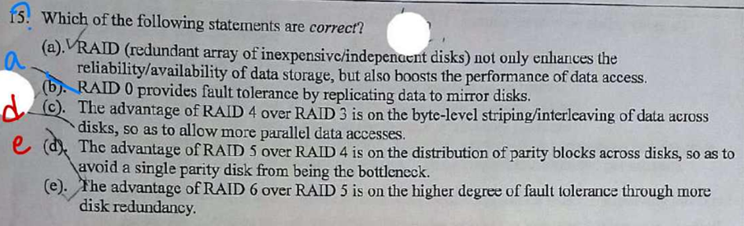

又是 RAID 請參考第 8 題~

## 第 16 - 20 題 **Pipeline**

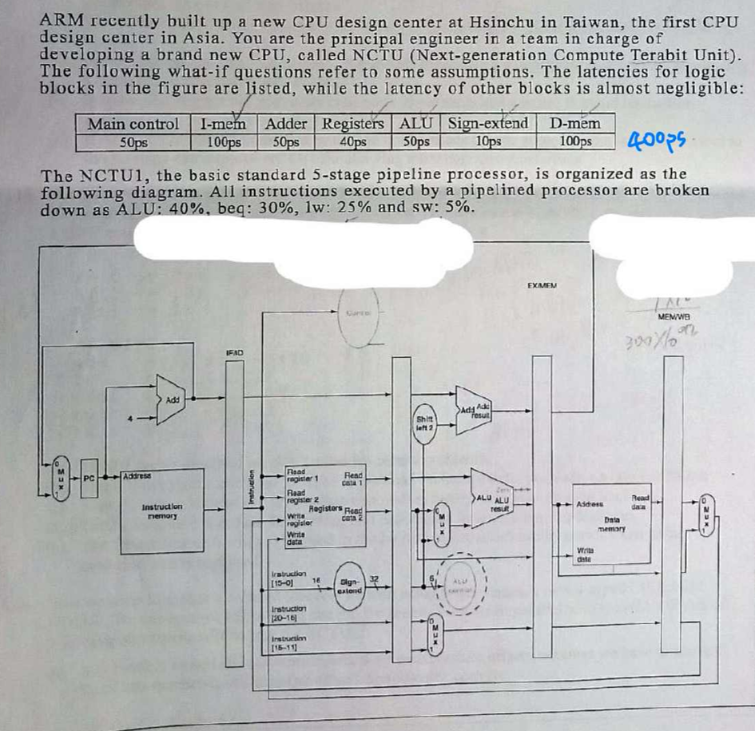

### 第 16 題

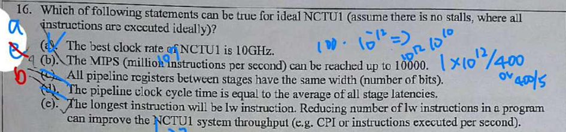

- (a) clock cycle 要遷就最長的操作，I-ME, D-ME 需要 100 ps → 1 sec/100 ps  10¹²/10² = 10¹⁰ → clock cycle = 1/10¹⁰ = 10 * 10⁹ Hz = 10GHz

- (b) 看來是假設 CPI = 1 配上時脈 10GHz 會得到 10000 MIPS

- pipeline register [請參考](https://medium.com/@thk1106/%E4%B8%80%E7%94%9F%E7%A7%91%E7%A7%91%E6%BA%96%E5%82%99%E8%B3%87%E5%B7%A5%E5%9C%A8%E8%81%B7%E5%B0%88%E7%8F%AD%E8%AE%80%E6%9B%B8%E7%AD%86%E8%A8%98-%E8%A8%88%E7%AE%97%E6%A9%9F%E7%B5%84%E7%B9%94-ch4-processer-core-9c144392cd86)

### 第 17 題

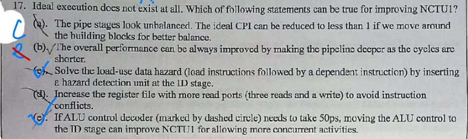

- (a) 單一流水線的理想 CPI 是 1，僅靠重新劃分組件不能把 CPI 降到 <1（除非做超標量或亂序等架構改變）

- (b) 加深流水線會縮短每段時鐘，但也帶來更多暫存器開銷、分支/資料懲罰和控制複雜度，未必永遠改善效能。

- (c) 增加讀埠能解決結構性衝突，但無法消除資料相依（data hazard）；資料相依仍需 forwarding 或 stall。

- (e) clock cycle 瓶頸在 memory read ，EX, ID 階段分別加上 50ps 也都還是 < 100ps 所以移到哪都不是關鍵影響。

### 第 18 題

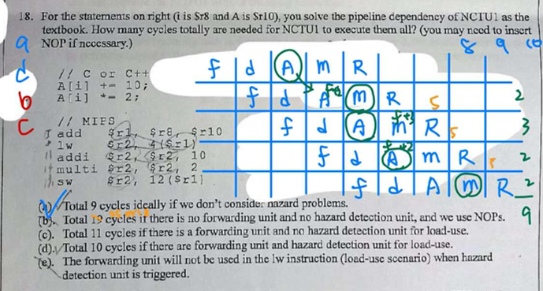

- forwarding unit
  1. R type I type 在 EX 算完之後 forward 給下一個 pipeline EX 或 forward 給下下一個 pipeline (ME → ID )
  2. lw 在 ME 階段後做 forward 下一個指令 EX ，因此下一個指令需要停等一個cycle 確保收到 forwarding

- hazard detect unit
  - lw 在 EX 算完 inform ID 階段的 detect unit → 控制 IF 階段是否 load 指令

- beq 類型
  1. 在 ID 階段 inform 下一個 pipeline IF do flush (相當於一個NOP)，因為要等到 EX 階段才能確定下一條指令 PC
  2. 搭配預測則不做 IF flush

- WB 與 ID 在同一個 cycyle 會使 WB 發生於前半個 cycyle ，ID 則在後半

- 當缺乏硬體元件 forwarding unit 或 hazard detect unit 就需要 compiler 根據資料相依性安排，注意 compiler 沒辦法在 pipeline 過程單停一個 cycle，只能 delay 整個指令
 
**no hazard**
| instr            | 1 | 2 | 3 | 4 | 5 | 6 | 7 | 8 | 9 |
|:---------:|:-:|:-:|:-:|:-:|:-:|:-:|:-:|:-:|:-:|
|add r1 ☐ ☐|IF |ID |EX |ME |WB|   |   |   |   |
|lw r2 4(r1)|   |IF |ID |EX |ME |WB|   |   |   |
|addi r2 r2 ☐|   |   |IF |ID |EX |ME |WB|   |   |
|multi r2 r2 ☐|   |   |   |IF |ID |EX |ME |WB|   |
|sw r2, ☐  |   |   |   |   |IF |ID |EX |ME |WB|

**hazard without both forwarding and hazard detect (compiler 安排)**
| instr            | 1 | 2 | 3 | 4 | 5 | 6 | 7 | 8 | 9 | 10 |
|:---------:|:-:|:-:|:-:|:-:|:-:|:-:|:-:|:-:|:-:|:--:|
|add r1 ☐ ☐|IF |ID |EX |ME |WB |   |   |   |   |    |
|lw r2 4(r1)|   |   |   |IF  |ID |EX |ME |WB |  |    |
|addi r2 r2 ☐|   |   |   |    |   |   |    |IF |ID |EX |
|multi r2 r2 ☐|   |   |   |    |   |   |    |   |   |   |
|sw r2, ☐  |   |   |   |    |   |   |    |   |   |   |

| instr            | 11 | 12 | 13 | 14 | 15 | 16 | 17 | 18 | 19 |
|:----------------:|:--:|:--:|:--:|:--:|:--:|:--:|:--:|:--:|:--:|
|add r1 ☐ ☐|    |    |    |    |    |    |    |    |    |
|lw r2 4(r1)|    |    |    |    |    |    |    |    |    |
|addi r2 r2 ☐|ME |WB  |    |    |    |    |    |    |    |
|multi r2 r2 ☐|IF  |ID  |EX  |ME |WB  |    |    |    |    |
|sw r2, ☐  |    |    |    |    |IF  |ID  |EX  |ME |WB  |

**hazard with forwarding unit but no hazard detect (compiler 要確保 addi ID 階段讀取正確的資料)**
| instr            | 1 | 2 | 3 | 4 | 5 | 6 | 7 | 8 | 9 | 10 | 11|
|:---------:|:-:|:-:|:-:|:-:|:-:|:-:|:-:|:-:|:-:|:--:|:-:|
|add r1 ☐ ☐|IF |ID |EX |ME|WB |   |   |   |   |    |   |
|lw r2 4(r1)|   |IF |ID |EX |ME|WB |   |   |   |    |   |
| stall     |   |   |NOP|NOP|   |   |   |   |   |    |   |
|addi r2 r2 ☐|   |   |   |   |IF |ID |EX |ME|WB|    | |
|mult r2 r2 ☐|   |   |   |   |   |IF |ID |EX |ME|WB | |
|sw r2, ☐  |   |   |   |   |   |   |IF |ID |EX |ME|WB |

**hazard with forwarding unit and hazard detection unit**
| instr            | 1 | 2 | 3 | 4 | 5 | 6 | 7 | 8 | 9 | 10 |
|:----------------:|:-:|:-:|:-:|:-:|:-:|:-:|:-:|:-:|:-:|:--:|
|add r1 ☐ ☐|IF |ID |EX*|ME|WB |   |   |   |   |    |
|lw r2 4(r1)|   |IF |ID |EX|ME|WB|   |   |   |    |
|addi r2 r2 ☐|   |   |IF | S |ID |EX|ME|WB |   |    |
|multi r2 r2 ☐|   |   |   |   |IF |ID |EX|ME|WB |    |
|sw r2, ☐  |   |   |   |   |   |IF |ID |EX|ME|WB  |

- (e) 即使 hazard detected 還是需要 forwarding 不然就會卡更久

### 第 19 題

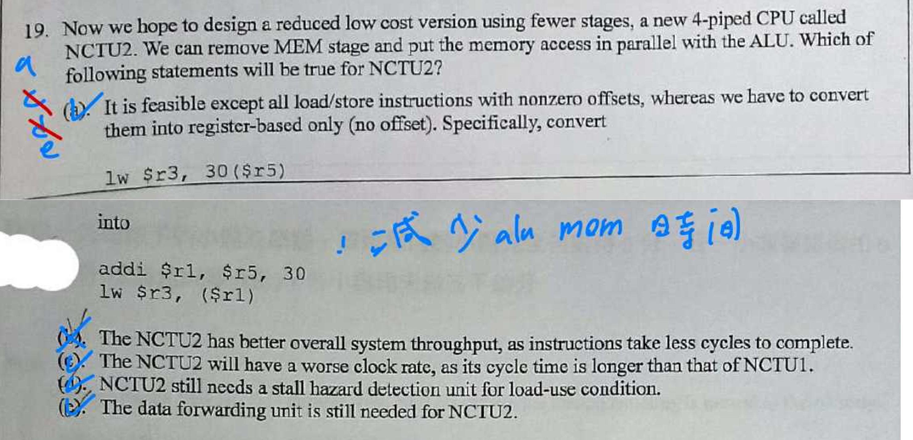

- (a) 把 ME 跟 ALU 同時進行表示 lw 要運算 address 應該先算完，所以會把指令分成兩個前後執行

- (b) pipeline 階段減少表示單位時間內執行的指令減少才對

- (c) 因為是 ME 跟 ALU 並行所以 clock cycle 應該還是 100ps

- (d, e) ME 跟 ALU 同一個 stage ，下一條指令的 ME 跟 ALU 一定是在上一個 ME 跟 ALU 後，所以 lw 後的 stall 可以不需要

- Load-Use Condition 指 上一個指令是讀取記憶體 (lw) 造成的 data hazard

### 第 20 題

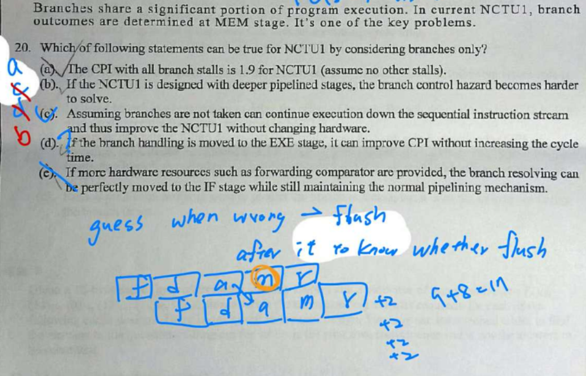

- (a) branch result 會在 ALU 之後如果下一個有依賴則需要stall 3 個 clock cycle，題目有給 beq(branch 指令) 機率 30% ，所以 1 CPI + 3*0.3 = 1.9

- (b) 管線越深（或分更多 stage）→ 分辨 branch 的 stage 距離 IF 越遠 → branch penalty 通常越大 → 需要的預測/硬體機制越強、複雜度越高，所以 control-hazard 更難處理。

- (c) branch taken 如果常常 miss 即使設計 default branch taken 實際效率還是差

- (d) 把 branch resolution 提早到 EXE（比 ME 早一 stage）會縮短每個 branch 的 penalty（例如由 3 cycle 變 2 cycle），因此 CPI 可改善。(我主要是覺得不還是要等ALU算完才知道結果嗎?)

- (e) 要在 IF 就「完美解決」一個分支（例如 beq），須在 IF 週期取得 branch 判定所需的兩個 register 值並比較，然而那些 register 的值可能尚未由前面指令產生（data hazards）。實務上，解法通常是更好的 branch predictor、BTB、或把比較推到 ID/EX 還是 EX，但「完美移到 IF 且維持正常 pipeline」幾乎不可行

## 第 21, 22 題 **Pipeline**

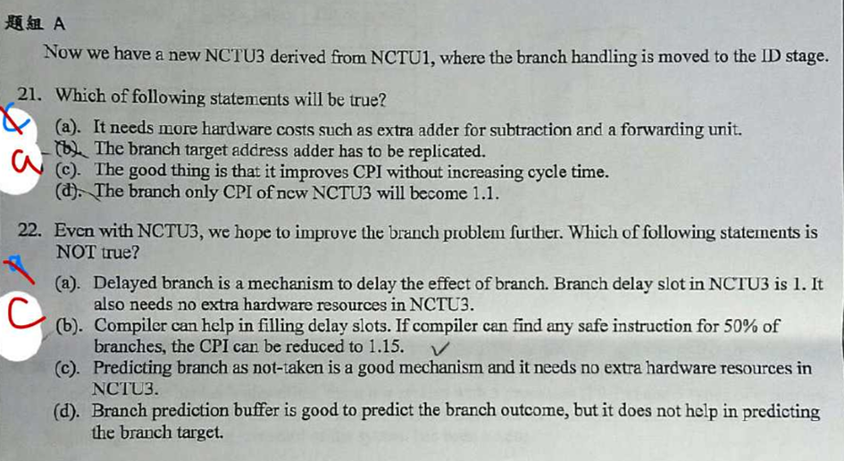

### 第 21 題

- (a) 提前算出要 jump 的 address，需要把 EXE 結果 forward 到下一個 instruction ID 階段
  - 把branch handle 整個移到 ID 表示 ALU (計算next pc 的那個) 需要一起移到 ID

- (b) 移動分支處理只需要再增加一個加法器來計算分支目標位址 (PC + Offset)，而不是複製既有的 PC+4 加法器

- (c) 如果 ID 變成 critical point 可能影響 cycle time
  - ID 要做的事變多了 如果 ID 階段需要的時間拉長 則 clock cycle 要拉長

- (d) 1 + 30% * 1 = 1.3 CPI

### 第 22 題

- (a) **Delay slot 完全靠編譯器**，不用加硬體

- (b) 計算：未填補 stall=1 → CPI=1.3；50% 被填補 → 有效等於 stall=0.5 → 1 + 0.5 * 0.3 = 1.15 ✔︎ (原來是補償 stall 影響的時間，沒看懂意思)

- (c) branch taken/not take 最好是可以有預測機制才是真的確定可以有助於效能

- (d) **分支預測緩衝區 (Branch Prediction Buffer) 有助於預測分支結果，但無助於預測分支目標 ( branch address )。**
  - Branch Target Buffer（BTB）專門記錄 branch instruction 的目標位址（branch target address）， 讓 CPU 在 IF 階段就能直接取下一條指令，不必等到 EX 算完。

## 第 23, 24 題 Cache

- 記得看到 address 後應該用 block size 做除法之後才知道屬於幾號 block 然後 mod (set number) 才是 index

- 如果是 address/block size 取得的整數一樣表示他們是同一個 block 裡的資料.

- 其他算式都在圖裡了~

## 第 25, 26, 27 題 **Banker Algorithm**

- 算出每個 process 還缺多少資源 ( Need = Max-Allocation ) 

| PID | Allocation (A B C) | Max (A B C) | Need (A B C) = Max - Allocation | Available (Work) |
|:---:|:------------------:|:----------:|:--------------------------------:|:----------------:|
| P0  | 0 1 0              | 7 5 3      | 7-0=7, 5-1=4, 3-0=3              | 3 3 2            |
| P1  | 2 0 0              | 3 2 2      | 3-2=1, 2-0=2, 2-0=2              |                  |
| P2  | 3 0 2              | 9 0 2      | 9-3=6, 0-0=0, 2-2=0              |                  |
| P3  | 2 1 1              | 2 2 2      | 2-2=0, 2-1=1, 2-1=1              |                  |
| P4  | 0 0 2              | 4 3 3      | 4-0=4, 3-0=3, 3-2=1              |                  |

- 把目前可分配資源給該 process 後 讓該 process 完成任務後可以釋放資源 接下來用這些資源給下一個process 讓所有 process 都能順利進行

## 第 28, 29 題 **Linux System**

- chmod (change mode) 
  - 每個檔案/資料夾都有三種使用者身份：user, group, others 
  - 權限用 3 個數字表示：r=4, w=2, x=1
  - chmod 763 [file path] 

  |user|group|others|
  |:---:|:---:|:---:|
  |權限7|權限6 |權限3|
  |1+2+4|4+2  |1+2  |
  |RWX  |RW   |WX   |

  **以此類推**

- chown (change owner)
  - chown user [file/dir] # 改擁有者
  - chown user:group [file/dir] # 同時改擁有者 + 群組

- chgrp (change group)
  - chgrp devteam [file/dir]

<!-- ---------------------------------------

呼 ~ 花了三天 ，這但是好像沒辦法降低焦慮感，我本來想說這可以幫我的進度打氣，結果是發現很多東西還沒看完，然後以為看熟的還是不會，進度又樣往後推，理論上我這週應該做 107 年考古題喔! 我突然覺得高中的我很厲害，可以做在 K 書中心 10 個小時，我現在專心 3 小時就已經很想撞牆了，而且還都做錯題目 ༼ಢ_ಢ༽ ༼ಢ_ಢ༽ ༼ಢ_ಢ༽ -->

<!-- 
- (a)

- (b)

- (c)

- (d)

- (e) 
-->