# 109 -Sys-HW

## 第 1 題 op system

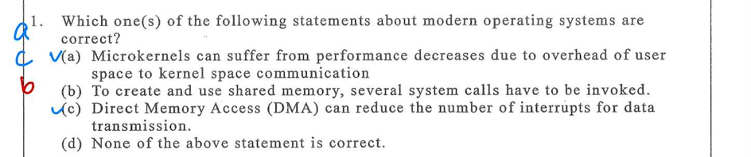

- Kernel 架構
  1. Monolithic Kernel: 將所有 OS 的核心功能（排程、記憶體管理、檔案系統、驅動程式等）全部打包在一個巨大的核心程式中，執行在同一個記憶體空間，效能極高，因為元件之間可以直接呼叫函數，但容易發生單點崩困 (SPF)。
  2. Microkernel: 將多數服務（如檔案系統、驅動程式）移至使用者空間 (User Space)。這導致不同模組間溝通需要大量的 IPC (行程間通訊) 與 Context Switch，確實會產生額外開銷並降低效能。
  3. Hybrid Kernel: 結合了 Monolithic 與 Microkernel 的優點。雖然大部分服務仍在核心空間執行（為了效能），但採用了模組化設計，讓結構更像 Microkernel。
  4. Exokernel: 極端簡化核心功能。核心幾乎不提供抽象層（不管理檔案系統或虛擬記憶體），只負責「分配硬體資源」與「保護」。讓應用程式直接控制硬體（如直接讀寫硬碟區塊）。
  5. **Nanokernel / Picokernel**: 比 Microkernel 更小的核心，只負責最底層的中斷處理與硬體抽象層。通常用於嵌入式系統或作為 Hypervisor (虛擬機管理程式) 的基礎。

- 記憶體管理
  - 建立並使用共享記憶體 (Shared Memory) 通常需要多個步驟。例如在 POSIX 標準中需先呼叫 shm_open() 建立物件，再呼叫 mmap() 將其映射到記憶體空間；或 System V IPC 中的 shmget() 與 shmat()

- I/O 資料讀寫
  - DMA (Direct Memory Access) 是一個硬體裝置包含了 Controller (負責發號施令) 跟 Internal Buffer (負責暫存調節流速) ，可以直接將周邊硬體(網卡或 SSD等) 資料寫入 driver process 被分配的記憶體區塊，寫入 RAM 跟 CPU 共用 BUS ，因此 CPU 會在開始與結束時處理中斷，相較過去技術不需針對每個 Byte 進行介入，因此大幅減少了 CPU 中斷次數。 [影片解說~](https://www.youtube.com/watch?v=s8RGHggL7ws)

## 第 2 題 op system

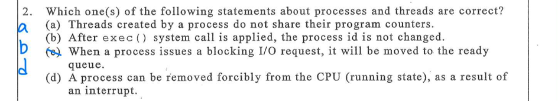

- Threads
  - Threads 由現有的 Process 透過特定的系統呼叫 (System Call) 向作業系統申請而來的。Thread 雖然共享 Process 的資源（如 Code、Data、Heap），但為了能夠獨立執行程式碼，每個 Thread 必須擁有**自己獨立的 Program Counter (PC)、Registers 和 Stack。**

- Process 建立
  - fork() 系統呼叫的作用是「沿用原本的 Process 結構與屬性**建立一個新Process (新的PID)**」
  - exec() 系統呼叫的作用是「覆蓋新的程式取代目前的記憶體內容（Code/Data/Stack）」

- Process state 管理
  - 當 Process 發出 Blocking I/O 請求時，它會進入 Waiting State (或 Blocked State) 等待 I/O 完成
    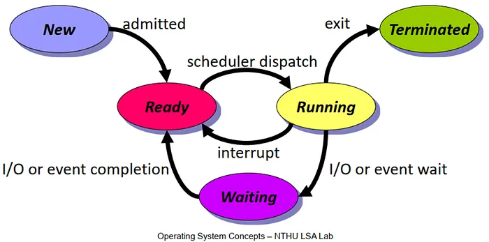

- Interrupt
  - 這是 Preemption (搶佔式) 排程的定義。當發生中斷（例如 Timer Interrupt 時間到，或高優先權的中斷發生）時，OS 會強制將 CPU 從目前的 Process 身上移走，將其狀態存回 Process Control Block (PCB) 並放回 Ready Queue。

## 第 3 題 **Semaphore**


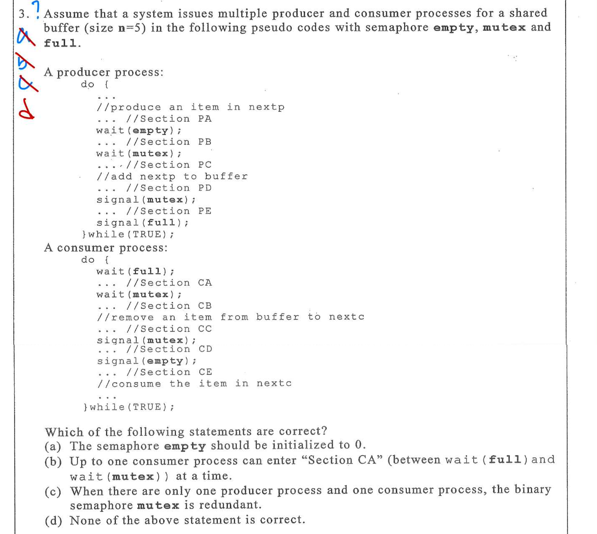


- Semaphore。它是一個整數變數，除了初始化外，只能透過兩個**原子（Atomic）**操作來存取：wait() (又稱 P 操作) 和 signal() (又稱 V 操作)。

  ```
  typedef struct {
  int value;
  struct process *list; // 等待佇列 (Waiting Queue)
  } semaphore;
  wait(semaphore *S) {
      S->value--;
      if (S->value < 0) {
          // 將此 process 加入 S->list
          block(); // System call: 讓 process 進入 sleep 狀態
      }
  }
  signal(semaphore *S) {
      S->value++;
      if (S->value <= 0) {
          // 從 S->list 移除一個 process (P)
          wakeup(P); // System call: 喚醒 process
      }
  }
  ```

  - 應用於三種模式
    1. 互斥 (Mutual Exclusion, Mutex): 同一時間只有一個人能進入
    2. 順序控制 (Signaling / Ordering): Process A 必須先執行完某語句，Process B 才能執行。
    3. 資源計數 (Counting / Multiplexing): 用來控管有限數量的資源（如 5 台印表機）

- Producer-Consumer Problem
  - empty： Counting Semaphore，表示 Buffer 中「剩餘的空位數量」。
  - full： Counting Semaphore，表示 Buffer 中「已存入的資料數量」。
  - mutex：Binary Semaphore，用於保護 Critical Section (臨界區間)，確保一次只有一個行程能存取 Buffer。
  - Buffer 大小 (n)：5

- (a) producer 一開始執行 wait(empty) 表示檢查 buffer 是否有空位，初始狀態buffer 為空， empty 如果設置為 0 表示 buffer 無空位，矛盾。.

- (b) producer 跟 consumer 真正對 buffer (通常就是記憶體)操作是在 wait(mutex) 跟 signal(mutex) 之間在這之外的操作並不會造成 race condition。

- (c) producer 跟 consumer 操作期間都需要修改到 empty 跟 full 變數，可以想像如果沒有 mutex ，producer 執行 wait(empty) 到 signal (full) 之間consumer 執行 wait(full) ，訊息直接錯亂了。
  - 注意如果使用 Circular Buffer 則 producer 只 maintain empty 變數; consumer 只 maintain full 變數，則不需要 mutex ，因為這個機制保證會讀取空的 buffer 位。

## 第 4 題 **Banker’s Algorithm**

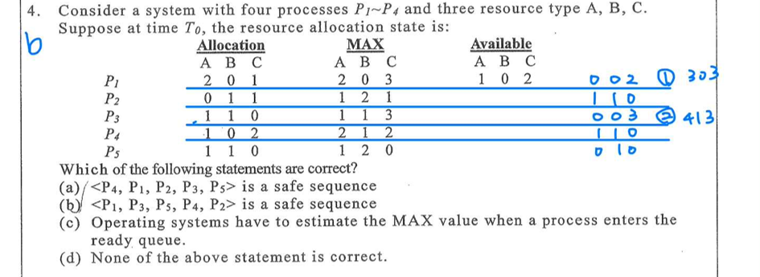

Allocation 是目前 process 佔有的資源，MAX 則是完成 process 並釋放資源需要多少資源 ，Available 就是還能分配的資源，所以分給 process 讓其達到 MAX 狀態後釋放資源，再將資源給下一個 process ，重複直到完成所有 process 。

- (c) 銀行家演算法 (Banker’s Algorithm) 是一個死結避免 (Deadlock Avoidance) 的演算法，不能用估算的。
  - 為了保證系統絕對安全，作業系統不能「猜」 (Estimate) 行程需要多少資源。如果猜錯了（例如猜它只需要 5 個，結果它執行到一半要 10 個），系統就會當機或死結。混淆了 CPU scheualing 中的觀念。在 SJF (Shortest Job First) 排程中，OS 確實需要去 estimate 下一個 CPU Burst Time (例如用指數平均法)。
  - process 在開始執行之前，必須主動 Declare 最多需要多少資源。這是已知的事實，不是 OS 算出來或猜出來的。

## 第 5 題 **Mutex**


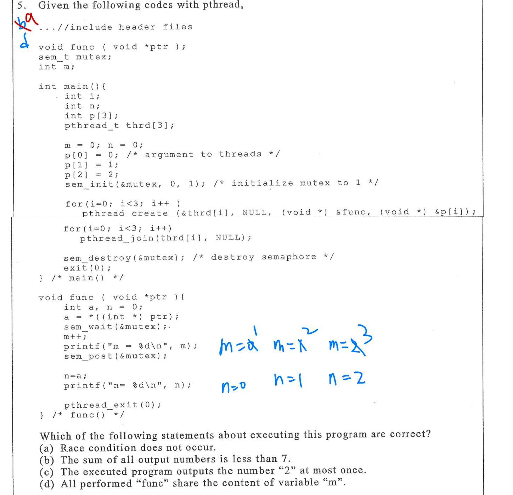


- (a) main 中 sem_init 打開 mutex，然後 loop 3 個 pthread create ，callbake fn 中 m++ , print 會是原子操作 ，此操作防止了 race condition 。

- m 是 global 變數，值會依序變為 1, 2, 3。印出的 m 值也會是 1, 2, 3 (順序固定)。

- n 是 local 變數，三個執行緒會分別印出 n = 0, n = 1, n = 2 (順序不固定，視排程而定)。

## 第 6 題 **Semaphore**

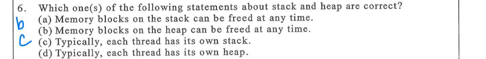

- stack 跟 heap 都位於被分配的記憶體區塊也可以動態改變大小。

- stack 通常是程式運作發生套嵌或是遞迴時 cache 上一個函式狀態的記憶結構，如果任意拋棄，整個process 會錯亂。

- 因此 thread 通常會有各自的 stack。stack 通常還是會有硬性上限（例如 Linux default 8MB），超過就炸掉 (Stack Overflow)

## 第 7 題 RAID

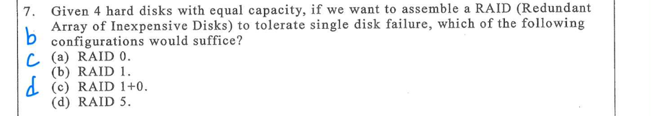

- RAID 0 : block-level Striping：資料切塊分散(平行)寫入所有磁碟，速度最快，但無冗餘，一顆壞整組掛。

- RAID 1 : 純鏡像（Mirroring）：資料完全複製到另一顆磁碟，最安全（可壞一顆），但容量減半，寫入無平行。

- RAID 5 : block-level Striping + 分散式同位檢查（Distributed Parity）：速度與容量平衡佳，可壞一顆，最常用。

- RAID 6 : RAID 5 升級版，加第二個分散式同位檢查：可壞兩顆，更安全，寫入稍慢。

- RAID 1+0（或 RAID 10）先條帶再鏡像 ：多組 RAID 0 再做 RAID 1，速度快、可壞多顆（每組一顆），最推薦企業用

## 第 8 題 **Page**

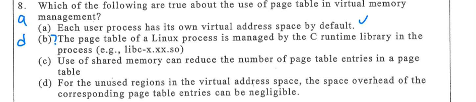

- (b) Page Table 是由 Kernel 管理的硬體結構，不是由 **User space 的函式庫 (glibc)** 管理

- (c) **共享記憶體通常是讓不同 Process 的 Page Table Entry (PTE) 指向同一個實體頁框 (Page Frame)**。這並不會減少 Entry 的數量，反而需要建立對應的 Entry 來進行映射。

- 對於虛擬空間中未使用的區域，其 Page table entries 的空間開銷可以忽略不計

## 第 9 題 **Unix File System (UFS / Ext2) 架構**

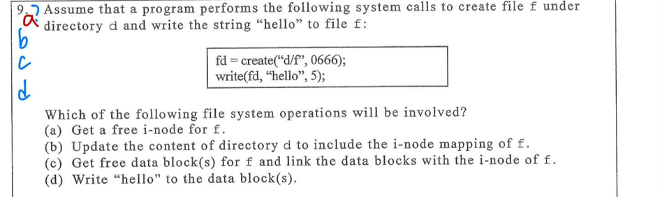

- Unix File System (UFS / Ext2) 架構
  1. Superblock / Bitmaps：用來管理「哪些 Inode 是空的」、「哪些 Data Block 是空的」。
  2. Inode Table：存放所有檔案的屬性（Metadata），但不包含檔名。
  3. Data Blocks：存放檔案的實際內容，以及目錄的「檔名對照表」。

- 建立新檔案 (Create File) 的運作流程
  1. 分配 Inode (Inode Allocation)
     1. 檢查 Bitmap：作業系統讀取 Inode Bitmap，尋找第一個標記為 0（未使用）的 bit。
     2. 鎖定與標記：將該 bit 設為 1（已使用），並計算出對應的 Inode Number (i-number)。
     3. 初始化 Inode：在 Inode Table 中找到對應的位置，寫入檔案屬性（Owner, Permissions, Size=0, Ctime, Mtime 等）。此時檔案內容為空，所以 Block Pointers 也是空的。
  2. 更新目錄 (Update Directory)
     1. 讀取父目錄：OS 讀取父目錄 d 的 Inode，找到 d 的 Data Block 位置
     2. 寫入 Directory Entry：在 $d$ 的 Data Block 中，新增一筆紀錄 (filename: "file.txt", inode: 1234)。
     3. 如果父目錄 d 的 Data Block 空間滿了，OS 必須先為目錄 d 分配一個新的 Data Block，才能寫入這筆新的 entry。

<div style="page-break-after: always;"></div>

- 寫入資料 (Write Data) 的運作流程
  1. 分配資料區塊 (Data Block Allocation)
     1. 檢查 Bitmap：OS 讀取 Data Block Bitmap，尋找空閒的區塊（Free Blocks）。
     2. 佔用區塊：將找到的 bit 設為 1，取得 Block Number（例如：Block 800）。
  2. 寫入實際內容 (Write Content)
     - Disk I/O：將使用者 Buffer 中的資料寫入剛剛分配到的實體 Block 800。
  3. 更新 Inode 指標 (Update Inode Pointers)
     - Direct Pointers：如果檔案很小，OS 會將 Block 800 的編號直接填入 Inode 的 Direct Block pointers 欄位（通常是前 12 個）。
     - Indirect Pointers：如果檔案變大，Direct pointers 用光了，OS 會再分配一個 Block 當作「指標表 (Index Block)」，這就是 Single Indirect。
     - 更新 Metadata：最後更新 Inode 中的 File Size 和 Modification Time。

## 第 10 題 **cyber safe**

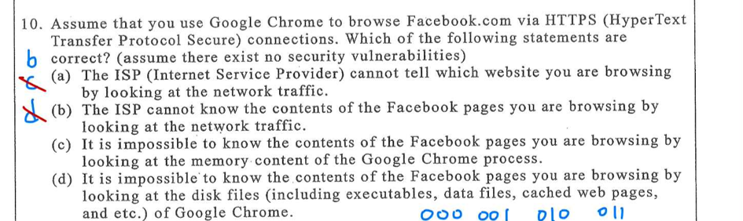

- (a) 雖然內容加密了，但在建立連線時（DNS 查詢、TLS Handshake 中的 SNI 欄位、以及目標 IP 位址），ISP 仍然可以知道你是連線到 facebook.com

- (b) HTTPS (TLS/SSL) 的主要功能是加密 HTTP 的 Header（如 URL 路徑、Cookie）和 Body（貼文內容、圖片），ISP 看到的只是一堆亂碼。

- (c) 瀏覽器為了將網頁顯示給你看，必須在記憶體中將加密的資料 解密 (Decrypt)。如果駭客或惡意軟體能存取你的 RAM，就能看到明文內容。

- (d) 瀏覽器會有 快取 (Cache)、Cookie 檔案，作業系統也會有 Swap/Pagefile (分頁檔)。這些檔案很可能包含了解密後的網頁內容或瀏覽紀錄。

## 第 11 題 2's Complement

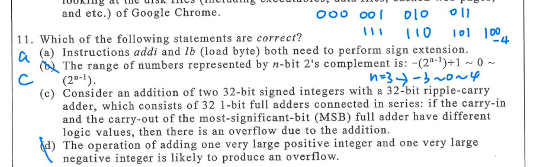

- (a) 以 32 bit MIPS ， addi 跟 lb 都是後 16 bit ，ALU 是 32 bit 因此一定需要做 sign extension

- (b) 可以用 n=3 的 2's complement 來觀察 000 = 0, 001 = 1, 111 = -1 ，1 開頭一定是負數 100 只能是 -4 ，所以範圍應該是 - 2ⁿ ~ 0 ~ 2ⁿ - 1

- (c) 對於最右邊的 bit 如果進位有 1 ，那麼加完得到 0 一定是 overflow 的結果。

- (d) 數字範圍是 - 2ⁿ ~ 0 ~ 2ⁿ - 1 所以如果取正數負數相加一定不可能產生 overflow

## 第 12 題 Big-endian Little-endian

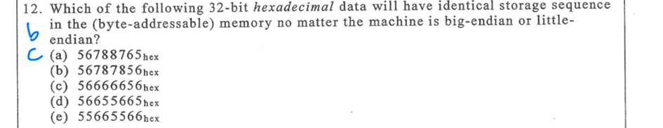

ref: 105-Sys-HW第 11 題 ISA 選項 (e)

- （以 32-bit 整數 0x12 34 56 78 為例）

|   記憶體位址   | Big-endian（內容） | Little-endian（內容） |
| :------------: | :----------------: | :-------------------: |
| 0x00（低位址） |    0x12（MSB）     |      0x78（LSB）      |
|      0x01      |        0x34        |         0x56          |
|      0x02      |        0x56        |         0x34          |
| 0x03（高位址） |    0x78（LSB）     |      0x12（MSB）      |

## 第 13 題 CPI

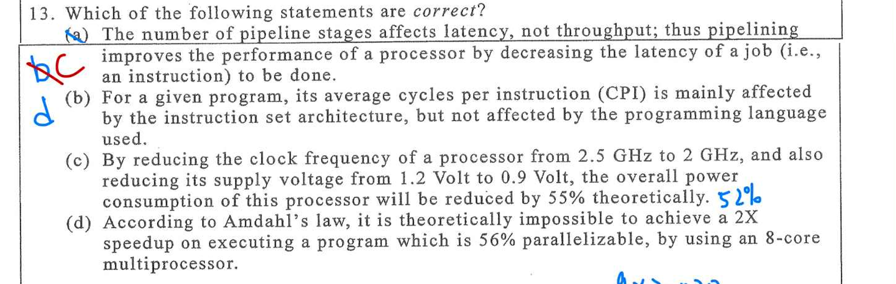

- (a) Pipelining (管線化) 的主要目的是增加 Throughput (吞吐量)，實際上，因為管線暫存器 (Latch) 的延遲，單一指令的 Latency 反而會稍微增加。

- (b) **程式語言與編譯器決定了指令的組合 (Instruction Mix)。不同語言產生的指令複雜度不同，絕對會影響平均 CPI。**

- (c) p = f v²

- (d) **Amdahl's law**
  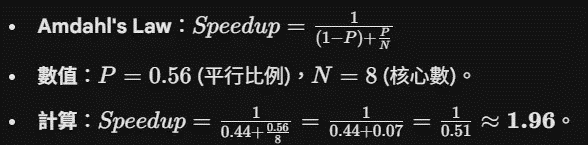

<div style="page-break-after: always;"></div>

## 第 14 題 **MIPS 指令**

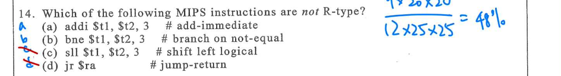

- MIPS 指令格式總整理
    1. R-type (Register format)
        - 格式結構 (32 bits)：$$\begin{array}{|c|c|c|c|c|c|}\hline\text{op (6)} & \text{rs (5)} & \text{rt (5)} & \text{rd (5)} & \text{shamt (5)} & \text{funct (6)} \\\hline\end{array}$$
        - add、**sll**、**jr** (雖然它名字叫 Jump Register，但因為它的目標位址存在「暫存器」($ra) 中，所以它必須讀取 rs 欄位，因此歸類為 R-type (Opcode=0, Funct=8)。)
    2. I-type (Immediate format)
        - 格式結構 (32 bits)：$$\begin{array}{|c|c|c|c|}\hline\text{op (6)} & \text{rs (5)} & \text{rt (5)} & \text{immediate (16)} \\\hline\end{array}$$
        - addi, bne
    3. J-type (Jump format)
        - 格式結構 (32 bits)：$$\begin{array}{|c|c|}\hline\text{op (6)} & \text{address (26)} \\\hline\end{array}$$
        - j, jal

<div style="page-break-after: always;"></div>

## 第 15 題 Float point, Branch

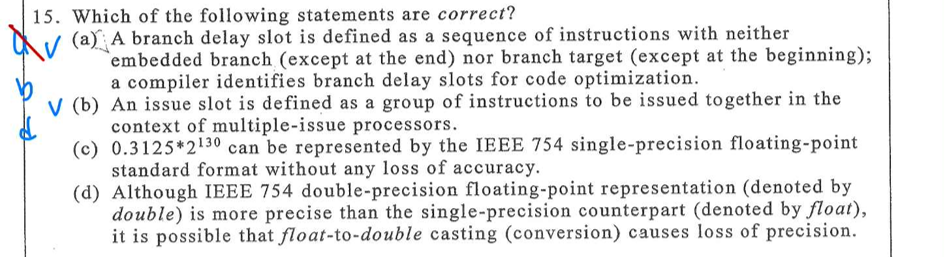

- (a) **Branch Delay Slot 確實是指分支指令後的那個指令位置，無論分支是否發生，該位置的指令都會被執行。編譯器負責填入適當指令以優化效能。**

- (b) Issue Slot 在多指令發射處理器 (Multiple-issue processor) 中，定義了同一個 Cycle 可以發射指令的位置數量。

- (c) **0.3125 × 2¹²³ = 1.25 × 2⁻² × 2¹³⁰ = 1.25 × 2¹²⁸，IEEE 754 單精確度 (Single Precision) 的指數最大值為 +127**

- (d) float (32-bit) 轉 double (64-bit) ，double 精確度 > float 精確度，轉換會損失精度。

## 第 16 題 Pipeline, ALU, Instruction


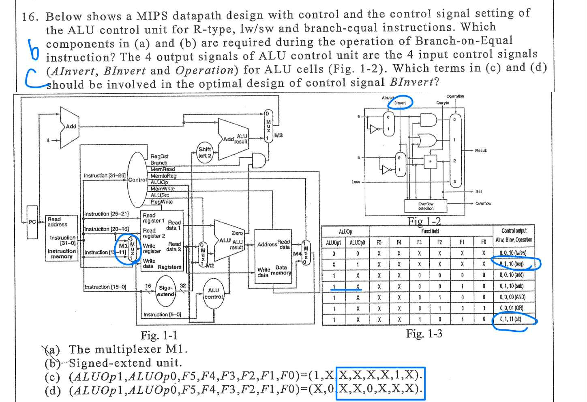


- Multiplexer M1：M1 是用來決定「寫入哪個暫存器（Write Register）」的（rt 還是 rd）， beq 指令不會寫回暫存器，因此 M1 的選擇對 beq 來說不是必要元件。

- 執行 beq 就需要 alu 操作 slt 這需要有訊號進入 alu control，依賴的是 register 之外的控制碼 15-0 的 message 會經過 sign-extend。

- 觀察 Truth Table (Fig 1-3)  看中間那欄 Control Output 的第二個 bit (BInvert)。

- 什麼時候 BInvert = 1
    - Row 2 (beq), Row 4 (sub), Row 7 (slt)

- R-type (ALUOp1 = 1) 的情況下，只要 F1 = 1，則 BInvert 就必須是 1

## 第 17 題 Vector processor, WSC, Nwtwork Topology

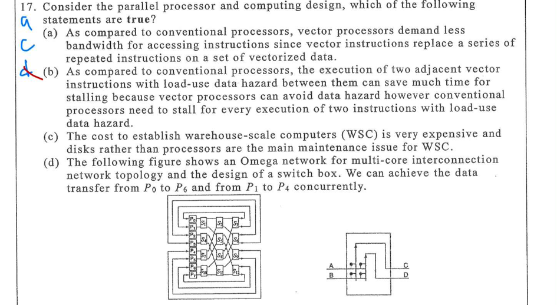

- (a) Vector processor 一個指令處理一堆資料，大幅減少 Instruction Fetch 的頻寬需求。

- (b) **vectol processor load 跟 execute 有各自 pipeline 當兩個指令在 load 階段卡住也不能執行 execute**

- (c) 在 Warehouse-scale computers (WSC) 中，硬碟 (Disk) 的故障率與維護成本往往高於 CPU。

- (d) **P0 連 P6 ⭢ S1 得設為 cross 狀態, 即 A 連接至 D 而 B 連接至 C。P1 連 P4 ⭢ S1 得設為 bar 狀態.即 A 連接至 C 而 B 連接至 D。因此, 不可能同時通訊。**

## 第 18 題 Pipeline

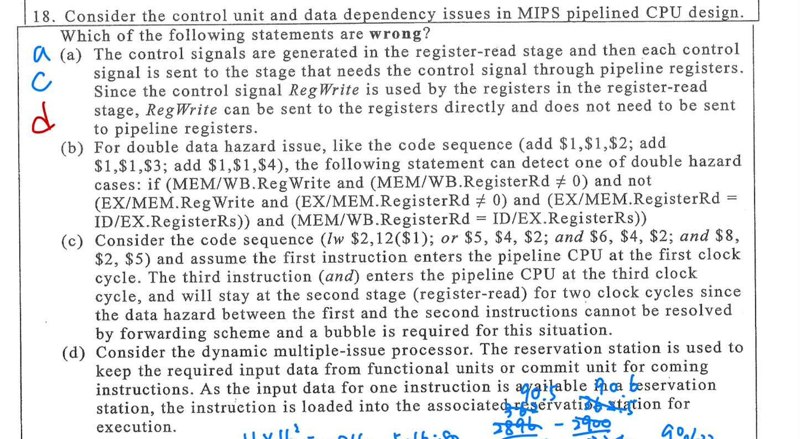

- (a) pipeline 之間有 register ，ID 階段讀到的控制訊息需要傳遞下去，不然後面的操作不能執行

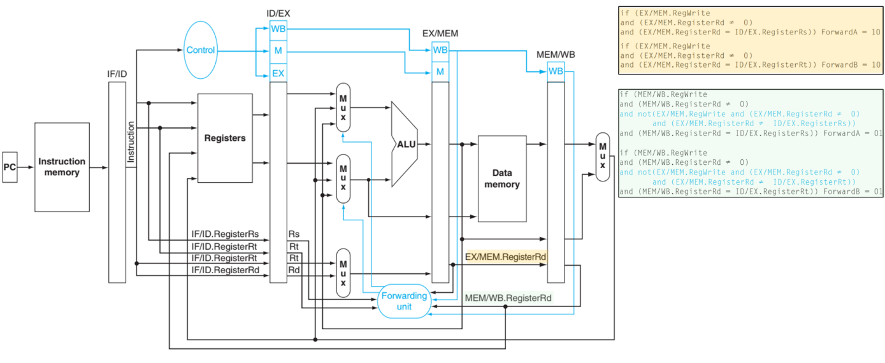

- (c) or 要等 lw 2 個 clock cycle， and 要等 or 1 個 clock cycle 。

- (d) **錯在最後一句 load… ，指令是在 Issue 階段就載入 Reservation Station (RS) 等待。而不是等資料好了才載入 RS。**

## 第 19 題 Cache 

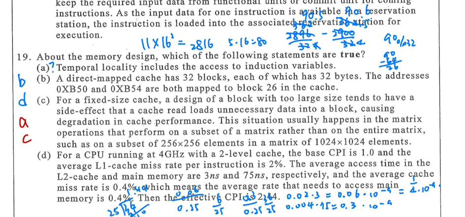

- **Induction variables (如迴圈計數器 i) 在迴圈中被頻繁重複存取，屬於Temporal Locality**

- Block size 太大會導致 Cache Pollution。特別是在處理矩陣子集 (Stride 大，跳著讀) 時，會讀入大量不必要的鄰近資料 (Low spatial locality for the specific task)，浪費頻寬與 Cache 空間。 (我以為 Stride 時候要自行配合 cache block size )

<div style="page-break-after: always;"></div>

## 第 20 題 **Pipeline 困難**

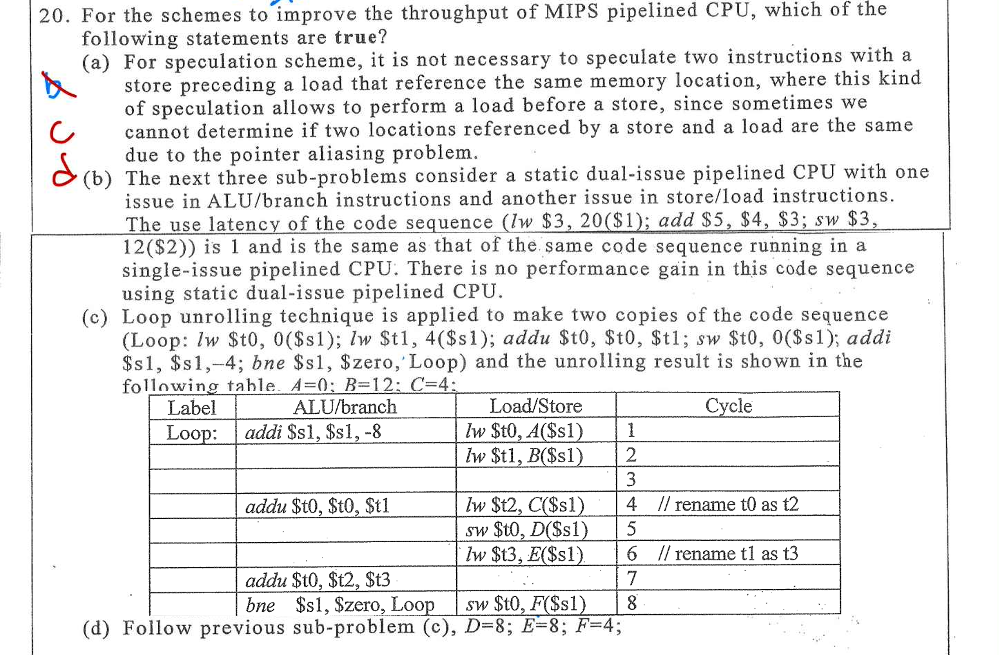

- 編譯器在編譯時 「無法確定」 記憶體位址是否衝突 (Pointer Aliasing)，所以硬體才需要 「推測 (Speculate)」 它們不衝突並提前執行 Load。如果猜錯了再 rollback；如果猜對了就賺到效能。

- 雖然 Load-Use Hazard 會導致 Stall，但在 Dual-issue 架構下，指令發射寬度變寬，仍然能帶來加速。

- 指令解析
    - A: 指令跟 addi 在同一拍發射 (Cycle 1)。在標準 MIPS 設計中，同一拍讀取暫存器會讀到 舊的值 (Old $s1) ，A = 0。
    - B:addi 已經發生 (在 EX/MEM 階段)，透過 Forwarding，此指令會用到 新值 (New $s1)， B = | - 4 - 8 | = 12。
    - C: 因為第二次迭代本來 $s1$ 會少 4 ， C = 4。
    - D: 這是 第一次迭代 的 Store ， D = 8。
    - E: 這是 第二次迭代 的第二個 Load ， E = 8。
    - F: 這是 第二次迭代 的 Store， F = 4。

## 第 21-24 題 

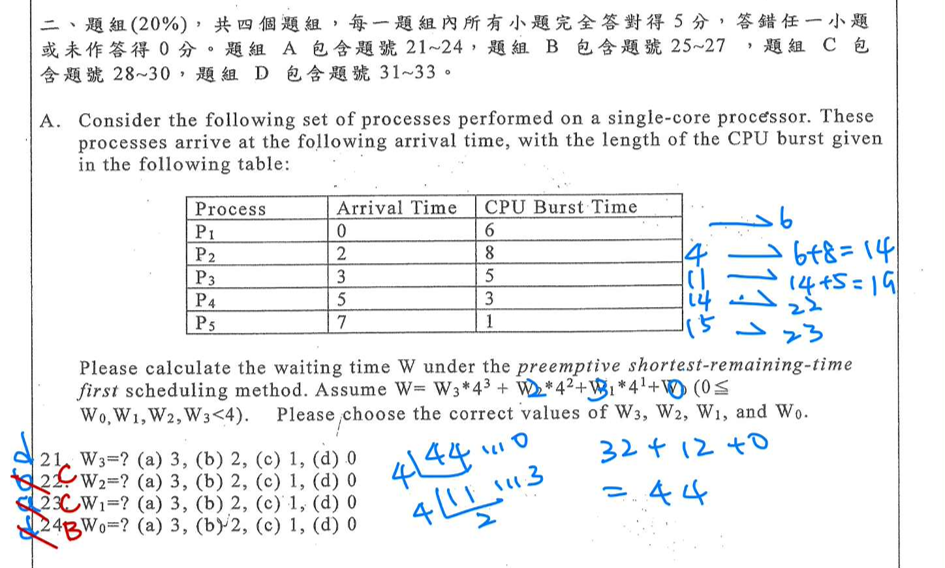

- 題目提到 "preemptive shortest remaining time first" 表示可以搶佔

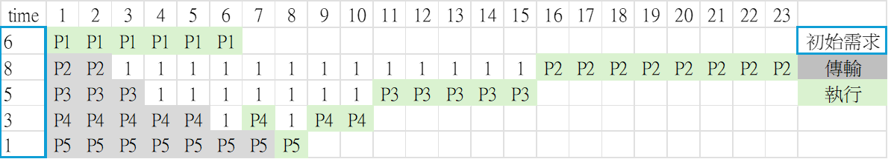

    - time = 7 時，P5 訊息還沒到當下 P4 是 shortest remaining
    - time = 8 時，P5 到了 P5 是 shortest remaining 搶佔 

## 第 25-27 題 **Virtual Memory**

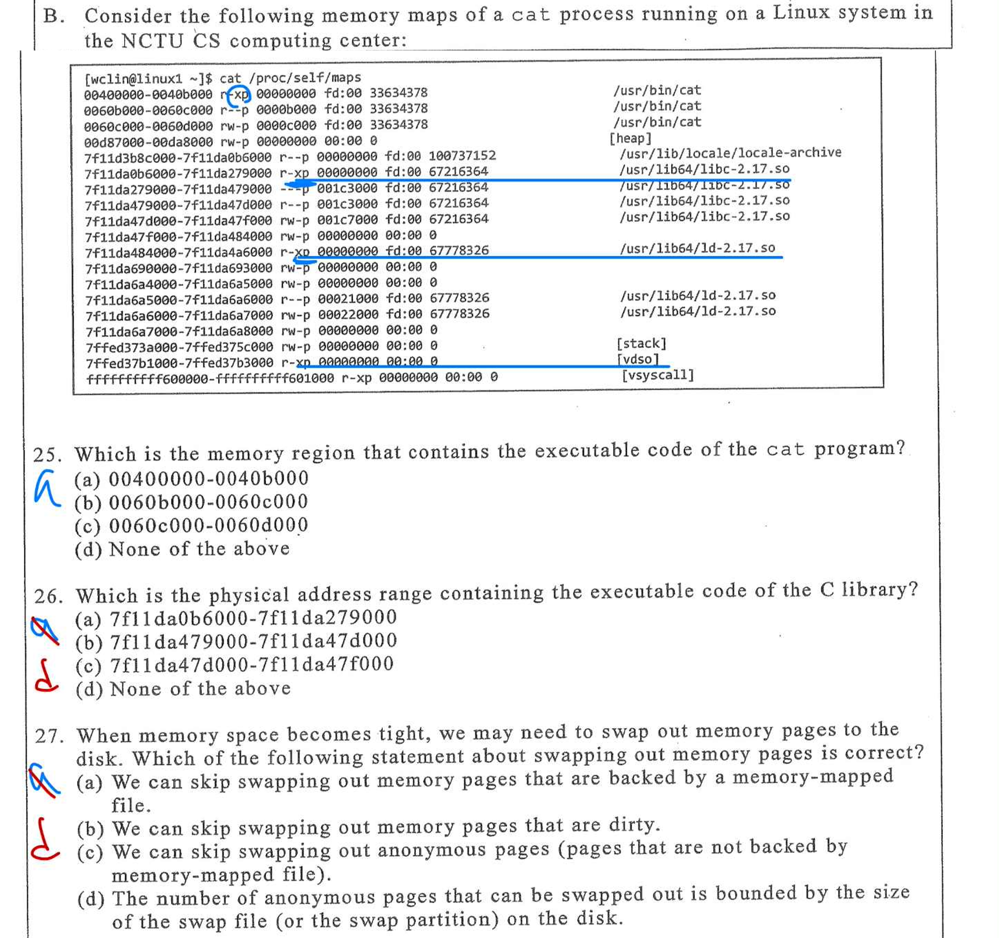

- 可執行碼 ⭢ 標記 xp

- memory map 都是 VA ，
    - 如果改問 VA 答案是：7f11da0b6000-7f11da279000 r-xp ... /usr/lib64/libc-2.17.so。

<div style="page-break-after: always;"></div>

### 第 27 題  ( gemini 說 a 比較正確 ~)

- (a) We can skip swapping out memory pages that are backed by a memory-mapped file. (我們可以跳過將「檔案映射分頁」寫入置換空間的動作)
    - 這裡的 “Swapping out” 狹義上指的是「寫入 Swap Partition/File」。
    - 因為這類分頁 (File-backed) 在硬碟已經有原本的檔案作為備份。
    - 如果是乾淨的 (Clean)，直接從 RAM 移除即可（Skip writing）。
    - 如果是髒的 (Dirty)，是寫回原本的檔案系統，而不是寫入 Swap 空間。
    - 結論：這類分頁確實不需要占用 Swap 資源，因此是正確的敘述。

- (b) We can skip swapping out memory pages that are dirty. (我們可以跳過將「髒頁」寫入置換空間的動作)
    - Dirty (髒頁) 代表記憶體中的資料已被修改，與硬碟上的內容不一致。
    - 如果直接丟棄 (Skip swapping/writing) 而不寫回硬碟（不管是寫回 Swap 還是原檔案），資料就會遺失，程式會出錯。
    - 因此絕對不能跳過寫出動作。

- (c) We can skip swapping out anonymous pages (pages that are not backed by memory-mapped file). (我們可以跳過將「匿名分頁」寫入置換空間的動作)
    - 匿名分頁 (如 Stack/Heap) 包含了程式執行中的變數數值。
    - 如果要釋放這塊記憶體給別人用，必須把它備份到 Swap Space。
    - 如果跳過不換出 (Skip)，就無法釋放記憶體；如果強制釋放但不寫入 Swap，程式就會崩潰。

- (d) The number of anonymous pages that can be swapped out is bounded by the size of the swap file (or the swap partition) on the disk. (可被換出的匿名分頁數量，受限於硬碟上置換檔案的大小)
    - 這句話本身在物理事實上是 正確的 (True)。你硬碟的 Swap 空間有多少，最多就只能塞這麼多匿名分頁。

## 第 28-30 題 ALU


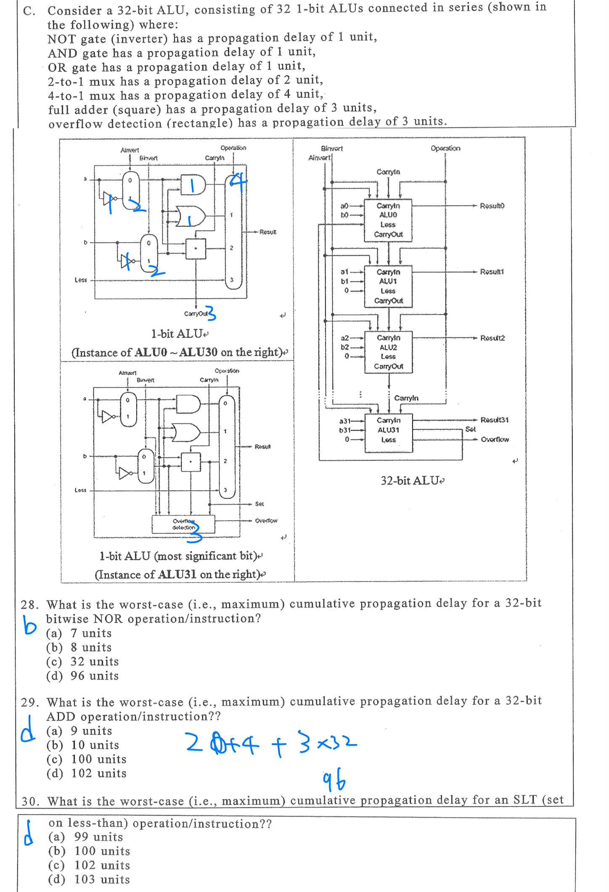


- NOR 是 not or ，而元件中 NOT gate雖然要對 A 跟 B 做，但是是並行發生的， 2 MUX (選擇器， 選 A 還是 ¬A)也是 OR gate 也是一樣道理，最後就是 32 個 1 bit ALU 也是並行使用 4 MUX (選擇器， 選操作 AND, OR, ADD, SUB) ，所以 1 + 2 + 1 + 4 = 8

- ADD 需要用到 full adder 傳遞進位 bit ，31 個 bit 要傳遞進位，第32個bit要檢查 overflow ，還是需要2 MUX (選擇器， 選 A 還是 ¬A) , 4 MUX (選擇器， 選操作 AND, OR, ADD, SUB) ， 2 + 4 + 31*3 + 3 = 102

- SLT 就是把兩個數字相減 ，所以相對 add 要多一個 NOT gate ，所以是 103

## 第 31-33 題 **Hamming code** 


  


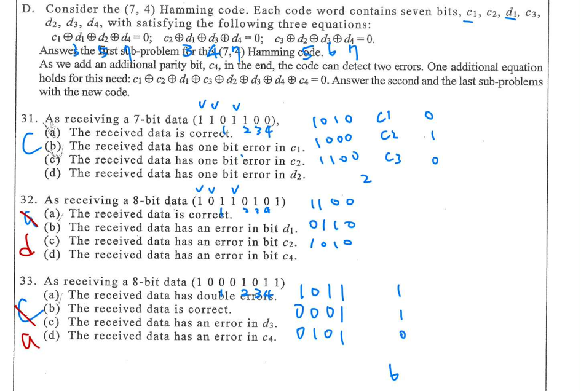

### 第 31 題

| c1 | c2 | d1 | c3 | d2 | d3 | d4 | c4 |
|:--:|:--:|:--:|:--:|:--:|:--:|:--:|:--:|
| 1  | 1  | 0  | 1  | 1  | 0  | 0  | -  |

    c1 + d1 + d2 + d4 = 2
    c2 + d1 + d3 + d4 = 2
    c3 + d2 + d3 + d4 = 2

- 都是偶數表示錯誤

### 第 32 題

| c1 | c2 | d1 | c3 | d2 | d3 | d4 | c4 |
|:--:|:--:|:--:|:--:|:--:|:--:|:--:|:--:|
| 1  | 0  | 1  | 1  | 0  | 1  | 0  | 1  |

    c1 + d1 + d2 + d4 = 2
    c2 + d1 + d3 + d4 = 2
    c3 + d2 + d3 + d4 = 2
    c1 + c2 + d1 + c3 + d2 + d3 + d4 + c4 = 1

- c1-c3 組確定 c1, c2, d1, c3, d2, d3, d4 都沒錯
- c4 偵測到錯 ，只有 c4 錯

### 第 33 題

| c1 | c2 | d1 | c3 | d2 | d3 | d4 | c4 |
|:--:|:--:|:--:|:--:|:--:|:--:|:--:|:--:|
| 1  | 0  | 0  | 0  | 1  | 0  | 1  | 1  |

    c1 + d1 + d2 + d4 = 3
    c2 + d1 + d3 + d4 = 1
    c3 + d2 + d3 + d4 = 2
    c1 + c2 + d1 + c3 + d2 + d3 + d4 + c4 = 4

1.  c1 + c2 + d1 + c3 + d2 + d3 + d4 + c4 = 偶數，表示有 0 或 2 個錯
2.  c1, c2 偵測到錯 ⭢ d1 錯 
3. 第 1, 2 點的矛盾表示有 2 個錯誤