# 111 -Sys-HW

## 第 1 題 **Process**

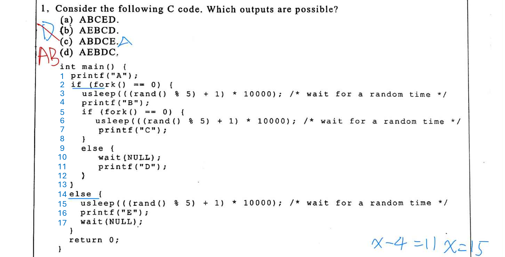 

- `fork()` 
    1. 複製記憶體：把變數、Stack、Heap 全部 copy 一份給子行程
    2. 複製 CPU 暫存器 (Registers)：這其中就包含了最重要的 PC (Program Counter)。
        - **子行程會從複製來的 PC 繼續往下執行**

- `wait(NULL)`: 父處理序會暫停執行（Block），直到它的一個子處理序結束為止。

- 執行
    ```
    1. P1: main() 
    2. P1: printf("A")
    3. fork() P2 created
    4. P2 執行 sleep or P1 執行 sleep 
    5. P2: printf("B")
    6. fork() P3 created
    7. P3 執行 sleep
    8. P3: printf("C")
    9. P2: printf("D")
    ```
    - P1: printf("E") 在 A 之後隨機穿插於 BCD

## 第 2 題 Banker’s Algorithm

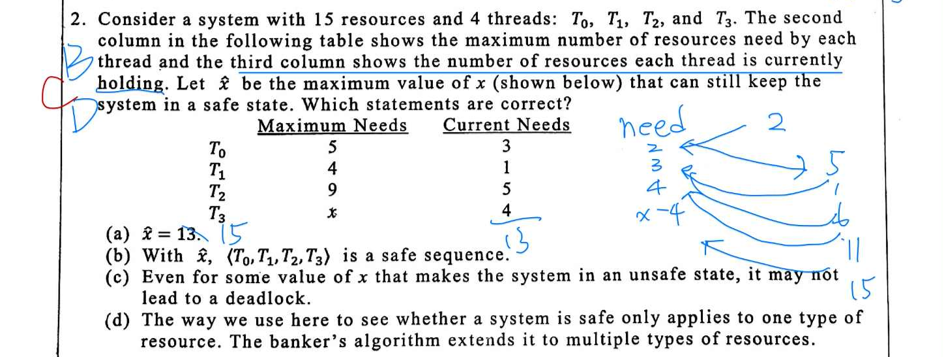 

- Unsafe State 不代表已經發生 deadlock

- 實際應用上電腦資源不會只有一種，Banker’s Algorithm 會計算多種資源下安全序列

## 第 3 題 **Semaphores**

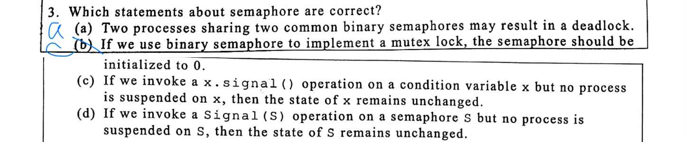 

- (a) P1 等待 S1, S2；P2 等待 S2, S1，形成循環等待

- (b) 初始如果是 0 表示一開始就鎖住 ，那也沒辦法啟用

- (c, d) Semaphore 和 ConditionVariable 資料結構
    ```
    struct Semaphore {
    int value; // 這是它的「狀態」
    Queue waiting_list;
    };

    void Signal(Semaphore S) {
        S.value++;  // <--- 重點在這裡！
        if (S.value <= 0) {
            // 叫醒一個在睡覺的 process
            wakeup(S.waiting_list.pop());
        }
    }

    ```
    ```
    struct ConditionVariable {
        Queue waiting_list; // 它的「狀態」只有這條隊列
        // 注意：這裡沒有 int value！
    };

    void Signal(ConditionVariable x) {
        if (!isEmpty(x.waiting_list)) {
            // 如果有人在等，叫醒一個
            wakeup(x.waiting_list.pop());
        }
        // 如果沒人在等... 什麼事都不發生！
        // 訊號直接消失 (Lost)
    }
    ===========================================
    //應用
    void Signal(ConditionVariable x) {
        if (!isEmpty(x.waiting_list)) {
            // 如果有人在等，叫醒一個
            wakeup(x.waiting_list.pop());
        }
        // 如果沒人在等... 什麼事都不發生！
        // 訊號直接消失 (Lost)
    }
    ```

- Condition Variable 的設計哲學是：狀態由程式設計師自己定義的變數（如 count）決定
    - 容易產生 Lost Wakeup（遺失喚醒）

## 第 4 題 Process States

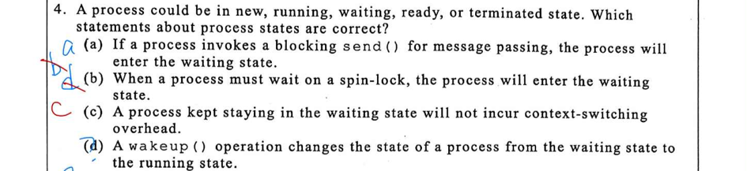 

- (b) Spin-lock 其實是 Process 會在 CPU 上跑一個 while 迴圈不斷檢查鎖的狀態，其實是一種busy waiting

- (c) 進入和離開 Waiting 狀態都需要 Context Switch (但是我覺得如果他一直在 Waiting 狀態，不就不會發生 Context Switch ，是語言問題嗎?)

- Wakeup() 是將 Process 移至 Ready Queue

## 第 5 題 **CPU Scheduling**

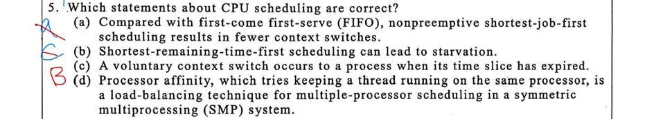 

- (a) FIFO (先進先出)：依照到達順序執行。; Non-preemptive SJF (最短工作優先)：挑最短的先做，但也是「做完才換下一個」。

- (b) SRTF (Shortest Remaining Time First)：這是 Preemptive SJF，每次抓最短的先做導致長的用遠輪不到

- (c) Time slice 是系統設定 context switch 的時間強制切換，對於 process 屬於 Involuntary (非自願)

- (d) Processor Affinity : OS 盡量讓同一個 Process 一直留在同一個 Core 上跑。(好處：不用重新載入 Cache，速度快。) Load Balancing :通常平均調用資源與 Processor Affinity 互斥了。

## 第 6 題 Page Table

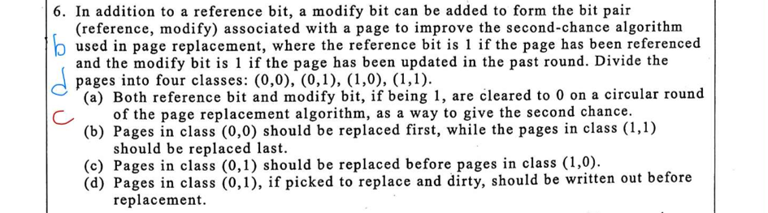 

(c) 先考慮近期有用過 ref=1 再考慮 modify=1

## 第 7 題 **Memory-mapped file**

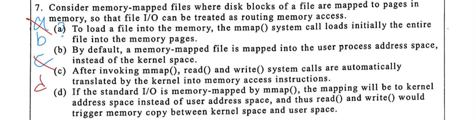 

- Memory-mapped file (mmap): 
    - OS 只是「預約」了地址空間(紀錄在kernal space VMA (Virtual Memory Area))，實際上根本還沒讀硬碟。
    - 當你真的去讀那個記憶體地址（例如 print(ptr[0])）時，CPU 發現資料不在，觸發 Page Fault（缺頁中斷），OS 這時候才趕快去硬碟把那一頁搬進來。這叫做 Demand Paging (需求分頁)。
    - Virtual Memory Area (VMA)
        - 執行中的行程都有一個「虛擬位址空間」，由許多不同用途的「區段」組成的，每一個區段就是一個 VMA。

    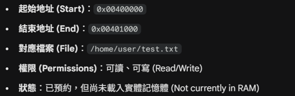 

- 傳統 I/O (read / write System Calls):
    - read() 時，CPU 就把資料從 Kernel Space (Page Cache) 複製一份到 User Space (Buffer)。
    - 因此標準 I/O 會有 Copy Overhead。

## 第 8 題 Allocation Methods

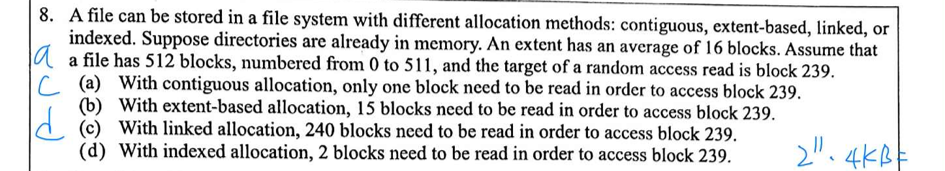 

- (a) Contiguous : 連續紀錄就像 array

- (c) Linked: 案散落在各地，每一塊 (Block) 的結尾都藏著一個指標 (Pointer)，指向下一塊在哪裡。目錄只記錄 Start Pointer只能從頭往後找。

- (d) Indexed: 讀 Index block (1) + 讀 Data block (1) = 2 次。

- (b) **Extent-based: pointer 連出去的位置存了多筆 Contiguous 資料，但是 block 之間是Linked list 所以一定要歷遍前面的 block，先找坐落在哪個 block 在找 block 裡面 239/16 = 14. ...，歷遍 14 個 block ， 然後在第 15 個 block 直接 access ，共讀 15 次。(感覺選項b好像也沒錯ㄟ)**

## 第 9 題 UNIX Inode Capacity


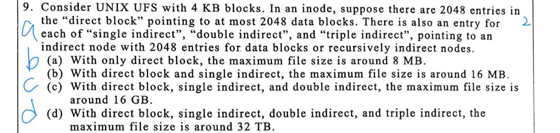 


- (a) direct 2048 個 4 KB block = 2¹¹ * 4 KB = 8 MB

- (b) single direct = 2048¹ 個 4 KB block = 2¹¹ * 4 KB = 8 MB

- (c) double direct = 2048² 個 4 KB block = 2²² * 4 KB = 16 GB

- (d) 以此類推

## 第 10 題 **Linux Mechanisms**

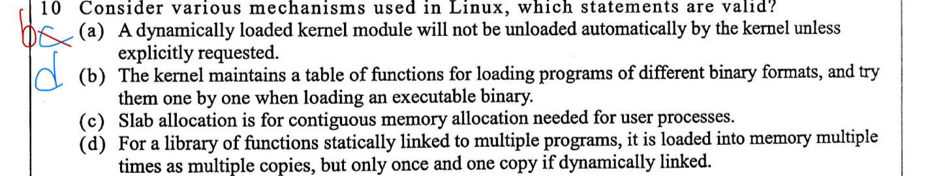 

- (a) 動態載入的核心模組不會自動被卸載，核心維護一個 Reference Count，當 Count = 0，核心**不會主動移除它**，它會讓模組待在記憶體裡待命 (Standby)。“Explicitly Requested”：必須由管理員手動下指令 `rmmod` 或 `modprobe -r`，核心才會執行卸載動作。 (ai 說這是對的)

- (b) 核心維護一張表格，紀錄不同二進位格式的載入函式，並在執行程式時一個一個嘗試。linux_binfmt (Linked List)，註冊了各種格式的處理器 (Handler)，`execve()` 系統呼叫時，讀取檔案 ELF 的前 128 bytes，Loop through linux_binfmt

- (c) 核心經常需要產生無數個「小物件」，例如 `task_struct` (紀錄行程資訊)、`inode` (檔案節點)。這些東西很小（例如只有幾百 Bytes），如果每次都跟系統要一大頁 (4KB)，會造成嚴重的 Internal Fragmentation。
    1. 它先跟底層 (Buddy System) 批發一大塊連續記憶體 (Slabs)。
    2. 把它切成無數個整齊的小塊 (Objects)。 
    3. 當核心需要一個 inode 時，`Slab` 就給它一個剛好大小的小塊。

- (d) 靜態連結的函式庫會有多份副本載入記憶體；動態連結則只有一份副本。

## 第 11 題 ISA


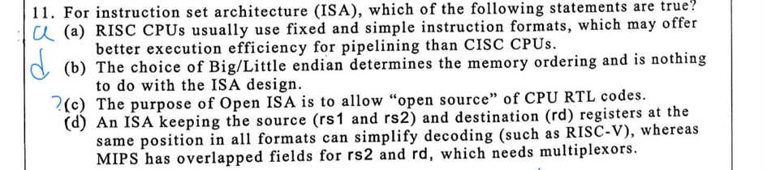 


- (c) Spec 開源不等於硬體碼 (RTL) 開源。

- (d) MIPS 的 `rd` 欄位在 R-type 是**來源**，在 I-type 是**目的**，需要 Mux 來選擇寫入暫存器編號。

## 第 12 題 **ALU**


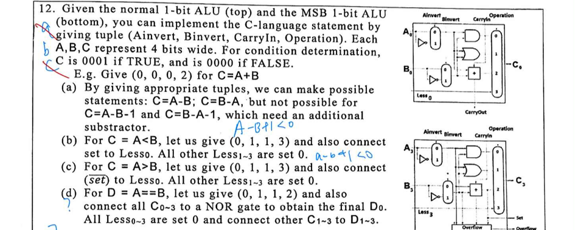 


- (a) A - B 因為是用 1’s complement 實際上是 A + (¬B + 1⇠(carryIn)) ，因此 A - B - 1 實際上是 A + (¬B + 0⇠(carryIn))

- (b) slt 硬體接線: 若 A < B，則 A - B 為負，MSB(最高位元) 的 Set (Sign bit) 為 1，這個 Set 訊號會被拉回到 Bit 0 (LSB) 的 `Less` 輸入端 (`Less0`)，其餘位元的 Less 輸入都接地 (0) ⭢ 當 MSB Set=1 時，LSB 的輸出就是 1 (00…01)；當 MSB Set=0 時，LSB 輸出就是 0 (00…00)。這正是 SLT 指令的標準實作

- (c) 如果只是使用 ¬Set 其實是做出 ¬ (A < B) ⭢ A ≥ B

- (d) **假如A==B ⭢ A & ¬B 應該C0 - C3 輸出 0000 ， NOR (0000) ⭢ 1，將其餘 C1–3 接到 D1–3 假設 A != B 會變成 D 顯示差值。**

## 第 13 題 **DMA**

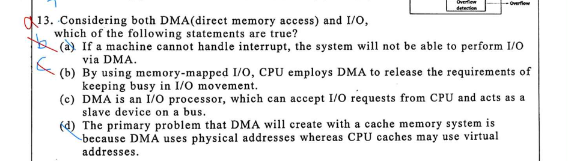 

- (a) DMA 傳輸完成需要 Interrupt 通知 CPU。(但如果系統不支援中斷，CPU 仍然可以用 「輪詢 (Polling)」 的方式來檢查 DMA 做完了沒。)

- (b) Memory-mapped I/O (MMIO) 是指「把 I/O 裝置的暫存器當作記憶體地址來存取」。

- (c) 當 DMA 正在搬資料時，它必須去控制記憶體和 I/O 裝置，這時候它必須是 Bus Master (匯流排主控者)，才有權力對匯流排發送地址和讀寫訊號。

- (d) **「Cache 用虛擬/舊資料」而「DMA 用實體/改新資料」造成的資料不同步** ⇒ DRAM 裡的資料已經被 DMA 更新了 ⭢ 但是 CPU 的 Cache 裡面還存著「舊資料」⭢ 因為 CPU Cache 用的是虛擬地址，它可能根本不知道 DMA 剛剛動到的那個實體地址對應到 Cache 裡的哪一行。

## 第 14 題 Clock Rate

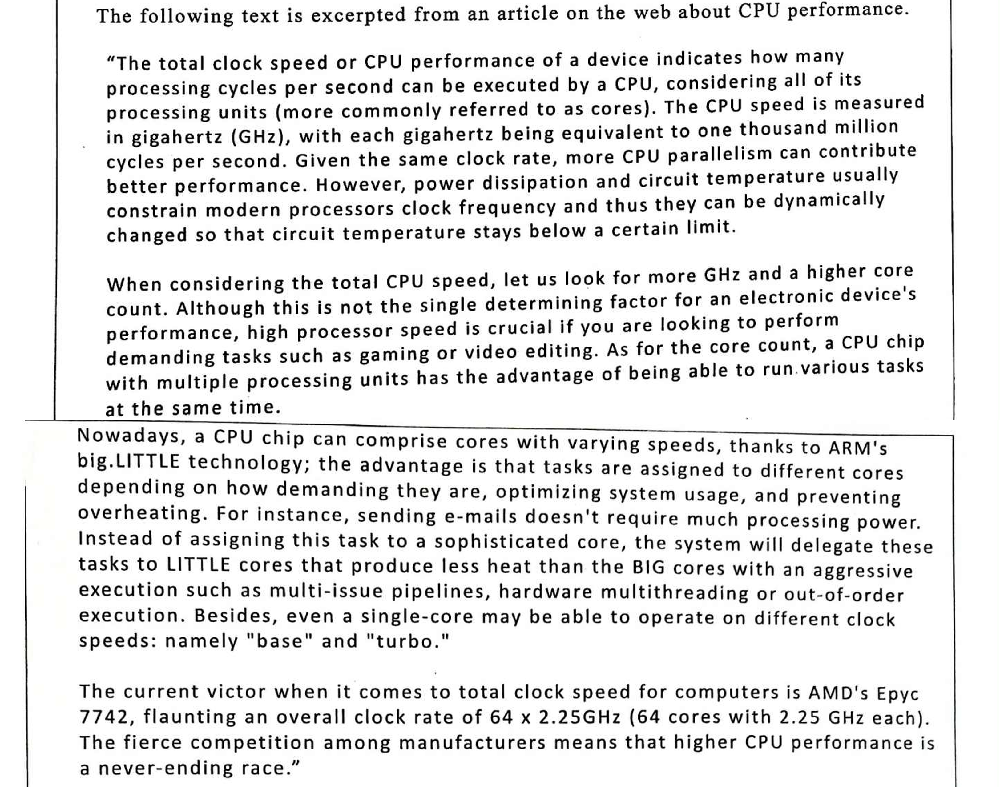 

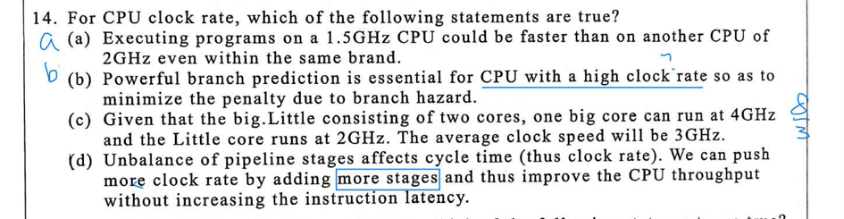 

- (a) clock rate 雖然是訊息改變速度的單位時間，但是不同的硬體架構搭配的ISA 或是使用的程式語言都會影響 CPI ， 有可能 clock rate 短，但是需要處理大量指令...等

- (b) 高時脈通常意味著深管線 (Deep Pipeline)，Branch penalty 代價大，故預測至關重要

- (c) Average clock speed 取決於工作負載分配，不能直接平均。

- (d) More stages 使 Throughput 增加，但單一指令的 Latency (從進到出) 會因為 Pipeline register overhead 而略微增加。

## 第 15 題 Clock Rate

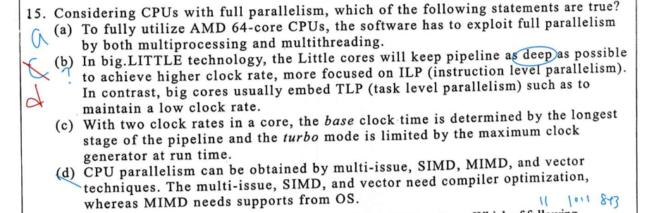 

- (a) Multiprocessing (多行程)：作業系統 (OS) 同時跑很多程式 (Chrome, Discord, VS Code…)，OS 把這些程式分配給不同核心。

- (a) Multithreading (多執行緒)：單一程式 (如影片轉檔軟體) 把工作切成 64 份，同時丟給 64 個核心跑。

- (b) 大核與小核的設計哲學差異

    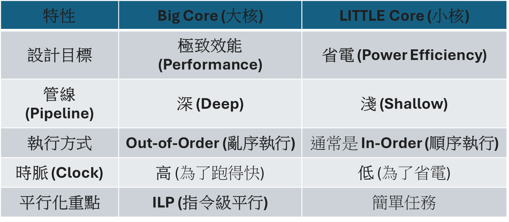 
    
- (c) Turbo Mode (加速模式) 被溫度與功耗限制，一旦碰到溫度牆或功耗牆，時脈就會被迫降下來，否則晶片會燒掉。

- (d) 編譯器 (Compiler) 負責 Instruction Level Parallelism (ILP) / Data Parallelism

- (d) 作業系統 (OS) 負責 Task Level Parallelism (TLP) / MIMD ⭢ 
    - MIMD 意味著有多個獨立的程式流 (Threads/Processes) 在跑。你需要 OS 的 Scheduler 把 Thread A 丟給 Core 1，Thread B 丟給 Core 2。
    - **MIMD 需要  OS 的 Scheduler 調度**
    - **SIMD, vector 需要 compiler 調度**

## 第 16 題 **Floating point**

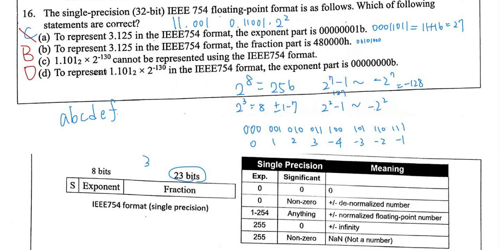 

- 3.125 = 3 + 1/8 = 11.001₂ ⇒ normalize = 1.1001₂ * 2¹
   
- Biased Exponent = Exponent - 127 = 1 ⇒ Exponent = 128 ⇒ 10000000₂
    - 0...0 Denormalized
    - 01..1 0ₜₑₙ
    - 1..10 最正
    - 1...1 NaN or ∞
    - 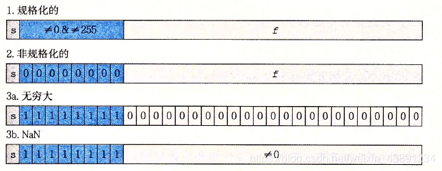 

- Fraction = 1001000… (23 bits)。
     - hex 480000 ⭢ bit 0100 1000 0000 0000 0000 0000

- (c) 可以用 Denormalized number 表示。

- 要會讀題目提供的規格表

## 第 17 題 **Pipeline Hazard Detect**

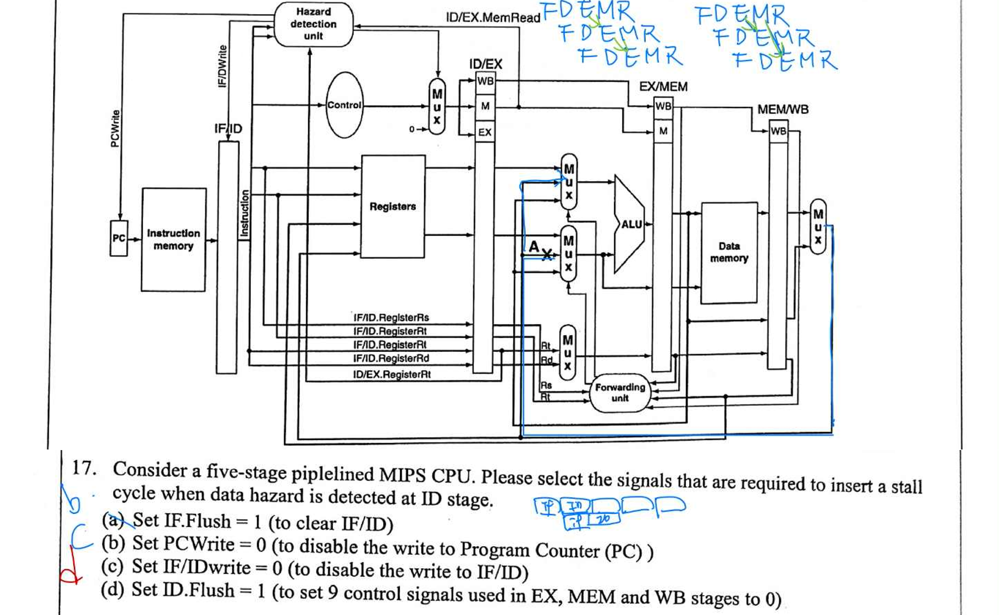 

- (a) `Flush` 通常用於 Control Hazard (Branch)。當分支預測失敗時，才需要清除已經抓進來的錯誤指令。在處理 Data Hazard 的 Stall 時，我們是希望指令「停下來」等一下，而不是「清除」它。

- (b) Set PCWrite = 0，防止 PC 更新到下一個指令。讓 IF Stage 在下一個時脈週期重複抓取同一個指令，維持指令流原地踏步。

- (c) Set IF/IDWrite = 0，保證 ID Stage 在下一個週期處理的是同一個指令（即被擋住的那個指令），不會被 IF Stage 抓到的新指令覆蓋。

- (d) Set ID.Flush = 1，當 ID Stage 的指令被擋住時，原本要往 EX Stage 送的控制訊號（如 RegWrite, MemWrite 等）必須全部清零。這樣在下一個週期，EX Stage 執行的是空指令，不會對暫存器或記憶體造成影響。


## 第 18 題 Pipeline Forwarding

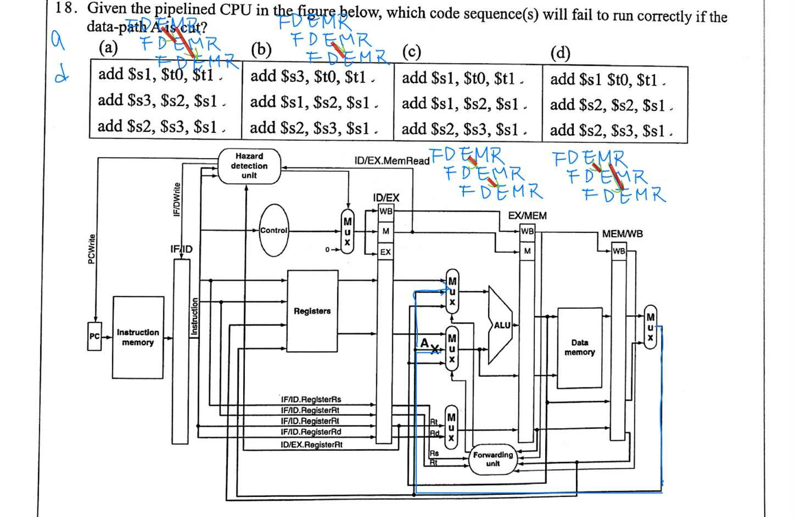 

- A cut 表示 memory access 後 forwarding to execute stage 不存在，如果在那個階段有 data hazard 就會有問題~其他就如圖

## 第 19 題 Pipeline Stall


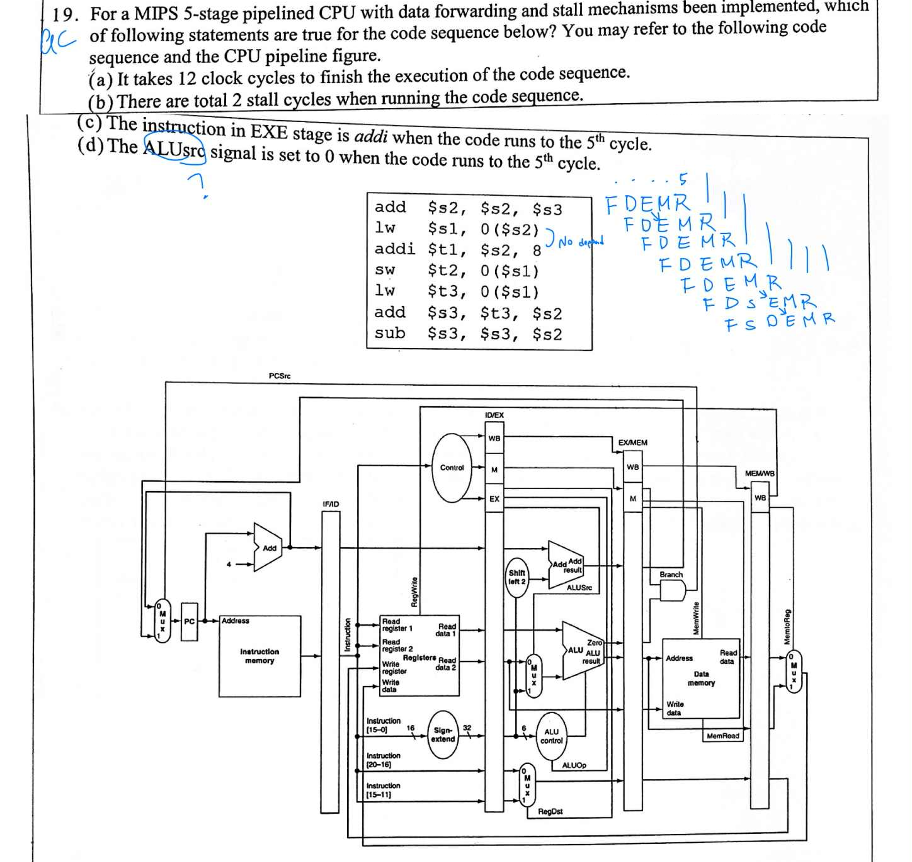 


- 應該如我圖中畫的 12個 cycle , 1 個 stall

- `addi` 是 Immediate運算，`ALUSrc` 通常設為 1 (選 Immediate)

## 第 20 題 **Branch Prediction**

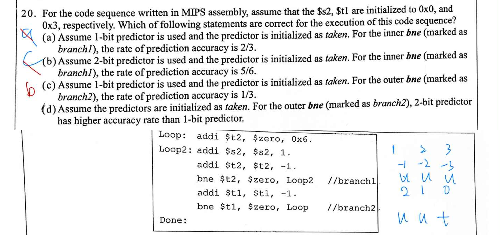 

- 這是一個 Nested Loop (我沒看出來我以為是各自的function block)

1. Loop() → t2 = 6 → Loop2() →
2. s2 = 1 , t2 = 5 → take Loop2()
3. s2 = s2+1 , t2 = t2-1 → take Loop2()
4. repeat 3
5. repeat 3
6. repeat 3
7. s2 = 6 , t2 = 0 → untake Loop2() → t1 = 2 → take Loop()
8. Loop() → t2 = 6 → Loop2() → [重複 2-6]
9. s2 = 12 , t2 = 0 → untake Loop2() → t1 = 1 → take Loop()
10. Loop() → t2 = 6 → Loop2() → [重複 2–6]
11. s2 = 18 , t2 = 0 → untake Loop2() → t1 = 0 → untake Loop() → Done

- Loop2 branch ⇒ t t t t t u t t t t t u t t t t t u

- 1 bit predictor init take ⇒ hit*5 + miss*2 + hit*4 + miss*2 + hit*4 + miss *1 ⇒ hit rate = 13/18

- 2 bit predictor init take ⇒ hit*5 + miss*1 + hit*5 + miss*1 + hit*5 + miss*1 ⇒ hit rate = 15/18

- Loop branch ⇒ t t u

- 1 bit predictor init take ⇒ hit*2 + miss*1 ⇒ hit rate = 2/3

- 2 bit predictor init take ⇒ hit*2 + miss*1 ⇒ hit rate = 2/3


## 第 21-24 題 **Readers-Writers Problem**

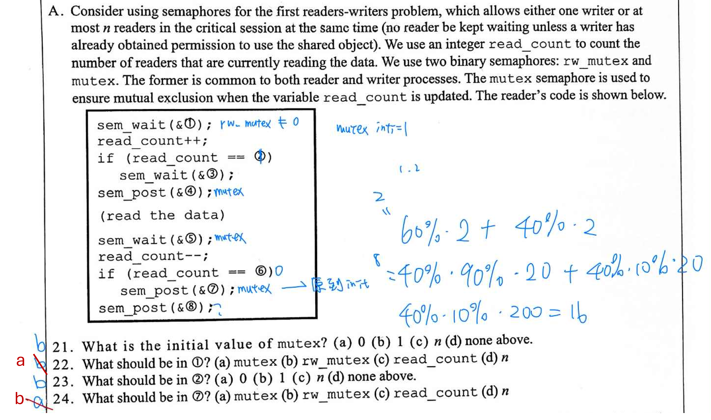 

讀者 (Reader)：只要有一個讀者在讀，後續的讀者可以直接進入，不需等待 Writer 鎖。只有第一個讀者需要鎖住 Writer，最後一個離開的讀者釋放 Writer。
- `mutex`: 用來保護 `read_count` 的互斥鎖。
- `rw_mutex`: 用來保護共享資料 (Critical Section) 的鎖，擋住 Writer。

- 填所有空格
    - `sem_wait(&mutex);` (① 填入 `mutex`)
        - 我们要準備修改 `read_count` 了，為了避免多個讀者同時修改導致數字錯亂，必須先取得 `mutex` 鎖。
    - `if (read_count == 1)` (② 填入 `1`)
        - 檢查我是不是 「第一個」 進來的讀者？如果是，我有責任要去鎖住寫者。
    - `sem_wait(&rw_mutex);` (③ 填入 `rw_mutex`)
        - 因為我是第一個讀者，要把大門鎖起來 (`rw_mutex`)，不讓寫者進來。後面的讀者只要發現門已經被讀者鎖了，就可以直接進來，不用再鎖一次。
    - `sem_post(&mutex);` (④ 填入 `mutex`)
        - read_count 修改完畢，變數檢查也做完了，釋放 mutex 讓其他讀者可以進來登記。
    - `sem_wait(&mutex);` (⑤ 填入 `mutex`)
        - 我要離開了，準備要修改 read_count (減 1)，所以同樣要先拿到 mutex 保護這個變數。
    - `if (read_count == 0)` (⑥ 填入 `0`)
        - 檢查我是不是 「最後一個」 離開的讀者？如果是，我有責任要去把大門打開。
    - `sem_post(&rw_mutex);` **(⑦ 填入 `rw_mutex`)**
        - 因為我是最後一個走的，圖書館現在空了。我要把擋住寫者的鎖 (`rw_mutex`) 解開，讓在那邊乾等的寫者終於可以進來。
    - s`em_post(&mutex);` (⑧ 填入 `mutex`)
        - `read_count` 修改完畢，釋放 `mutex`

## 第 25–28 題 Memory Hierarchy

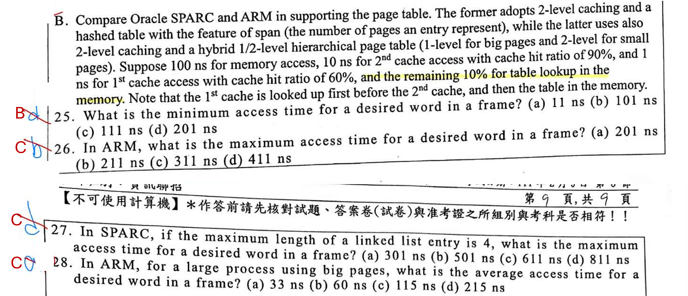 

- 題目給的 access time 就是 request to response 來回的時間了

### 第 25 題

- 100 ns (查 page table 表) + 1 ns (L1 Data Hit)= 101 ns。

### 第 26 題

- ARM Small Pages 2-level page table

- 200 ns (查 2-level page table 表) + 1 ns (L1 miss)+ 10 ns (L2 miss) + 100 ns (memory) = 311 ns

### 第 27 題

- Hashed Page Table 先查出 linked list pointer

- Linked List 有 4 個 entry

- 100 ns (查 Hashed Page Table 表) + 400 ns (查 Linked List) + 1 ns (L1 miss) + 10 ns (L2 miss) + 100 ns (memory) = 611

### 第 28 題

- AMAT= (0.6 * 101 (L1 hit)) + (0.3 * 111 (L2 hit)) + (0.1 * 211 (memory)) = 115

## 第 29–32 題 Memory Hierarchy

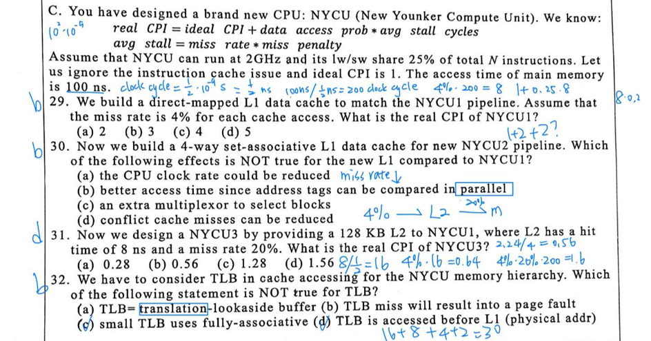 

### 第 29 題

- Ideal CPI = 1

- Clock = 2 GHz → 1 cycle = 0.5 ns

- Penalty: 200 cycles

- 1 + 25% * 4% * 200 = 3 CPI

### 第 30 題

- Direct-mapped 擁有最佳的 Hit Time

### 第 31 題

- Penalty: 16 cycles

- 1 + 25% * ( 4% * 16 + 4% * 20% * 200)= 1.56 CPI

### 第 32 題

- TLB Miss 不等於 Page Fault

## 第 33–35 題 ISA

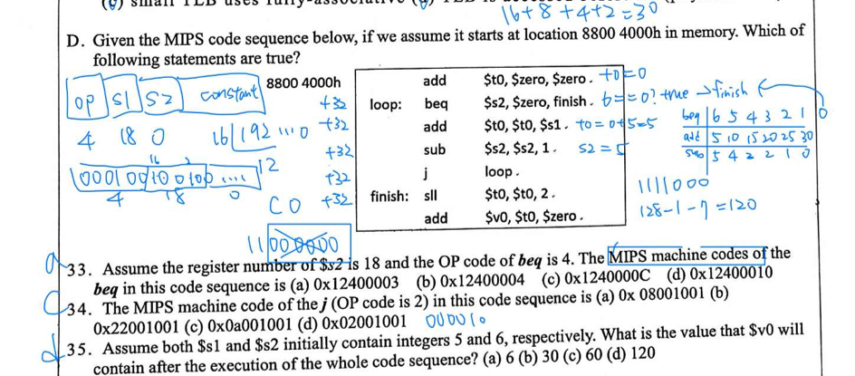 

- 要知道指令 32 bit， 指令 0-5 是 op code， 然後是 register 編號 `$rs`, `$rt`

- 展開 hex 可以推敲出答案，不需要真的去背有哪些 op code

- beq 跳轉有一個設計細節，因為 address 32 bit 但是指令還需要配置 op code, register 編號，用掉了 16 bit，beq 的 jump 是利用指令後 PC register + 指令中 16 bit，這 16 bit 還不是單純的，為了可以跳轉更多地址其實少寫最後 2 個 bit，因為每次都會以 32 bit 為單位跳轉地址，最大化可以跳轉地址。

ref: 計算機組織-ch2 — Conditional Branch 指令

- `finish` (`4014`)

- 當前 PC (執行到 beq 時，PC 已加 4) = `4008`

- Offset (bytes) = `4014` - `4008` = `0xC` (12 bytes)。

- 1100 去掉兩個 bit → XXXX..0011 → 結尾是 3

- loop 做完 `$t0` = 30 然後要 `sll` (left sheft 2 bit) 得到 120