<style>
b, strong {
  /* font-weight: 800; */
  font-size: 20px;
}
.tight-list li > p {
  margin: 0 0;
  line-height: 1.2;
}
.tight-h3 h3 {
    margin: 0 0;
}

.tight-h2 h2 {
    margin: 0 0;
}

.tight-p p {
    margin: 0 0;
}
</style>
# 113 -Sys-HW (113 年的考題是惡魔)

## 第 1 題 **x86 Instruction**

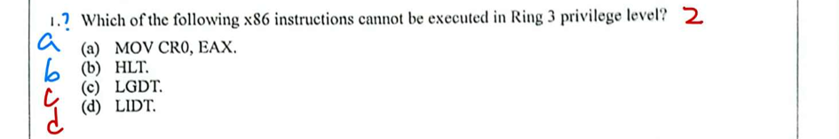 

- 指令集架構:

| 類型 | 指令集 / 架構 | 功耗 | 主要應用 | 代表廠商 |
|------|---------------|------|----------|----------|
| CISC | x86 / x64     | 較高 | PC、Server | Intel、AMD |
| RISC | ARM 架構     | 較低 | Mobile、IoT、Server | Apple、Qualcomm、AWS |

- X86 指令 Protection Rings
    - Ring 0（Kernel mode）
        - 可執行 所有特權指令
        - 硬體、I/O、Page Table
        - OS 核心在這層
    - Ring 3（User mode）
        - 不能執行特權指令
        - 透過 System Call 請求 OS 執行特權指令
        - 一般應用程式所在
    - Ring 1 / Ring 2
        - 設計給 Driver / Service
        - 實務上 OS 幾乎不用
        - 現代系統只用 Ring 0 / Ring 3
    - Ring −1
        - 由硬體虛擬化支援
        - 專門給 Hypervisor / VMM 使用
        - 能攔截、管理 Guest OS 的特權操作

- (a) CR0 暫存器控制了處理器的關鍵狀態
    - PE (Protection Enable)： 開啟保護模式。
    - PG (Paging)： 開啟分頁機制（虛擬記憶體）。
    - WP (Write Protect)： 是否允許寫入唯讀記憶體分頁。

- (b) `HLT` (Halt)
    - 讓處理器停止執行指令，直到下一個外部中斷（Interrupt）發生。
    - 只有作業系統的核心（Idle Loop）才有權決定何時讓 CPU 進入休眠狀態。

- (c) `LGDT` (Load Global Descriptor Table Register)
    - GDT 定義了系統中所有段（Segments）的存取權限與記憶體範圍。

- (d) `LIDT` (Load Interrupt Descriptor Table Register)
    - IDT 決定了當硬體中斷或系統呼叫發生時，CPU 該跳轉到哪一個核心函式去執行。

- 常見的特權指令還包括：
    - `IN` / `OUT` (存取 I/O 埠，雖然可透過 IOPL 修改權限)
    - `CLI` / `STI` (關閉/開啟中斷)
    - `LTR` (載入工作暫存器)
    - `LMSW` (載入機器狀態字)

## 第 2 題 **x86 Instruction**

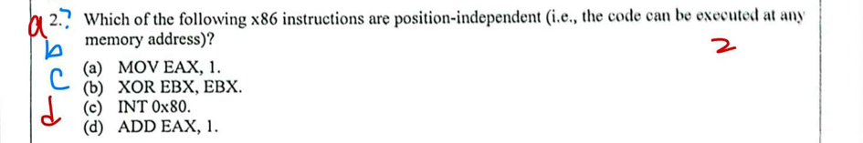 

- PIC (Position-Independent Code) 不論被載入到記憶體的哪一個起始位址，都能正常運作
    - 立即值 (Immediate)、暫存器 (Registers) 或 相對位址 (Relative Address, 如 EIP-relative)

- (a) `MOV EAX, 1`
    - 將常數 1（立即值）放入暫存器。不涉及任何記憶體位址。

- (b) `XOR EBX, EBX`
    - 對暫存器進行互斥或運算（常用於清空暫存器為 0）。純暫存器操作。

- (c) `INT 0x80`
    - 觸發第 `0x80` 號軟體中斷（Linux 中常用於系統呼叫）。`0x80` 是編號而非記憶體位址。

- (d) `ADD EAX, 1`
    - 將暫存器數值加 1（立即值）。不涉及任何記憶體位址。

- x86 架構有一套標準的暫存器命名方式
    - 暫存器通常以 E 開頭
    - `EAX` (Accumulator), `EBX` (Base), `ECX` (Count), `EDX` (Data)。
    - `ESI` (Source Index), `EDI` (Destination Index)。
    - `EBP` (Base Pointer), `ESP` (Stack Pointer)。

## 第 3 題 **Process**

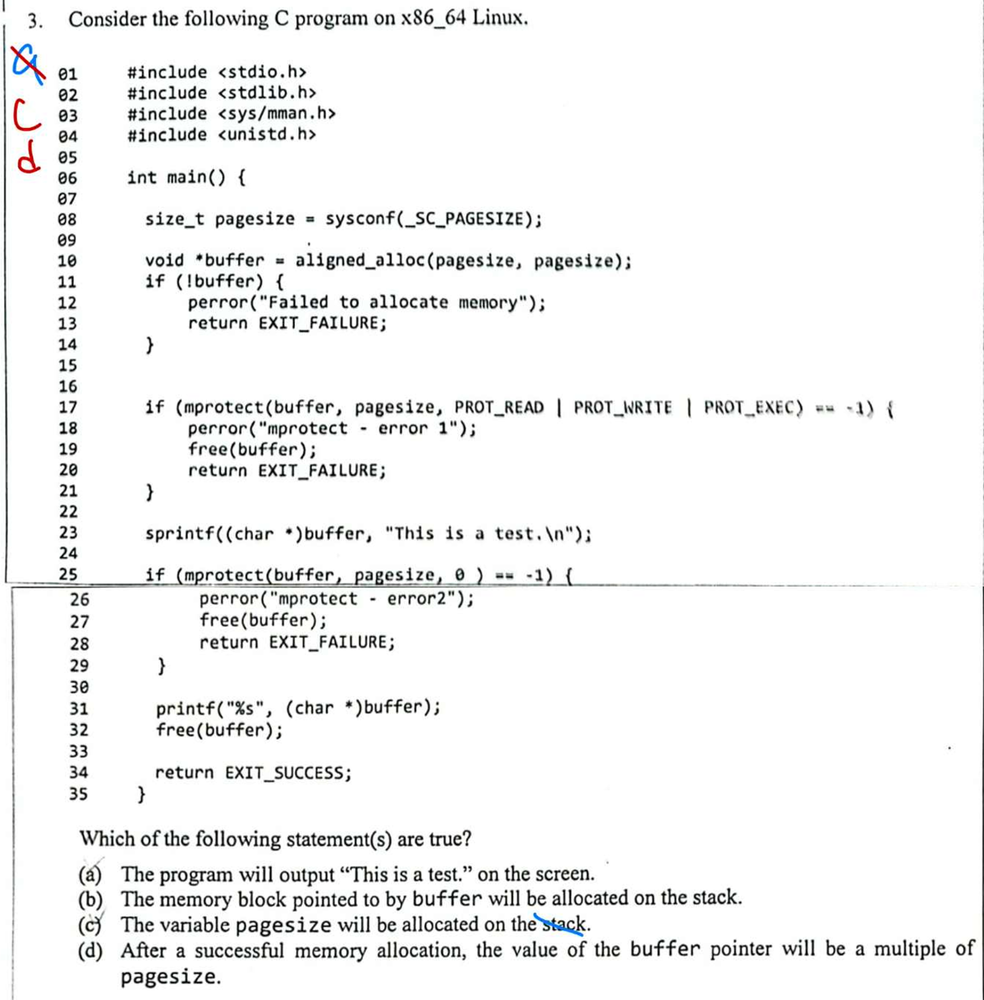 

- 使用 `aligned_alloc` 要求回傳一個地址，該地址必須是 pagesize 的倍數。

- Line 17：將該記憶體設為「可讀、可寫、可執行」。

- Line 23：將字串寫入該緩衝區。

- Line 25：將權限設為 0。在 Linux 中，這代表 PROT_NONE，意即 任何存取（讀/寫/執行）都是不允許的。

- **(a)** 因為 Line 25 一旦設定為 0 (PROT_NONE)，該記憶體分頁就變成了禁區。當 Line 31 的 printf 試圖去讀取 buffer 指向的內容時，硬體會觸發例外，作業系統會直接送出 SIGSEGV，導致程式 Segmentation Fault (崩潰)。

- (b) buffer 指向的記憶體區塊會分配在 Heap

- (c) 區域變數 pagesize 會存放在 Stack

- (d) aligned_alloc(alignment, size) 的功能。它的第一個參數指定了對齊要求。既然傳入的是 pagesize，系統保證回傳的記憶體起始地址位址（指標的值）一定是 pagesize 的整數倍。

## 第 4 題 OS Scheduling

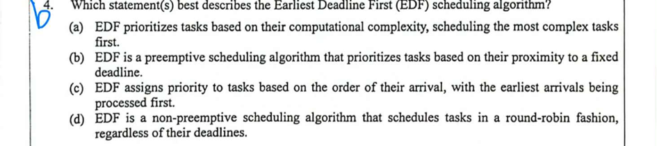 

(a) Longest Job First(LJF) 根據計算複雜度排序，優先執行最複雜的任務

(b) Earliest Deadline First (EDF) 是一種搶佔式演算法，根據任務與固定截止時間的接近程度來排序

(c) First-Come, First-Served (FCFS) 根據到達順序分配優先權，最早到達的先處理

(d) Round Robin (RR) 是一種非搶佔式演算法，以輪轉方式排班且無視截止時間

## 第 5 題 Syscall

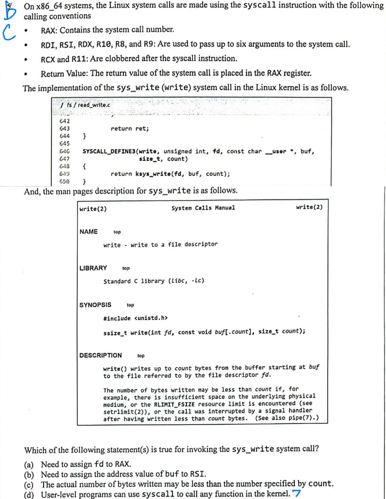 

```
RAX：存放 系統呼叫編號 (System call number)
RDI：第 1 個參數。
RSI：第 2 個參數。
RDX：第 3 個參數。
write 函式原型： 
    ssize_t write(int fd, const void *buf, size_t count);
參數 1 (fd)：檔案描述符。
參數 2 (buf)：緩衝區地址。
參數 3 (count)：寫入位元組數。
```

- **(d)** syscall 只能呼叫定義在系統呼叫表 (Syscall Table)*中、專門暴露給使用者層級使用的介面（如 write, read, open 等）。核心內部的輔助函式（如某些驅動程式內部的私人函式）是無法透過 syscall 直接存取的。

## 第 6 題 Process

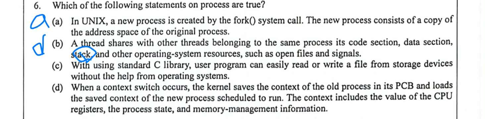 

- (a) 在 UNIX 中，新行程由 fork() 產生，且包含原始行程位址空間的副本
    - 現代系統會使用 Copy-on-Write 技術來優化效能，但概念上它確實是一個副本。

- (b) 執行緒確實共享 Code、全 Data 和 作業系統資源 (如開啟的檔案)。但是，Stack, Register file 是執行緒私有的。

- **(c)** 標準 C 函式庫（如 fopen, fread）最終都必須透過 System Calls 請求作業系統核心代為執行讀寫操作。

- (d) 當環境切換發生時，核心會將舊行程的 Context 存入其 PCB 並載入新行程的 Context

## 第 7 題 **I/O System**

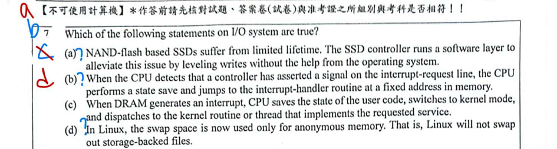 

- (a) 基於 NAND 快閃記憶體的 SSD 壽命有限，控制器的軟體層會執行損耗均衡（Wear Leveling）且無需作業系統參與

- (b) 當 CPU 偵測到控制器發出中斷請求信號時，會儲存狀態並跳轉到記憶體中固定位址的中斷處理程式

- **(c)** DRAM（主記憶體）本身是受控的被動元件，不會主動產生「中斷」來請求服務。會產生中斷的通常是 I/O 設備（如磁碟、網卡、鍵盤）或計時器。如果是記憶體發生錯誤（如 ECC Error），那是由記憶體控制器（Memory Controller）回報，而非 DRAM 內部主動產生。

- **(d)** 在 Linux 中，Swap space 現在僅用於 Anonymous Memory，意即 Linux 不會交換 File-backed Memory
    - Anonymous Memory： 如 Heap 或 Stack，沒有對應的磁碟檔案，必須寫入 Swap Space 才能釋放。
    - File-backed Memory： 如程式碼段或 mmap 的檔案。因為磁碟上本來就有這份檔案，當記憶體不足時，核心只需要直接「捨棄（Discard）」分頁即可，不需要佔用 Swap。需要時再從原檔案讀回即可。

## 第 8 題 **Memory Management**

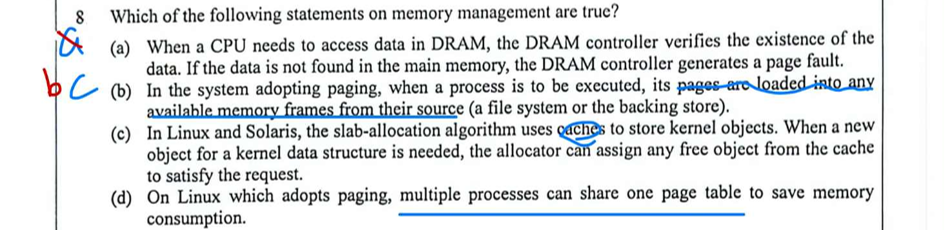 

- **(a)** Page Fault 是由 MMU (記憶體管理單元) 觸發的，而不是 DRAM 控制器。當 CPU 試圖存取的 Page Table 中的 Valid bit 為 0 時，MMU 會發出陷阱 (Trap) 給作業系統核心。DRAM Controller 僅負責實體地址的讀寫訊號，不具備處理虛擬記憶體分頁邏輯的功能。

- (b) 在分頁系統中，行程執行時，分頁會從來源（檔案系統或備份儲存體）載入到任何可用的記憶體框 (Frames)

- **(c)** 在 Linux 與 Solaris 中，Slab 分配演算法使用快取來儲存核心物件，並從中分配空閒物件
    - Slab Allocation 是為了高效管理經常建立與銷毀的核心資料結構（如 task_struct, inode）而設計的。**它會預先為特定類型的物件建立「快取 (Caches)」，每個快取由一或多個「Slabs」組成。**當核心需要新物件時，分配器會直接從該快取的空閒空間中取出一個物件，避免了頻繁分配/釋放實體頁面的開銷。

- (d) 每個行程都有自己獨立的頁表 (Page Table)，以確保行程 A 無法存取行程 B 的記憶體。

## 第 9 題 **Virtual Memory Management**

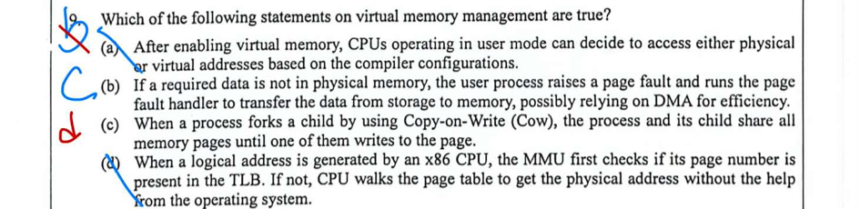 

- (a) 一旦作業系統開啟了分頁機制（在 x86 中是將 `CR0` 暫存器的 `PG` 位元設為 1），所有在 User Mode 下執行的指令所產生的位址都會被視為虛擬位址。
    - user process 絕對無法繞過 MMU 去直接存取 Physical Address ，這是為了確保行程間的隔離與系統安全。

- (b) 當存取失敗時，是 MMU 偵測到無效位元並觸發 Page Fault 
    - 隨後執行 Page Fault Handler 是 Kernel，user process在此過程中是被動 Blocked。

- **(c)** Copy-on-Write (CoW):
    1. 建立子行程時，核心並不立即複製物理記憶體，而是讓父子行程的頁表指向相同的物理頁。
    2. 這些頁面會被標記為「唯讀」。
    3. 當任一者試圖寫入時，硬體觸發例外，核心才複製該頁面並重新對映。這能大幅節省記憶體與建立行程的時間。

- (d) 當 x86 CPU 產生邏輯位址時，MMU 會先檢查 TLB，若未命中則由 CPU 自動走訪 page table


## 第 10 題 **File System**

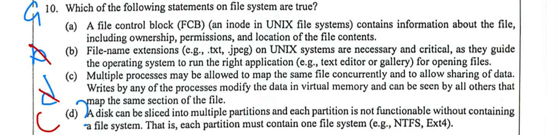 

- (a) 檔案控制區塊 (FCB) 在 UNIX 中稱為 inode，包含檔案擁有者、權限及資料位置
    - inode 不包含「檔案名稱」，檔名是儲存在目錄檔案（Directory file）的項目中。

- **(b)** UNIX 通常使用 Magic Numbers ，即讀取檔案開頭的前幾個位元組來判斷格式（例如 ELF 代表執行檔、PNG 代表圖檔），或是透過 MIME type 機制處理，與 Windows 不同。

- (c) 多個行程可以同時映射同一個檔案以共享資料，任何行程的修改都能被其他行程看見
    - 記憶體映射檔案 (Memory-mapped Files) 的共享模式（MAP_SHARED）
    - 當多個行程將同一個檔案映射到各自的虛擬記憶體時，核心會讓這些虛擬位址指向相同的 分頁快取 (Page Cache) 實體分頁，這也是一種高效的 行程間通訊 (IPC) 手段

- **(d)** 分割區通常會格式化為檔案系統，但並非「不包含檔案系統就無法運作」。
    - Swap Space：Linux 的 Swap 分割區就不使用傳統檔案系統。
    - Raw Partitions：某些大型資料庫（如 Oracle）會直接存取原始塊設備（Raw Devices）來管理資料，以繞過檔案系統層的開銷來提升效能。

## 第 11 題 **MIPS ISA**

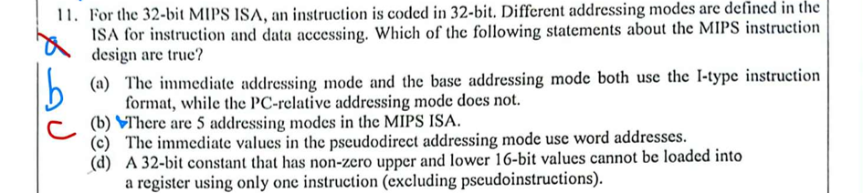 

- (a) (b) MIPS ISA 中共有 5 種定址模式
    1. Immediate Addressing (I-type) (`addi`)
    2. Register Addressing (R-type)
    3. Base/Displacement Addressing (I-type) (`lw`, `sw`)
    4. PC-relative Addressing (I-type) (`beq`, `bne`)
    5. Pseudodirect Addressing (J-type)

- **(c)** J-type 指令（如 j, jal）中，目標位址欄位有 26 位元。
    - MIPS 的指令一定是 4 位元組對齊（Word-aligned），所以目標位址的末兩位一定是 00。
    - 為了擴大跳躍範圍，這 26 位元存放的是「字組位址（Word Address）」。在實際轉換時，硬體會將這 26 位元左移 2 位（乘以 4），變成 28 位元的「位元組位址（Byte Address）」，再補上 $PC+4$ 的最高 4 位元，組合成完整的 32 位元位址。

- (d) 若一個 32 位元常數的高位與低位 16 位元皆非零，則無法僅用一個指令載入暫存器
    - `lui` (Load Upper Immediate) 載入高 16 位元
    - `ori` (Or Immediate) 或 addi 填入低 16 位元


## 第 12 題 **Pipelining**

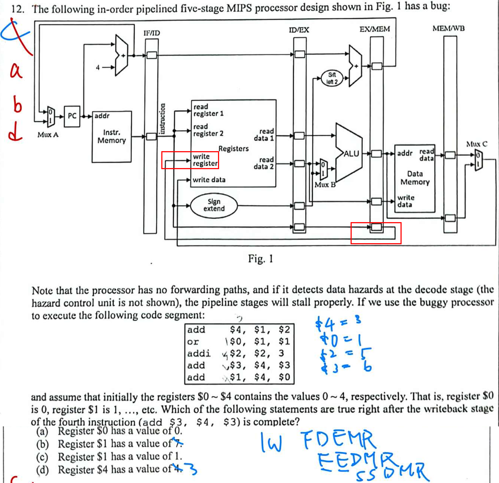 

- write register（寫入目標暫存器編號） 的輸入來源並非標準的 MEM/WB 管線暫存器，而是直接連接到了 EX/MEM 管線暫存器 的輸出。
    - 使得某指令執行到 WB 將會把資料存到下一個指令的 write register

 
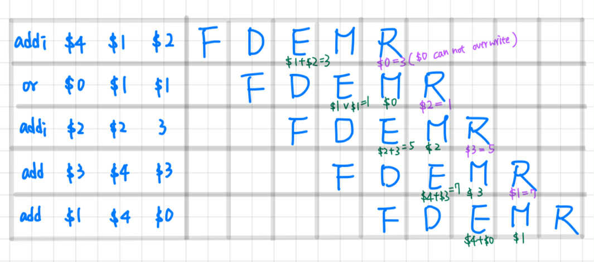 
 

- `$0` always 是 0 ; `$1` = 7; `$4` = 4


## 第 13 題 **Pipelining**

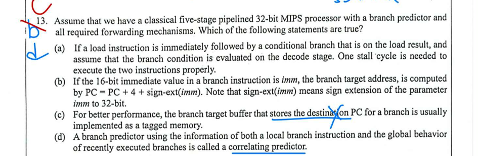 

- (a) Load 指令後緊跟著一個使用其結果的條件分支，應該需要 2 個 stall 等待讀取記憶體後 forward 到 decode 階段 hazard detect unit

    |cycle|1|2|3|4|5|6|7|8|
    |-----|-|-|-|-|-|-|-|-|
    |load |F|D|E|M|R| | | |
    |beq  | |F|S|S|D|E|M|R|

- (b) 分支目標位址的計算方式為 $$PC = (PC + 4) + (\text{sign-ext}(imm) \ll 2)$$

- **(c)** Branch Target Buffer 是小型快取，用來儲存分支指令的位址以及對應的目標跳轉位址。

- (d) 同時使用局部與全域資訊的分支預測器稱為 Correlating Predictor


## 第 14 題 CPI

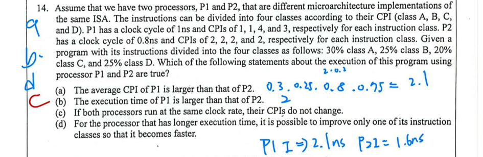 

- 處理器 P1 的計算
    - 平均 CPI ($CPI_{P1}$)：
        - $$(0.30 \times 1) + (0.25 \times 1) + (0.20 \times 4) + (0.25 \times 3) = \mathbf{2.1}$$
    <!-- - 執行時間 ($ET_{P1}$)：
        - $$I \times 2.1 \times 1 \text{ ns} = \mathbf{2.1 \times I \text{ ns}}$$ -->

- 處理器 P2 的計算
    - 平均 CPI ($CPI_{P2}$)：
        - $$(0.30 \times 2) + (0.25 \times 2) + (0.20 \times 2) + (0.25 \times 2) = \mathbf{2}$$
    <!-- - 執行時間 ($ET_{P2}$)：
        - $$I \times 2 \times 1 \text{ ns} = \mathbf{2 \times I \text{ ns}}$$ -->

- **(c)** 改變頻率通常不會改變執行一個指令所需的「週期數」，CPI 視為架構常數。

- (d) 針對執行時間較長的處理器 (P1)，有可能只改進其中一類指令就讓它變快
    - Amdahl's Law


## 第 15 題 MIPS ISA

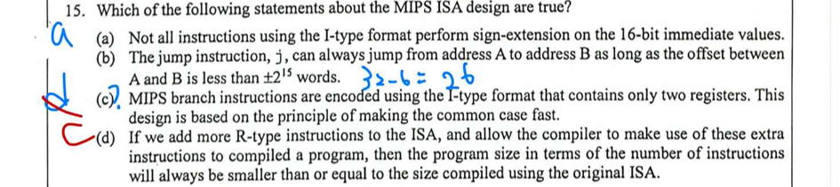 

- (a) 並非所有使用 I-type 格式的指令都會對 16 位元立即值進行符號擴充 (Sign-extension)
    - 算術/記憶體指令：如 `addi` (Add Immediate), `lw` (Load Word)，會進行 符號擴充，將 16 位元擴展成帶正負號的 32 位元。
    - 邏輯指令：如 `andi` (And Immediate), `ori`, `xori`。邏輯運算通常被視為位元字串（Bit strings），因此會進行 零擴充 (Zero-extension)，在高位補 0，而非複製正負號位元。

- (b) `j` 指令 (J-type)：擁有 26 位元的目標位址欄位，採用 偽直接定址 (Pseudodirect Addressing)，跳躍範圍可達 256MB 的區塊（即 $2^{28}$ **位元組**）。

- (b) $\pm 2^{15}$ 字組限制：這是 分支指令 (如 `beq`, `bne`) 的限制。分支指令使用 I-type 格式中的 16 位元立即值來存放「相對位移量」，其範圍才是 $\pm 2^{15}$ 個**字組**。

- (c) MIPS 分支指令採 I-type 編碼且僅包含兩個暫存器，基於「 Making the common case fast 」的原則
    - 大多數的程式分支只需判斷相等或不相等。限制分支指令的複雜度 (只比較兩個暫存器是否相等)，可以讓硬體管線（Pipeline）更精簡、速度更快，而較複雜的條件判斷則交由多個簡單指令組合完成。

- (d) 若在 ISA 中增加更多 R-type 指令供編譯器使用，程式的指令數量將會小於或等於原先的大小
    - 如果一個新的 R-type 指令可以完成原本需要 2 個指令才能做到的事情（例如一個同時做加法與位移的指令），那麼編譯後的指令總數就會減少。
    - 由於新的 ISA 是原先 ISA 的超集（Superset），編譯器在最差的情況下也只需要使用原本的指令集，因此指令數量「總是」會小於或等於原始版本。

## 第 16 題 **AI chip**
 
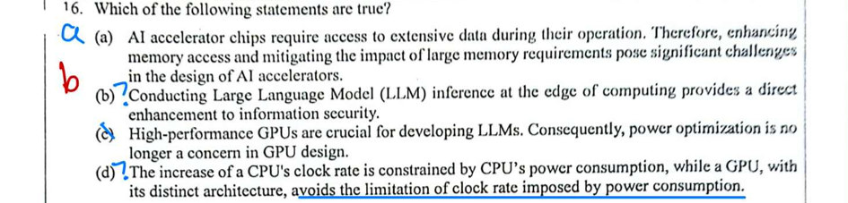 
 
- (a) AI 加速器晶片運作時需要大量數據，因此優化記憶體存取與緩解大量記憶體需求是設計上的重大挑戰
    - AI 模型（特別是像 GPT 這樣的龐然大物）擁有數十億甚至數兆個參數。計算單元（運算核心）跑得飛快，但資料如果從記憶體搬運的速度跟不上，運算核心就會閒置。因此，現代 AI 加速器（如 NVIDIA H100）大量採用 HBM (高頻寬記憶體) 來解決這個嚴峻的挑戰。

- (b) 在邊緣端進行大型語言模型 (LLM) 推論，對資訊安全有直接提升
    - 當推論在「邊緣端」（即你的手機或本地伺服器）完成時，敏感資料（如對話紀錄、私人文件）不需要上傳到雲端伺服器。這減少了資料在傳輸過程中被截獲的風險，也避免了第三方服務商可能發生的資料外洩，從隱私與資安角度來看是直接的增強。

- (c) 極高性能伴隨著極高熱量。數據中心面臨電力供應與散熱成本的巨大壓力。如果不能優化「每瓦效能 (Performance per Watt)」，硬體就會因為過熱而降頻，甚至燒毀。現代 GPU 晶片有很大一部分的設計心力都花在如何在不讓電費爆表的情況下提升算力。

- (d) 雖然 GPU 採用大規模並行架構，可以透過「多核心、低時脈」來換取高吞吐量，但這並不代表它能避開功耗限制。GPU 的總功耗 (TDP) 往往比 CPU 還高（例如高階 GPU 可達 450W 以上），提升時脈同樣會導致功耗呈指數級增長，這就是所謂的 「功耗牆 (Power Wall)」。

## 第 17 題 common

 
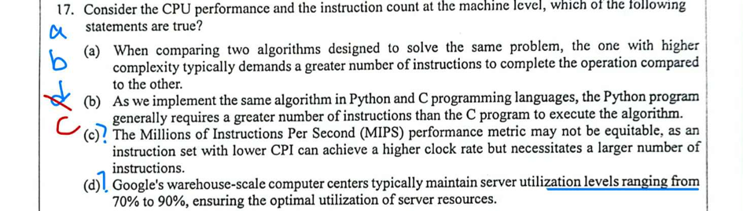 
 

- (a) 比較解決同一問題的兩個演算法，複雜度較高者通常需要更多指令來完成運算

- (b) 以 Python 和 C 實作相同演算法，Python 程式執行時通常需要更多指令

- (c) MIPS 效能指標可能不公平，因為 CPI 較低的指令集可能需要更多指令數
    - $MIPS = \frac{Instruction\ Count}{Execution\ Time \times 10^6}$，這是一個常被誤導的指標。
    - 此時 RISC 的 MIPS 值會很高，但實際執行速度（執行時間）不一定比 CISC 快。

- (d) Google 的倉庫級電腦中心通常維持 10% 到 50% 的伺服器利用率 
    - 伺服器必須預留大量容量以應對突發的流量高峰 (Spikes)，且為了確保低延遲（Tail Latency），系統不能在高負載下運作。若利用率長期達到 70-90%，排隊延遲會劇增，導致使用者體驗嚴重惡化。


## 第 18 題 ALU, Multiplier

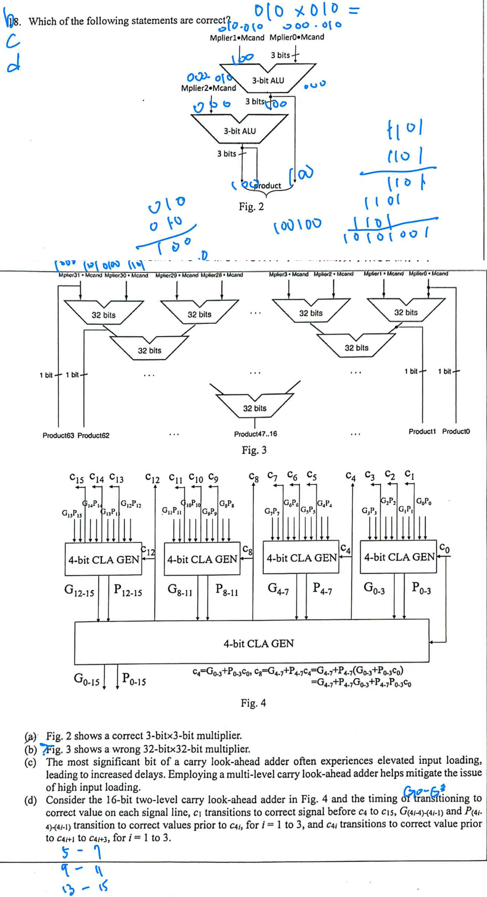

- (a) Fig. 2 中顯示 partial products 進入的是 3-bit ALU。在相加的過程中，因為部分乘積（Partial Products）需要進行位移（Shift），位移後的相加會產生超過 3 bits 的結果與進位。僅使用 3-bit ALU 會導致資料溢位與遺失。

- (b) Fig. 3 中所有的中間層加法器都標註為 32 bits，且最終輸出的 Product 雖然標註了 0-63，但若中間運算只用 32-bit 加法器且沒有處理位移產生的位元擴展，這套硬體電路無法正確算出 64 bits 的乘積。

- (c) Carry Look-ahead Adder, CLA 的 MSB 會有較高的輸入負載
    - 採用 多層級（Multi-level）CLA（如圖 4 將 16 位元拆成四個 4-bit 區塊），可以將每個邏輯閘的 Fan-in 限制在 4 到 5 之內，有效緩解負載問題。

- **(d)** $c_{4i}$ 先於 $c_{4i+1} \sim c_{4i+3}$ 穩定
    1. $c_1, c_2, c_3$。因為它們只需通過第一層的 4-bit CLA 邏輯（由 $g_i, p_i, c_0$ 決定）。因此 $c_1$ 會比需要經過第二層運算的 $c_4 \sim c_{15}$ 更早穩定。
    2. 第一層的各區塊產出 Block Generate ($G_{i-j}$) 與 Block Propagate ($P_{i-j}$)
    3. 底部的「4-bit CLA GEN（第二層）」接收到 $G, P$ 後，計算出 區塊進位 $c_4, c_8, c_{12}$。
    4. 一旦 $c_4$（作為第二個區塊的 carry-in）穩定後，第二個區塊內部的 $c_5, c_6, c_7$ 才能根據 $c_4$ 算出正確值。
        - 最早的 ALU carry 會等待前一個 bit 算完才能算下一個 bit
        - 其實利用布林邏輯可以一次算完 (就是 CLA)
        - 加法器加速計算 O(n) → O(log n)
        - Gᵢ​=Aᵢ∧Bᵢ​
        - Pᵢ=Aᵢ​⊕Bᵢ​
        - Cᵢ+1​=Gᵢ​∨(Pᵢ​∧Cᵢ​)

## 第 19 題 ALU, Multiplier, Divider

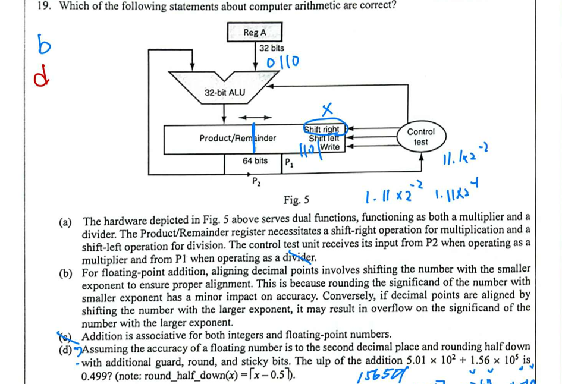

- (a) 測試點 $P_1$ 與 $P_2$ 的功能寫反了

- (b) 浮點數加法必須移動階數（Exponent）較小者以確保精確度並防止溢位

- (c) 浮點數加法：不符合結合律。

- **(d)** 計算的 Unit in the Last Place 誤差
    1. $1.56 + 0.00501 = 1.56501 \times 10^5$.
    2. 捨入
        - 目標精度為小數第二位，即 $1.56$ 與 $1.57$ 之間。
        - 設定 $x = 156.501$（以 $0.01$ 為單位）。
        - 公式：$\lceil x - 0.5 \rceil = \lceil 156.501 - 0.5 \rceil = \lceil 156.001 \rceil = 157$。
        - 捨入結果為 $1.57 \times 10^5$。
    3. 誤差量 $= |157 - 156.501| = 0.499$。

## 第 20 題 Hamming Code (109 第 31-33 題)

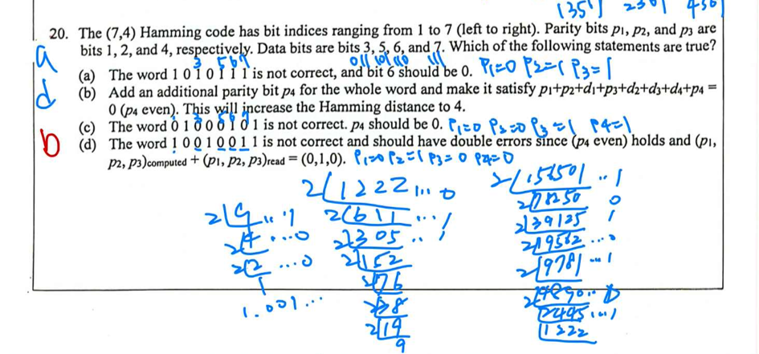

- 漢明距離: 在資訊理論中，兩個等長字串之間的漢明距離是兩個字串對應位置的不同字元的個數。

- (7,4) Hamming Code 為什麼距離是 3
    - 可偵測 2-bit error
    - 可更正 1-bit error
    - 1-bit 或 2-bit 錯誤都不可能「剛好變成另一個合法碼字」
    - 至少有 3 個 bit 不同

- (8,4) Hamming Code 為何距離是 4
    - 更正 1-bit error
    - 偵測 3-bit error
    - 能偵測但不能更正 2-bit error
    - 至少差 4 個 bit

- (b) 增加 $p_4$ 作為全體校驗位可將距離增加至 4
    - 原本的距離 $3$ 只能糾正單錯或偵測雙錯，但無法區分。增加 $p_4$ 後變成 (8,4) SECDED，漢明距離變為 $4$，可明確區分單錯（需更正）與雙錯（僅偵測）。
    
## 第 21-22 題 Process

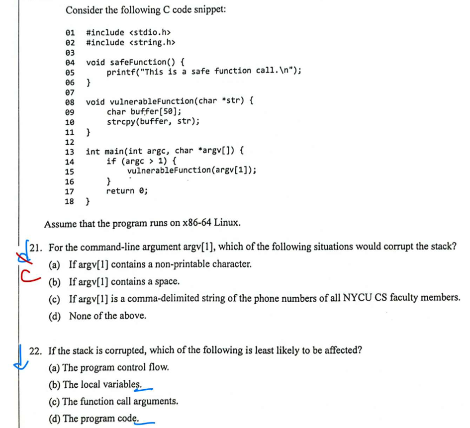 

### 第 21 題

哪種情況會導致堆疊毀損 (Stack Corruption)?

- `strcpy` 會持續複製字元直到遇見空字元 (\0) 為止。如果輸入的字串 str 長度超過 50，它會繼續往 buffer 邊界之外的記憶體寫入資料，從而覆蓋掉堆疊 (Stack) 上的其他重要資訊（如返回位址）。

- (c) NYCU CS 所有教授的電話號碼：陽明交通大學資工系的教授數量眾多（通常數十位），一支電話號碼約 10 位數。即便是幾位教授的號碼加總，長度就極易突破 50 bytes 的上限，因此這必然會導致緩衝區溢位並毀損堆疊。

### 第 22 題

如果堆疊被毀損，哪一項「最不可能」受到影響？

- (d) Program code 儲存在 Text 段，與 Stack 段 在實體與虛擬位址上是分開的。

- 當程式呼叫一個函式時，Control Flow 會跳轉到該函式的起始位址。為了在函式結束後能「找路回家」，CPU 會將下一條要執行的指令位址（返回位址）推入 stack 中。

## 第 23-24 題 Process
 
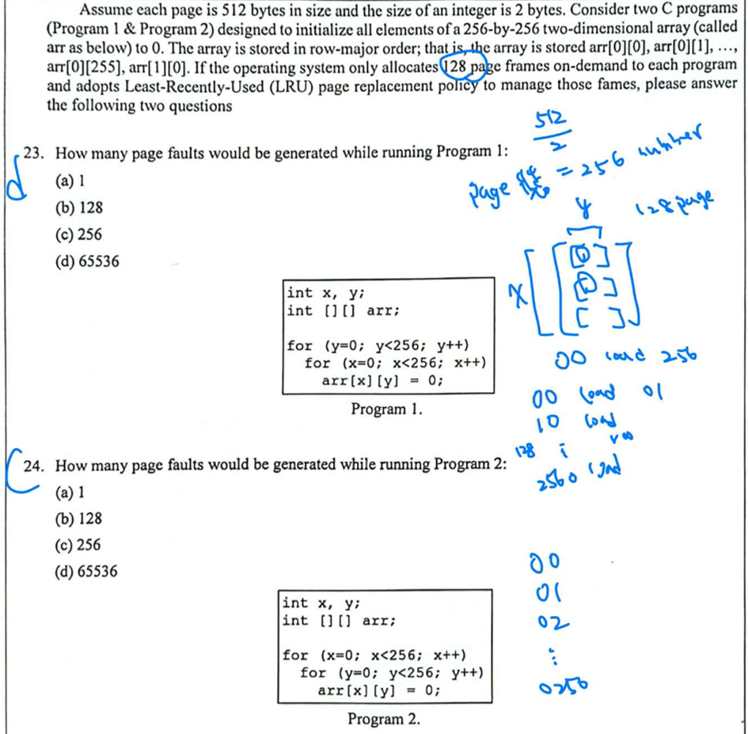 

```
- 分頁大小 (Page Size)：512 bytes。
- 整數大小 (Integer Size)：2 bytes。
- 每頁可容納元素數：512 / 2 = 256 個元素。
- 陣列大小：256 × 256 元素。
- 每列正好有 256 個元素，而每頁也剛好能放 256 個元素
    - Row 0 → Page 0
    - ...
    - Row 255 → Page 255
```

### 第 23 題
    - 存取順序為：$arr[0][0], arr[1][0], arr[2][0] \dots arr[255][0]$。
    - 內迴圈每執行一次，就會跳到 下一個分頁。
    - $= 256 \times 256 = \mathbf{65,536}$ 次錯誤

### 第 24 題
    - 存取順序為：$arr[0][0], arr[0][1], arr[0][2] \dots arr[0][255]$。
    - 總共有 256 列，所以總共只會發生 256 次 分頁錯誤。

## 第 25-27 題 Process

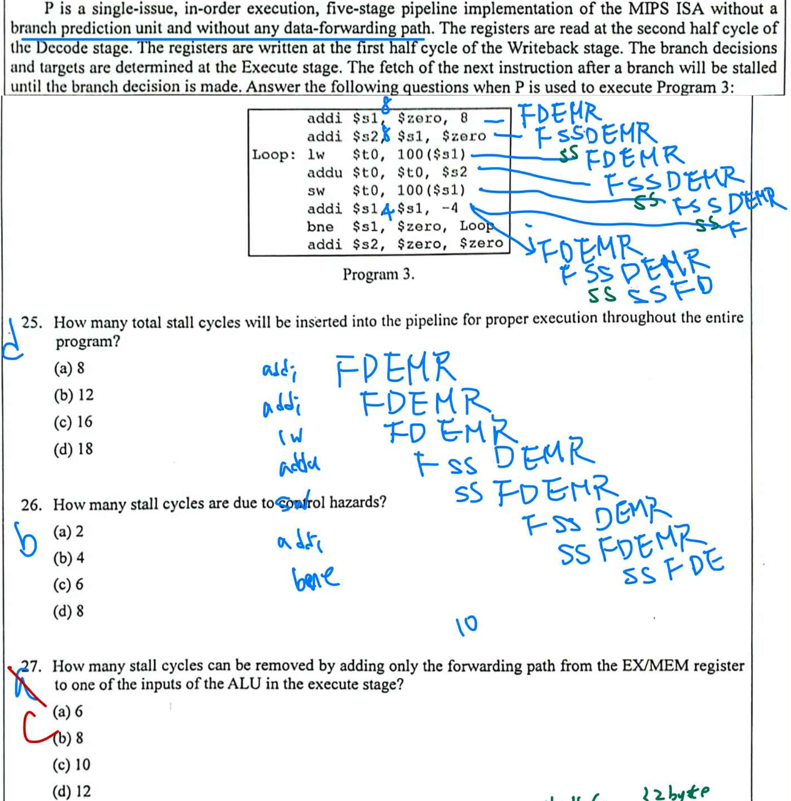

### 第 25 題

- 初始設定段：
    - $I_1 \rightarrow I_2$（相依於 $s1$）：距離 0，產生 2 個 Stall。
    - $I_2 \rightarrow I_4$（相依於 $s2$）：距離 1 指令（$I_3$），由於 WB/ID 重疊，產生 0 個 Stall。

- 第一圈迴圈 ($s1=8 \rightarrow 4$)：
    - $I_3 \rightarrow I_4$（相依於 $t0$）：距離 0，產生 2 個 Stall。
    - $I_4 \rightarrow I_5$（相依於 $t0$）：距離 0，產生 2 個 Stall。
    - $I_6 \rightarrow I_7$（相依於 $s1$）：距離 0，產生 2 個 Stall。
    - $I_7$ 控制冒險：分支決定在 EX，產生 2 個 Stall。
    - 第一圈小計：8 個 Stall。

- 第二圈迴圈 ($s1=4 \rightarrow 0$)：
    - Stall 情況與第一圈完全相同：$2+2+2+2 = \mathbf{8}$ 個 Stall。
    - 每次執行 bne 產生 2 個 Stall。

### 第 26 題

- 多少個 Stall 是由控制冒險（Control Hazards）造成的
    - 控制冒險僅發生在 $I_7$ (bne)。

### 第 27 題

- 加入 EX/MEM $\rightarrow$ EX forwarding 可以少掉幾個 stall
    - $I_1 \rightarrow I_2$：addi 產生的 $s1$。減少 2 個 Stall。
    - $I_4 \rightarrow I_5$：addu 產生的 $t0$。每圈減少 2 個，共 4 個 Stall。
    - $I_6 \rightarrow I_7$：addi 產生的 $s1$。每圈減少 2 個，共 4 個 Stall。

## 第 28-30 題 Process

 
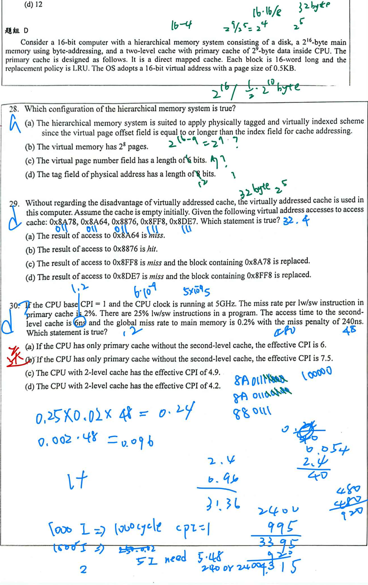 
 
- 16 位元電腦：指令與資料寬度為 16-bit（2 bytes）

- 虛擬位址 (VA)：長度為 16 bits。

- 分頁大小 (Page Size)：0.5 KB = 512 bytes = $2^9$ bytes
    - Page Offset = 9 bits
    - Virtual Page Number (VPN) = $16 - 9 = \mathbf{7 \text{ bits}}$

- 快取 (Direct Mapped)：
    - Block Size：16-word = 32 bytes = $2^5$ bytes。
        - Offset = 5 bits (bits 0-4)。
    - Cache Size：$2^9$ bytes → Cache Lines：$2^9 / 32 = 16 = 2^4$ 行。
        - Index = 4 bits (bits 5-8)
    - Tag = $16 - 4 - 5 = \mathbf{7 \text{ bits}}$

### 第 28 題

- (a) 當 Index + Offset $\le$ Page Offset 時，VIPT 不會產生別名（Aliasing）問題。
    - 這意味著 Index 位元在位址轉換前後不會改變，可以並行加速存取。

### 第 29 題

- 虛擬定址快取（Virtually Addressed Cache），位址拆解為：[Tag: 15-9 | Index: 8-5 | Offset: 4-0]。

1. 0x8A78：1000 1010 0111 1000 $\rightarrow$ Index=0x3, Tag=0x45。Miss（初始清空）

2. 0x8A64：1000 1010 0110 0100 $\rightarrow$ Index=0x3, Tag=0x45。Hit（與上一筆同 Block）。

3. 0x8876：1000 1000 0111 0110 $\rightarrow$ Index=0x3, Tag=0x44。Miss（Tag 不符，替換 0x8A78）。

4. 0x8FF8：1000 1111 1111 1000 $\rightarrow$ Index=0xF, Tag=0x47。Miss（初始清空）。

5. 0x8DE7：1000 1101 1110 0111 $\rightarrow$ Index=0xF, Tag=0x46。Miss（Tag 不符，替換 0x8FF8）。

### 第 30 題 (送分)

- 時脈週期：$5 \text{ GHz} \rightarrow 1 \text{ cycle} = 0.2 \text{ ns}$。

- L2 命中延遲：$6 \text{ ns} = 30 \text{ cycles}$。

- DRAM 懲罰：$240 \text{ ns} = 1200 \text{ cycles}$。

- 情況 1：僅有 L1 快取
    - $CPI = 1 + 0.25 \times 0.02 \times 1200 = 1 + 6 = \mathbf{7.0}$。

- 情況 2：二級快取 (L1 + L2)
    - $Stalls = 0.25 \times (\text{L1 Miss Rate} \times \text{L2 Hit Time} + \text{Global Miss Rate} \times \text{DRAM Penalty})$  
        - $Stalls = 0.25 \times (0.02 \times 30 + 0.002 \times 1200) = 0.25 \times (0.6 + 2.4) = 0.75$。
    - $CPI = 1 + 0.75 = \mathbf{1.75}$。
    - 假設指令抓取 (Instruction Fetch) 也有相同失效率，計算會變為：
        - $(1 + 0.25) \times (0.6 + 2.4) = 3.75 \rightarrow CPI = 4.75$。